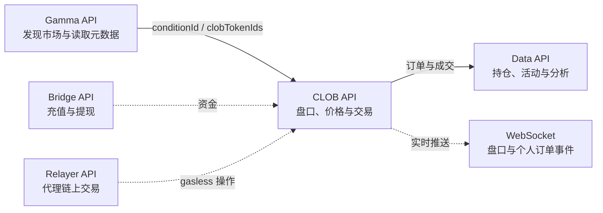

## Overview

Polymarket 并没有一套包办所有功能的 API。市场目录、实时盘口、用户持仓和交易操作被拆到了不同服务中。最实用的心智模型是：



官方把核心 REST 接口分成 Gamma、Data 和 CLOB 三套；Bridge 独立处理充值与提现。[1](#ref-1)

| 服务 | Base URL | 回答的问题 | 认证 |
| --- | --- | --- | --- |
| Gamma API | `https://gamma-api.polymarket.com` | 有哪些事件和市场？规则、标签、结束时间是什么？ | 无需认证 |
| CLOB API | `https://clob.polymarket.com` | 现在盘口怎样？能以什么价格成交？如何下单或撤单？ | 行情公开；交易需要认证 |
| Data API | `https://data-api.polymarket.com` | 某地址持有什么？历史成交、活动、OI 和大户数据怎样？ | 无需认证 |
| WebSocket | `wss://ws-subscriptions-clob.polymarket.com/ws/...` | 如何持续接收盘口和个人订单变化？ | Market 公开；User 需认证 |
| Bridge API | `https://bridge.polymarket.com` | 如何充值和提现？ | 取决于具体操作 |
| Relayer API | `https://relayer-v2.polymarket.com` | 如何代理提交 gasless 链上交易？ | 需要相应凭证与签名 |

本文以 **2026-07-22 的 CLOB V2** 为基线。CLOB V2 已于 2026-04-28 上线生产环境，旧版 `clob-client`、`py-clob-client` 和 V1 签名订单不再兼容；新项目应使用 V2 SDK。[2](#ref-2)

---

## 1. 先理解数据模型

### Event、Market 与 Outcome

Polymarket 的页面组织和交易对象不是同一层：

```text
Event：一个页面级主题
└─ Market：一个具体、可交易的问题
   ├─ Outcome token：YES
   └─ Outcome token：NO
```

- **Event** 是上层容器，可以只有一个 market，也可以包含多个相关 market；
- **Market** 是最基本的可交易单元；
- **Outcome** 是该 market 的可能结果，二元市场通常为 `Yes` 和 `No`；
- **Outcome token** 是 CLOB 实际买卖的资产，因此查询盘口时传的是 token ID，而不是网页 slug。[3](#ref-3)

例如，“某人将去哪所大学？”可以是一个 Event，其中每个候选学校分别是一个 Yes/No Market。Event 适合页面展示，Market 才对应具体仓位和订单簿。

### 最重要的几种 ID

| 字段 | 属于哪一层 | 主要用途 |
| --- | --- | --- |
| `event.id` | Gamma | 查找一个 Event |
| `market.id` | Gamma | 查找 Gamma 中的一条 Market 记录 |
| `slug` | 页面与搜索 | 构造可读 URL、按名称检索 |
| `conditionId` | Market / CTF / CLOB | 标识一个条件市场，关联持仓、用户频道和链上结算 |
| `questionId` | Oracle / CTF | 标识需要被判定的问题 |
| `clobTokenIds` | Outcome token | 查询 YES/NO 盘口、价格以及订阅 Market WebSocket |
| wallet / proxy wallet | User | 查询账户持仓与活动；需分清 signer 地址和 Polymarket 资金地址 |

对一般行情程序，最关键的桥梁是：

```text
Gamma market
├─ conditionId       → 标识整个市场
└─ clobTokenIds[]    → 标识每个可交易 outcome
```

`outcomes`、`outcomePrices` 与 `clobTokenIds` 通常按数组下标一一对应：

```json
{
  "outcomes": "[\"Yes\", \"No\"]",
  "outcomePrices": "[\"0.63\", \"0.37\"]",
  "clobTokenIds": "[\"YES_TOKEN_ID\", \"NO_TOKEN_ID\"]"
}
```

即 `Yes → 0.63 → YES_TOKEN_ID`，`No → 0.37 → NO_TOKEN_ID`。Gamma 的部分数组字段可能以 JSON 字符串返回，使用前需要按实际响应反序列化。

---

## 2. Gamma API：发现市场

Gamma 是“市场目录和内容数据库”，适合：

- 列出 active / closed markets；
- 按 slug、ID、tag、series 或关键词查找；
- 读取标题、描述、resolution source、起止时间和图片；
- 从 market 取得 `conditionId` 和 `clobTokenIds`，再进入 CLOB。

常见接口：[3](#ref-3)

```http
GET /events
GET /events/{id}
GET /markets
GET /markets/{id}
GET /public-search
GET /tags
GET /series
GET /sports
GET /teams
```

最小示例：

```bash
curl "https://gamma-api.polymarket.com/markets?active=true&closed=false&limit=5"
```

拉取大量市场时，优先使用 keyset pagination：

```http
GET /markets/keyset?limit=100
GET /markets/keyset?limit=100&after_cursor=<上一次返回的 next_cursor>
```

`/markets/keyset` 使用不透明的 `next_cursor`，比不断增大的 `offset` 更稳定；该接口不接受 `offset`，单次 `limit` 最大为 100。[4](#ref-4)

### Gamma 价格应该怎样理解

`outcomePrices` 可以用来快速展示市场概率，但它不是完整订单簿。价格 `0.63` 通常可直观读成市场隐含约 63% 概率，不过这不意味着此刻一定能以 `0.63` 买到任意数量。

真正交易前应查询 CLOB 的 best bid / best ask 和订单深度。换句话说：

- Gamma price：适合市场发现、列表和粗略快照；
- CLOB book：适合判断实际可成交价格、滑点和流动性。

---

## 3. CLOB API：读取盘口与执行交易

CLOB 是 Central Limit Order Book。它采用链下撮合、链上结算：用户在本地签署订单，撮合服务匹配买卖双方，最终交易在 Polygon 上结算。[5](#ref-5)

### 公开行情接口

```http
GET  /book              # 单个 token 的订单簿
POST /books             # 批量订单簿
GET  /price             # 单个 token 某一 side 的价格
GET  /prices            # 批量价格
GET  /midpoint          # 买一卖一中间价
GET  /spread            # 买一卖一价差
GET  /prices-history    # 历史价格
GET  /clob-markets/{condition_id}
```

其中 `GET /clob-markets/{condition_id}` 可一次取得 market 的 token、minimum tick size、minimum order size、费率和 RFQ 状态等 CLOB 参数。[6](#ref-6)

### 不同“价格”不是同一个概念

| 字段或接口 | 含义 | 能否保证成交 |
| --- | --- | --- |
| `bestBid` | 当前最高买价 | 只有卖方向相应深度成交 |
| `bestAsk` | 当前最低卖价 | 只有买方向相应深度成交 |
| `midpoint` | `(bestBid + bestAsk) / 2` | 不能，只是参考值 |
| `spread` | `bestAsk - bestBid` | 不是价格，用于衡量盘口宽度 |
| `lastTradePrice` | 最近一次成交价 | 不能，盘口可能已经变化 |
| Gamma `outcomePrices` | 方便展示的市场价格快照 | 下单前仍应检查订单簿 |

只看 midpoint 或 last trade 会忽略 spread 与深度。例如买一 `0.58`、卖一 `0.64` 时，midpoint 是 `0.61`，但市场上并没有人承诺以 `0.61` 卖给你。

### YES 与 NO 的关系

二元市场最终 payout 通常是 `1` 或 `0`，所以交易价格经常被当作隐含概率。但 YES/NO 的实时可成交价格不一定严格相加为 `1`：两边各有独立订单簿，spread、费用、深度和短暂失衡都会造成偏差。

因此不要把：

```text
NO 可成交价 = 1 - YES 最近成交价
```

写成永久成立的规则。需要 NO 的实际价格时，直接查询 NO token 的盘口。

---

## 4. Data API：持仓、成交与分析

Data API 更像“已经发生了什么”和“某个账户现在是什么状态”的查询层，而不是实时撮合层。常见接口包括：[3](#ref-3)

```http
GET /positions?user=<address>          # 当前持仓
GET /closed-positions?user=<address>   # 已关闭持仓
GET /activity?user=<address>           # 用户活动
GET /value?user=<address>              # 总持仓价值
GET /trades                            # 历史成交
GET /holders                           # 主要持有人
GET /oi                                # Open Interest
```

它适合：

- 计算或展示账户 portfolio；
- 观察某地址的交易历史；
- 分析市场大户、成交和 open interest；
- 构建 leaderboard 或“聪明钱”研究工具。

需要留意三点：

1. **地址口径**：网页账户可能涉及 signer、proxy wallet 或 Safe 地址，查不到仓位时先确认传入的是哪一个；
2. **快照延迟**：分析型接口可能与撮合引擎存在短暂时间差，不能代替订单状态流；
3. **PnL 口径**：`realizedPnl`、`cashPnl`、`currentValue` 和 `totalPnl` 含义不同，不能只凭字段名混加。

---

## 5. WebSocket：持续接收变化

REST 适合按需查询，WebSocket 适合行情面板、交易机器人和订单状态跟踪。官方提供 `market`、`user`、`sports` 与 RTDS 等频道。[7](#ref-7)

### Market Channel

```text
wss://ws-subscriptions-clob.polymarket.com/ws/market
```

它公开提供 Level 2 盘口、价格变化、最近成交和 market lifecycle 事件。订阅时传 **outcome token ID**：

```json
{
  "assets_ids": ["YES_TOKEN_ID", "NO_TOKEN_ID"],
  "type": "market",
  "custom_feature_enabled": true
}
```

常见消息有 `book`、`price_change`、`last_trade_price`、`tick_size_change` 和 `best_bid_ask`。[7](#ref-7)

### User Channel

```text
wss://ws-subscriptions-clob.polymarket.com/ws/user
```

User Channel 推送自己的 `order` 和 `trade` 生命周期，需要 API credentials，并以 **condition ID** 筛选 market：[8](#ref-8)

```json
{
  "auth": {
    "apiKey": "...",
    "secret": "...",
    "passphrase": "..."
  },
  "markets": ["0x...condition_id"],
  "type": "user"
}
```

这里有一个很容易踩的坑：

```text
Market Channel → assets_ids → YES / NO token IDs
User Channel   → markets    → condition IDs
```

Market 和 User 频道连接后都要每 10 秒发送 `PING` 保活。User Channel 的 credentials 只应出现在服务端，不要放进浏览器前端代码。[7](#ref-7) [8](#ref-8)

---

## 6. 认证：L1、L2 与订单签名

Gamma、Data 和 CLOB 只读行情接口公开，无需 API key。下单、撤单和读取私有订单等 CLOB 操作需要认证。[9](#ref-9)

### L1：钱包证明

L1 使用钱包私钥签署 EIP-712 消息，作用是：

- 证明对钱包的控制权；
- 创建或派生 API credentials；
- 在本地签署订单 payload。

私钥不应该发送给 Polymarket，也不应该写入 Git 仓库。

### L2：API credentials

L2 credentials 包含：

```text
apiKey + secret + passphrase
```

客户端使用 `secret` 对 HTTP 请求生成 HMAC-SHA256 签名。交易接口通常需要五个 `POLY_*` headers：

```text
POLY_ADDRESS
POLY_SIGNATURE
POLY_TIMESTAMP
POLY_API_KEY
POLY_PASSPHRASE
```

L2 证明“这个 API 请求有权限”，订单本身仍需要钱包的 EIP-712 签名。两者不是互相替代，而是分别保护请求层与订单层。[9](#ref-9)

实际开发优先使用官方 V2 SDK，让 SDK 处理签名格式和 headers：

```text
TypeScript: @polymarket/clob-client-v2
Python:     py-clob-client-v2
Rust:       polymarket_client_sdk_v2
```

---

## 7. Bridge 与 Relayer 在哪里出现

### Bridge API

Bridge API 负责充值和提现，不负责找市场或撮合订单。当前官方接口是对 fun.xyz bridge service 的代理，因此遇到跨链卡住、合规检查或到账问题时，应把它视为独立于 CLOB 的资金通道。[1](#ref-1)

### Relayer API

Relayer 用于代表用户广播已签名的链上交易，例如 proxy wallet / Safe 的 gasless 操作。它不是 CLOB 下单接口。`POST /submit` 返回 `transactionID` 和初始状态，之后需要轮询交易查询接口才能取得链上 `transactionHash`。[10](#ref-10)

可以把两者记成：

```text
Bridge  → 钱怎样进入或离开 Polymarket
Relayer → 已签名的链上操作由谁代为广播
CLOB    → 订单怎样进入盘口并被撮合
```

---

## 8. 三条典型调用链

### 做一个市场浏览器

```text
Gamma /events 或 /markets
→ 展示标题、规则、结束时间和 outcomePrices
→ 保存 conditionId 与 clobTokenIds
→ CLOB /book 补充真实盘口
```

### 做一个行情监控器

```text
Gamma 发现 active markets
→ 取出 YES/NO clobTokenIds
→ CLOB REST 拉初始快照
→ Market WebSocket 持续更新订单簿
→ 断线后重新拉快照，再恢复增量更新
```

### 做一个交易机器人

```text
Gamma 找市场和 token IDs
→ CLOB 检查盘口、tick size、minimum order size 与 fee 参数
→ L1 派生 L2 credentials
→ 钱包签订单 + L2 认证请求
→ POST order
→ User WebSocket 跟踪 MATCHED / MINED / CONFIRMED
→ Data API 查询组合持仓与事后分析
```

---

## 9. 常见误区

1. **把 Gamma 当成交易 API**：Gamma 用于发现和元数据，不负责挂单与撤单。
2. **用 market ID 查询 `/book`**：CLOB 盘口通常需要 `clobTokenIds` 中的 outcome token ID。
3. **把 `0.63` 当成任意数量都能成交的报价**：真实成交还取决于 ask、深度、费用和滑点。
4. **认为 midpoint 是成交价**：它可能只是 bid 与 ask 之间一个不存在订单的位置。
5. **只查 YES，然后用 `1 - YES` 代替 NO 盘口**：互补关系描述最终 payout，不保证两个实时订单簿无价差。
6. **混淆 `conditionId` 与 token ID**：前者表示整个 market，后者表示一个具体 outcome。
7. **把 API credentials 当作钱包私钥**：L2 credentials 用于请求认证，不能取代订单签名。
8. **把 secret 放进前端或 Git**：User WebSocket 与交易操作应放在服务端。
9. **继续照抄 V1 教程**：包名、订单结构、抵押品和签名域已经发生变化。[2](#ref-2)
10. **假设 REST 和 WebSocket 永不丢数据**：生产程序需要限速、重连、快照恢复、去重和状态校验。

---

## 10. 一句话速查

```text
找市场       → Gamma
查真实盘口   → CLOB REST
接收实时行情 → Market WebSocket
下单撤单     → CLOB + L1/L2
跟踪我的订单 → User WebSocket
查用户持仓   → Data API
充值提现     → Bridge
代理链上操作 → Relayer
```

## References

<a id="ref-1"></a>[1] Polymarket Docs, [API Introduction](https://docs.polymarket.com/api-reference/introduction).

<a id="ref-2"></a>[2] Polymarket Docs, [Migrating to CLOB V2](https://docs.polymarket.com/v2-migration).

<a id="ref-3"></a>[3] Polymarket Docs, [Market Data Overview](https://docs.polymarket.com/market-data/overview).

<a id="ref-4"></a>[4] Polymarket Docs, [List Markets — Keyset Pagination](https://docs.polymarket.com/api-reference/markets/list-markets-keyset-pagination).

<a id="ref-5"></a>[5] Polymarket Docs, [Trading Overview](https://docs.polymarket.com/trading/overview).

<a id="ref-6"></a>[6] Polymarket Docs, [Get CLOB Market Info](https://docs.polymarket.com/api-reference/markets/get-clob-market-info).

<a id="ref-7"></a>[7] Polymarket Docs, [WebSocket Overview](https://docs.polymarket.com/market-data/websocket/overview)；[Market Channel](https://docs.polymarket.com/market-data/websocket/market-channel).

<a id="ref-8"></a>[8] Polymarket Docs, [User Channel](https://docs.polymarket.com/market-data/websocket/user-channel).

<a id="ref-9"></a>[9] Polymarket Docs, [Authentication](https://docs.polymarket.com/api-reference/authentication).

<a id="ref-10"></a>[10] Polymarket Docs, [Submit a Relayer Transaction](https://docs.polymarket.com/api-reference/relayer/submit-a-transaction).
