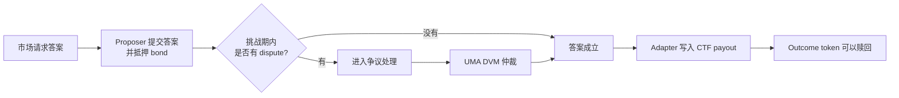
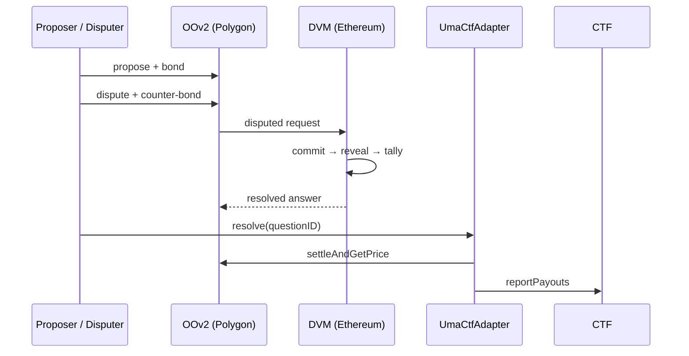

## Overview

Polymarket 需要把现实世界的事件结果写入链上，但智能合约无法自行判断“候选人是否当选”或“比赛是否结束”。[`UmaCtfAdapter`](https://github.com/Polymarket/uma-ctf-adapter) 为这个问题提供了一条判定通道：它向 UMA Optimistic Oracle V2（OOv2）请求答案，再把答案转换成 Conditional Tokens Framework（CTF）能够结算的 payout。[1](#ref-1)

这套机制的核心不是让所有市场都经过投票，而是采用一个更便宜的默认假设：

> 一个带有经济担保的答案，只要在挑战期内无人反对，就可以被视为正确；只有发生 dispute，才启用成本更高的去中心化仲裁。

因此，“乐观”描述的是验证策略，而不是对提议者的道德判断。系统允许任何人提交答案，同时用 proposer bond、disputer bond 和最终的 DVM 仲裁约束说谎与恶意挑战。



---

## 1. 三层协议各自负责什么

整个系统可以抽象成三个相互独立的层次：

| 协议层 | 职责 | 不负责什么 |
| --- | --- | --- |
| UMA OOv2 | 接收答案、托管 bond、开放挑战期 | 不发行 Polymarket outcome token |
| UMA DVM | 对 disputed request 给出最终仲裁结果 | 不处理普通的无争议市场 |
| Polymarket CTF | 保存 `[YES, NO]` payout，并允许持币者赎回 | 不判断现实世界事实 |

`UmaCtfAdapter` 位于三者之间：

- 面向 OOv2，它是请求答案的 requester；
- 面向 CTF，它是有权报告 payout 的 oracle；
- 面向 Polymarket，它把 UMA 的通用 `int256 price` 翻译成 YES、NO 或 UNKNOWN。

也就是说，OOv2 解决“哪个答案可以被接受”，CTF 解决“接受该答案后如何分配抵押品”，Adapter 负责把两套协议接起来。

---

## 2. 乐观预言机的正常路径

### 2.1 Request：市场请求一个答案

创建市场时，Adapter 把问题、判断规则、resolution source、reward、bond 和挑战期等信息注册到 OOv2。这里的“price”并不一定是资产价格；UMA 使用同一个数值接口承载任意可验证答案。

Polymarket 的二元问题通常使用以下编码：

| OO 返回值 | 市场语义 | CTF payout `[YES, NO]` |
| ---: | --- | --- |
| `0` | NO | `[0, 1]` |
| `0.5e18` | UNKNOWN | `[1, 1]`，两边各兑回 50% |
| `1e18` | YES | `[1, 0]` |

### 2.2 Propose：提交答案并抵押 bond

市场达到可判定条件后，任何人都可以成为 proposer。Proposer 根据市场规则和公开证据提交一个答案，同时向 OOv2 抵押 bond。

Bond 的作用是把“给出错误答案”变成有成本的行为。Proposer 并不因为最先发交易就天然可信；他的答案必须经过一段 liveness，也就是公开挑战期。

### 2.3 Liveness：等待公开挑战

在 liveness 内，任何人都可以检查答案是否符合市场规则：

- 如果无人 dispute，答案在挑战期结束后成为可结算结果；
- 如果有人 dispute，disputer 也必须抵押资金，争议随后进入仲裁路径。

这使绝大多数答案明显、没有分歧的市场只需一次 proposal 和一次最终结算，不需要全体 UMA voter 为每个市场投票。乐观预言机由此把昂贵共识变成一种按需启用的后备机制。

### 2.4 Settle：把答案写入 CTF

挑战期结束不会让合约自动执行。任何地址都可以调用 Adapter 的 `resolve(questionID)` 推动结算：Adapter 从 OOv2 取得最终答案，将其转换成 `[YES, NO]` payout，再调用 CTF 记录结果。

CTF 完成 resolution 后，正确一侧的 outcome token 才可以兑换抵押品。

---

## 3. Dispute 如何发生

Disputer 需要在 liveness 结束前提交反对，并抵押与请求相关的 counter-bond。OOv2 随后把该 request 标记为 `Disputed`，将问题送往 UMA 的最终仲裁层。

经济上，dispute 不是一次免费举报：

- proposer 用 bond 担保原答案；
- disputer 用 counter-bond 担保挑战有依据；
- 仲裁结果决定哪一方获胜以及 bond 如何分配；
- 一部分费用用于支付 UMA 的最终仲裁成本。

这套结构同时提高了虚假提议和无理挑战的成本。只提高 proposer bond 并不等于提高 DVM 的安全性：bond 约束提议者与挑战者，而 DVM 的投票权来自 voter 质押的 UMA，两者是不同的经济层。

### Polymarket 的第一次 dispute 优化

`UmaCtfAdapter` 没有让市场在第一次 dispute 后立即等待 DVM，而是自动创建第二个 OO request：

```text
第一次 request 被 dispute
├─ 旧 request → 继续进入 DVM，只负责裁定第一轮 bond 归属
└─ 新 request → 重新开放 proposal 与 liveness，继续推动市场结算
```

如果第二个 proposal 无人挑战，市场可以直接按第二个答案结算，不必等待旧 request 的 DVM 结果。这降低了明显错误 proposal 或恶意 dispute 长时间冻结市场的能力。

如果第二个 proposal 再次被 dispute，Adapter 不再创建第三个请求；当前市场开始等待 DVM 的最终结果。因此 Polymarket 的实际路径是：

```text
第一次 dispute：重开请求，DVM 只裁定旧请求的 bond
第二次 dispute：不再重开，市场等待 DVM 仲裁
```

---

## 4. DVM 如何解决争议

UMA Data Verification Mechanism（DVM）是 OOv2 的最终仲裁后端。Polymarket 的相关合约位于 Polygon，而 DVM 位于 Ethereum，因此 disputed request 会经 oracle tunnel 发送到 Ethereum，结果产生后再跨链返回 Polygon。[2](#ref-2)

DVM 采用 stake-weighted commit–reveal voting：

1. **Stake**：voter 把 UMA 质押到 `VotingV2`，effective stake 决定票重。
2. **Commit**：voter 提交答案的 hash，暂时隐藏自己的选择。
3. **Reveal**：在 reveal phase 公开答案和 salt，合约验证其与 commit 一致。
4. **Tally**：达到最低参与度和最低共识门槛后，modal outcome 成为 DVM 结果。

Commit–reveal 的意义在于减少跟票：其他参与者在 commit phase 看不到明文答案，需要独立研究市场规则与证据。正确 voter 获得奖励，错误或缺席 voter 可能被 slash。若投票未达到 DVM 的参与或共识门槛，request 会进入后续 round，而不是自动返回 UNKNOWN。[3](#ref-3)

DVM 得出结果后，oracle tunnel 将结果带回 Polygon。OOv2 使用该结果判断 proposer 与 disputer 谁胜出并分配 bond。随后仍需外部账户调用 `adapter.resolve(questionID)`，Adapter 才会把答案写入 CTF。



---

## 5. 这套机制的安全假设

乐观预言机的安全性来自多层激励与后备仲裁，而不是单一可信数据源：

- **公开可挑战**：任何人都能检查 proposal，并在 liveness 内提出 dispute；
- **双边担保**：proposer 和 disputer 都需要承担错误成本；
- **按需仲裁**：只有存在真实争议时才使用 DVM，降低正常市场的成本；
- **质押投票**：DVM voter 的投票权和潜在损失与 UMA stake 绑定；
- **规则优先**：DVM 判断的是 ancillary data 和 resolution source 定义的问题，而不是自由解释市场标题；
- **需要 keeper**：时间到期、DVM 出结果或跨链完成都不等于自动结算，仍需有人发送推进状态的交易。

系统仍然存在 Adapter 管理权限、跨链消息延迟、市场规则歧义、DVM 投票门槛以及部署版本差异等信任边界。所谓 permissionless，主要指正常路径中的 propose、dispute 与 resolve 可以由任意地址触发，并不意味着所有合约都没有管理员或应急路径。

---

## 6. 源码与函数细节

以下内容用于把上面的机制映射回 [`uma-ctf-adapter`](https://github.com/Polymarket/uma-ctf-adapter) 与 UMA 合约，不影响对主流程的理解。

### 6.1 各阶段的关键函数

| 阶段 | 外部交易 | 关键内部调用 | 状态结果 |
| --- | --- | --- | --- |
| 创建问题 | `adapter.initialize(...)` | `ctf.prepareCondition(...)` → OO `requestPrice(...)` → `setEventBased(...)` → `setCallbacks(...)` | OO request 进入 `Requested` |
| 提交答案 | OO `proposePrice(...)` / `proposePriceFor(...)` | 拉取 `bond + finalFee`，写入 `expirationTime` | `Requested → Proposed` |
| 发起挑战 | OO `disputePrice(...)` / `disputePriceFor(...)` | 拉取 counter-bond → Oracle `requestPrice(...)` → Adapter `priceDisputed(...)` | `Proposed → Disputed` |
| 第一次 dispute | OO callback `priceDisputed(...)` | Adapter `_reset(...)` → `_requestPrice(...)` | 旧请求进 DVM，question 指向新请求 |
| 第二次 dispute | OO callback `priceDisputed(...)` | Adapter 设置 `refund = true` | 当前请求等待 DVM |
| DVM 投票 | `stake(...)`、`commitVote(...)`、`revealVote(...)` | `processResolvablePriceRequests(...)` | resolve、roll 或 delete |
| 结果回传 | Root tunnel `publishPrice(...)` | DVM `getPrice(...)` → Child tunnel 接收消息 | Polygon oracle 保存 resolved price |
| 市场结算 | `adapter.resolve(questionID)` | OO `settleAndGetPrice(...)` → Adapter `_constructPayouts(...)` → CTF `reportPayouts(...)` | Bond 分配，CTF payout 固定 |
| 用户赎回 | CTF `redeemPositions(...)` | burn outcome token，释放 collateral | 持币者取得抵押品 |

### 6.2 三种不同的标识

- `questionID`：Adapter 根据追加了 initializer 地址的 ancillary data 生成，用于索引 `questions`；
- OO request key：由 requester、identifier、timestamp 与 ancillary data 共同确定；reset 改变 timestamp，因此会生成新请求；
- CTF `conditionId`：由 oracle、`questionID` 与 outcome slot count 共同确定。

一个 `questionID` 可以因为 reset 对应多个 OO request，但 CTF condition 仍然保持不变。

### 6.3 特殊结果与边界

- `0.5e18` 表示 UMIP-107 的 UNKNOWN，不等同于 DVM 未达到投票门槛；
- `type(int256).min` 表示 P4 / too early，Adapter 会重开请求而不是结算 CTF；
- Neg Risk 市场通常不能接受 `[1,1]`，市场规则需要避免合理落入 UNKNOWN；
- `totalBond = request bond + finalFee`，实际数值应从具体 request 读取；
- DVM 结果产生后仍需跨链回传和 `adapter.resolve(...)`，不会自动写入 CTF。

### 6.4 部署版本

本文以仓库 `main` commit `8b76cc9` 为主，并与已部署的 `v3.1.0` 对照。两者的普通 OO → Adapter → CTF 路径一致，但 constructor、safety period 和手动结算接口有所不同。分析具体市场时，应以 Adapter 地址对应的 verified bytecode 与 ABI 为准。[1](#ref-1) [4](#ref-4)

---

## References

<a id="ref-1"></a>[1] Polymarket, [`uma-ctf-adapter`](https://github.com/Polymarket/uma-ctf-adapter)；[Resolution](https://docs.polymarket.com/concepts/resolution)；[`v3.1.0` release](https://github.com/Polymarket/uma-ctf-adapter/releases/tag/v3.1.0).

<a id="ref-2"></a>[2] UMA Protocol, [Polygon cross-chain oracle architecture](https://github.com/UMAprotocol/protocol/blob/a16ee53125c433dfa4e29738b73d9069ff109c03/packages/core/contracts/polygon-cross-chain-oracle/README.md)；[`OracleChildTunnel.sol`](https://github.com/UMAprotocol/protocol/blob/a16ee53125c433dfa4e29738b73d9069ff109c03/packages/core/contracts/polygon-cross-chain-oracle/OracleChildTunnel.sol)；[`OracleRootTunnel.sol`](https://github.com/UMAprotocol/protocol/blob/a16ee53125c433dfa4e29738b73d9069ff109c03/packages/core/contracts/polygon-cross-chain-oracle/OracleRootTunnel.sol).

<a id="ref-3"></a>[3] UMA Protocol, [`VotingV2.sol`](https://github.com/UMAprotocol/protocol/blob/a16ee53125c433dfa4e29738b73d9069ff109c03/packages/core/contracts/data-verification-mechanism/implementation/VotingV2.sol)；UMA Docs, [DVM 2.0](https://docs.uma.xyz/protocol-overview/dvm-2.0)；[UMIP-107: `YES_OR_NO_QUERY`](https://github.com/UMAprotocol/UMIPs/blob/3006370d15e62bb4f24375de187f890967709f8d/UMIPs/umip-107.md).

<a id="ref-4"></a>[4] Polymarket, [`UmaCtfAdapter.sol` at commit `8b76cc9`](https://github.com/Polymarket/uma-ctf-adapter/blob/8b76cc9e0d46c6f7450a0adb0ddc0f5b0568c9cc/src/UmaCtfAdapter.sol)；[`UmaCtfAdapter.sol` at v3.1.0](https://github.com/Polymarket/uma-ctf-adapter/blob/v3.1.0/src/UmaCtfAdapter.sol).
