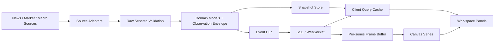

## Document Record

| Field | Value |
| --- | --- |
| Category | Research |
| Sequence | 001 |
| Status | Exploratory |
| Scope | 全球新闻、多资产价格、宏观数据、实时曲线与多 Panel Workspace |
| Evidence snapshot | 2026-08-05 |
| Agent handoff | [Agent Handoff（raw markdown）](computer_sci/dev/everythingdesk/attachments/research_001_agent_handoff.md) |

## Summary

Everything Desk 不是单一行情终端，也不是地图新闻站的复刻。它需要把不同更新时间尺度的资料放进同一个可追溯工作区：新闻和事件以条目流进入，价格以 snapshot 与 delta 进入，宏观数据以低频序列进入，Agent 则在这些可观察数据之上进行检索、比较与解释。

现有代码已经具备一组可保留的底层能力：工具注册、能力策略、命令注册、模型事件翻译、同请求合并的 TTL cache，以及带 timeout/retry 的 JSON 请求。需要替换的是单领域 Artifact、硬编码 runtime、短生命周期 Agent SSE、轮询式市场接口、React SVG 曲线和单体页面组件。

外部项目形成四类参照：World Monitor 的异构采集与缓存；OpenBB 的标准模型与 Provider 适配；Gloomberb 的 capability/plugin 生命周期；QuantPilot 的 snapshot-first、可见范围订阅与真实延迟标识。图形层可直接评估 Lightweight Charts、uPlot 与 Perspective，Workspace 可直接评估 React Grid Layout。许可证决定了“读懂后重写”与“引入依赖/复用代码”必须分开记录。

实时链路不预先绑定 SSE 或 WebSocket。初始状态由 snapshot 提供；增量事件按频率、方向、恢复要求选择传输；普通资源写入客户端查询缓存；高频曲线绕过 React state，以 frame buffer 写入 Canvas。传输、batch window 与图表库最终由目标设备上的端到端延迟、frame time、memory 和断线恢复实验确定。

## Product Frame

Everything Desk 汇集全球新闻、市场价格、宏观指标与其他持续更新的信息。信息之间有三种根本差异：

- 数据形态不同：article、quote、bar、event、indicator 不能压成一个万能对象；
- 时间尺度不同：行情可能一秒多次变化，新闻按秒或分钟出现，宏观指标按日、月或季度发布；
- 来源语义不同：source timestamp、exchange session、修订历史和抓取时间都影响“最新”的含义。

因此系统同时维护 snapshot 与 incremental event。snapshot 用于初始渲染、查询、历史窗口和断线恢复；event 只描述 snapshot 之后的变化。

本文件覆盖数据源抽象、缓存、传输、曲线渲染、Workspace 与扩展机制。新闻事件聚类、跨语言处理、推荐算法、Agent 论证质量和交易执行另行研究。

## Horizontal Comparison

### Products and platforms

| System | Primary job | Ingestion and normalization | Freshness path | Extension model | Workspace model | Transferable mechanism | Reuse boundary |
| --- | --- | --- | --- | --- | --- | --- | --- |
| Everything Desk current code | 对话驱动的单领域研究工作区 | 单个工具调用外部 API；schema validation；Artifact 投影 | Agent response 走有限 SSE；数据面板用 2s/15s polling | `ToolRegistry`、policy、commands | 单体 React 页面与固定 sidebar | Registry/policy/runner、同请求合并 cache、HTTP client、事件翻译 | 本地代码可直接重构；领域命名和类型需拆除 |
| [World Monitor][1] | 全球新闻、地缘、基础设施和市场监测 | 大量 source adapter；后台 seed；Redis envelope | seed → memory/Redis → bootstrap；smart polling；部分专用 stream | 以服务与数据层为主，非通用插件市场 | 地图中心、多信息面板 | smart poll、measure/mutate batch、negative cache、in-flight coalescing、bootstrap pipeline | AGPL-3.0-only；模式研究后独立实现 |
| [OpenBB][2] | 多供应商金融研究平台 | standard model + provider-specific Fetcher | 主要是请求/查询，不以浏览器 tick streaming 为核心 | Python entry point；provider/model registry | API/SDK/Workspace 多消费端 | Query transform → extract → data transform；显式 provider 选择 | AGPL-3.0；模型思想可借，代码复用需许可证兼容 |
| [Gloomberb][3] | 可扩展市场终端与 Agent 工作台 | Provider 被包装成 typed capability | capability 同时支持 `invoke` 与 `subscribe` | plugin setup/dispose；pane、command、shortcut、capability registry | pane、dock/floating、command-first | headless capability registry、side-effect metadata、subscription cleanup | MIT；可选择性改造类型和 registry 实现 |
| [QuantPilot][4] | 本地股票筛选与实时观察 | 小型 Provider Protocol；snapshot 与 live quote 分层 | 两阶段 snapshot → live；可见项与 watchlist 才订阅；poll fallback | 命名 registry，范围很小 | 单页密集金融终端 | 数据延迟作为字段、真实 stream health、subscription budget | AGPL-3.0；Yahoo 使用条款也不适合作为商业基础 |
| [Situation Monitor][5] | 全球新闻、市场和地缘态势面板 | 统一 service registry 与 API client | L1 memory + localStorage；SWR；retry；circuit breaker | 固定 panel/config registry | Svelte panel dashboard | 小型 service client 将 cache、dedupe、retry、breaker 串联 | 仓库未发现 LICENSE；只记录结构，不复制代码 |
| [FINOS Perspective][6] | 浏览器/服务端流式分析和数据透视 | typed table；JSON/CSV/Arrow；WASM/worker | `table.update()` append 或按 index partial update | Viewer plugins 与 client/server API | Data grid、pivot、chart workspace | 有界 streaming table、浏览器端聚合、Arrow 路径 | Apache-2.0；适合分析面板，不必承担普通价格图职责 |

### UI and rendering components

| Component | Update model | Domain fit | Operational cost | License / notice | Place in Everything Desk |
| --- | --- | --- | --- | --- | --- |
| [Lightweight Charts 5.2][7] | `series.update()` 追加数据；相同时间替换最后一点；历史点更新较慢 | 价格线、K 线、volume、price scale | 中等；需管理 chart instance、ResizeObserver 与 tick bucket | Apache-2.0；用户可见页面需 TradingView attribution 与链接 | 金融价格 Panel 的首个候选 |
| [uPlot 1.6.32][8] | 调用方维护列式数组，以 `setData()` 提交窗口 | 高密度、通用 line/area/OHLC | 较低；数据对齐、窗口裁剪和处理由产品承担 | MIT | 高频 line-only 或指标 Panel 的对照候选 |
| [Perspective][6] | `table.update()`；有 index 时支持 partial row update；可设 row limit | 大数据表、group-by、pivot、streaming blotter | 较高；WASM/worker/viewer 体系更完整也更重 | Apache-2.0 | 分析/表格插件，不进入基础曲线热路径 |
| [React Grid Layout 2.2.4][9] | layout state + drag/resize callbacks；支持序列化恢复 | 自由排列的 dashboard grid | 中等；每个 Panel 仍需自己的尺寸与生命周期控制 | MIT | Workspace shell 候选，不代替 Panel registry |

## Source-Level Findings

### World Monitor: ingestion and cache discipline

World Monitor 的数据路径不是简单的“前端定时请求所有 API”。后台 seed 任务先将慢源或共享源写入 Redis，API 进程再使用短期内存状态、Redis 与 upstream fetch 组成多层路径。[1]

`cachedFetchJson()` 的同 key 请求共享一个 in-flight Promise；fetcher 有超时，避免永久占住该 key；空结果和错误可进入短期 negative cache；Redis 故障时还有有限的本地 positive fallback。`/api/bootstrap` 使用 Redis pipeline 批量读取多个 key，减少首屏 N+1。seed 发布采用 staging key → canonical key → cleanup 的三步单元，并记录抓取时间与条目数量。

前端的 `startSmartPollLoop()` 同时处理：

- 页面隐藏时暂停或降低频率；
- 回到可见状态时立即刷新；
- 单次 poll 未结束时不重叠执行；
- 失败后指数退避，成功后复位；
- jitter，避免所有客户端同时击中服务端。

`layout-batch.ts` 将 DOM measure 与 mutate 分成两个队列，并在同一 animation frame 内先读后写。该机制适合 Panel resize、地图和图表布局，但 World Monitor 的 AGPL 许可意味着这里记录的是可独立实现的算法结构，不是待复制文件。

### OpenBB: domain models before universal records

OpenBB 的 provider extension 把标准 model name 映射到 Fetcher。Fetcher 具有三个阶段：[2]

```text
standard query
  → transform_query
  → extract_data / aextract_data
  → transform_data
  → standard domain model
```

这个结构比单个 `DataProvider.fetch()` 更适合多来源系统，因为 provider-specific query、网络访问和语义转换可以分别测试。OpenBB 的 quote model 还保留 participant、SIP、TRF 等时间戳，说明“统一 schema”不等于删除来源语义。

Everything Desk 的内部边界可采用“common envelope + domain model”：

```typescript
interface ObservationEnvelope<T> {
  kind: "quote" | "bar" | "article" | "event" | "indicator"
  source: string
  sourceTimestamp: number | null
  observedAt: number
  receivedAt: number
  revision?: string
  data: T
}
```

`Quote`、`NewsItem` 与 `MacroObservation` 分别定义，避免把 article、tick 和统计指标放入同一可选字段集合。

### Gloomberb: capability and UI contribution separation

Gloomberb 的 plugin 在 `setup(ctx)` 中注册 pane、command、shortcut 与 capability，并在 `dispose()` 或 unregister 时清理。Capability operation 明确区分 `read`、`query`、`action`、`stream`，同时携带 side-effect metadata。[3]

这与 Everything Desk 现有的 Tool Registry 兼容：保留现有 policy/runner，将 capability registry 扩展为 UI、Agent 与 CLI 共享的 headless 层；Panel Registry 只管理 UI contribution，不直接持有 provider 凭据或网络连接。

```text
Provider Adapter
  → Domain Capability (invoke / subscribe)
  → Capability Registry
      ├─ UI Panel
      ├─ Agent Tool projection
      └─ Background task
```

订阅 cleanup 与 plugin lifecycle 是需要保留的细节。如果 unregister 只删除菜单入口而不关闭上游 WebSocket，插件系统会变成连接泄漏源。

### QuantPilot: truthful freshness and subscription budget

QuantPilot 将 `lag_seconds`、盘前价格、盘后价格和 regular-session price 分开存放；stream health 取决于最近是否真正收到 tick，而不是 socket 是否处于 open。[4]

它的行情订阅只覆盖 viewport 与 pinned watchlist，并设定 symbol 数量上限；其余标的保留 snapshot 或 polling fallback。页面先显示 snapshot，再以 live quote 覆盖，因此“可见”与“最新”是两个独立状态。

这个模式适合 Everything Desk：Panel 可见性决定高频订阅等级，但不能决定数据是否存在。被折叠或离屏的 Panel 可以降级为 snapshot cadence，重新可见时再做一次 gap check。

QuantPilot 使用非官方 Yahoo 接口，并在 README 中指出自动化商业使用存在服务条款限制。它适合作为交互和故障恢复参考，不适合作为正式数据采购方案。

### Situation Monitor: compact service client

Situation Monitor 将前端服务调用拆成 `CacheManager`、`RequestDeduplicator`、`CircuitBreaker`、`ServiceRegistry` 与 `ServiceClient`。[5] ServiceClient 的顺序是：fresh cache → stale-while-revalidate → circuit gate → in-flight dedupe → timeout/retry → stale fallback。

这种组合适合中低频 REST source，但其 L2 使用 `localStorage`，容量、同步序列化和多 tab 一致性都限制了它处理大规模时间序列的能力。Everything Desk 的浏览器持久数据更适合 IndexedDB；`localStorage` 只保存小型 layout 和 preference。

### Perspective: streaming analytics, not a universal chart replacement

Perspective 的 streaming example 在 Web Worker 中创建带 `limit: 500` 的 table，并持续调用 `table.update()`；无 index 时追加，有 index 时可局部更新行，缺失列保持不变。[6]

这使它适合 blotter、pivot、group-by、聚合与大表，不必进入每个价格曲线 Panel。只有当浏览器端需要持续聚合大量记录，且普通 selector/query cache 已经成为瓶颈时，再引入 Perspective 的 worker、WASM 与 Viewer 体系。

## Everything Desk Code Reuse Map

### Existing local code

| Current module | Treatment | Target role | Required change |
| --- | --- | --- | --- |
| `web/lib/agent/tool-registry.ts` | Keep and generalize | Capability registration and Agent projection | 支持 stream operation、domain metadata 与 unregister cleanup |
| `web/lib/agent/capability-policy.ts` | Keep | Human/Agent capability boundary | 将 risk 与 side-effect metadata 对齐；保留交易确认隔离 |
| `web/lib/agent/tool-runner.ts` | Keep | Validation、timeout、policy、artifact creation | Artifact 从单领域 union 改为 registry-driven projection |
| `web/lib/commands/command-registry.ts` | Keep | Command palette 与 slash command 的共享命令层 | 将 UI command contribution 纳入同一 descriptor |
| `web/lib/cache/async-ttl-cache.ts` | Keep | Process-local L1 cache 与同请求合并 | 增加 negative cache、freshness metadata；持久层保持独立 |
| `web/lib/http/request-json.ts` | Keep | Provider HTTP adapter baseline | 增加 per-provider rate policy、telemetry 与 typed error reason |
| `web/lib/agent/events.ts` | Adapt | Typed event envelope 与 SSE framing | 增加 named event、event id、resume/gap 语义 |
| `web/app/api/agent/route.ts` | Separate | 有限生命周期的 Agent response stream | 不充当持久 live-data hub |
| `web/lib/agent/artifacts.ts` | Replace shape | Agent 产物投影 | 从固定 market artifact 改为注册式 domain artifact |
| `web/app/api/market-data/route.ts` | Replace boundary | Snapshot API | Provider-neutral resource query；stream 另设通道 |
| `web/lib/markets/chart-scale.ts` | Rework | Numeric scale utility | 移除 `[0,1]` 概率范围假设 |
| `web/app/PolydeskAgent.tsx` | Decompose | Workspace、Panel、composer | 拆成 shell、panel registry、domain panels；不延续 SVG polyline 热路径 |

### External code and dependency boundary

| Source | Reuse mode | Candidate | Constraint |
| --- | --- | --- | --- |
| Gloomberb | Selective adaptation or code reuse | capability types、registry lifecycle、subscribe cleanup | MIT notice；需融入现有 registry，避免并存两套核心 |
| Lightweight Charts | Dependency | price/candlestick/volume series | Apache notice；页面加入 TradingView attribution/link |
| uPlot | Dependency / benchmark peer | high-density line panels | MIT notice；调用方承担 aligned arrays 与 window management |
| Perspective | Optional dependency | streaming blotter、pivot、browser aggregation | Apache notice；体积和 runtime 复杂度需单独测量 |
| React Grid Layout | Dependency | resizable/serializable workspace grid | MIT notice；Panel lifecycle 与订阅不由布局库处理 |
| World Monitor | Independent reimplementation | smart poll、cache coalescing、bootstrap batch、measure/mutate queue | AGPL-3.0-only，不复制源码 |
| OpenBB | Independent reimplementation | Fetcher stages、domain standard models | AGPL-3.0，不复制源码 |
| QuantPilot | Independent reimplementation | viewport subscription、snapshot-first、lag semantics | AGPL-3.0；数据源条款另有风险 |
| Situation Monitor | Observation only | service-client composition | 未发现 LICENSE，不能推定有复用许可 |
| Freqtrade/FreqUI | Observation only | trading operations UI、WebSocket state | GPL-3.0；领域过窄，不作为核心架构来源 |

许可证记录用于工程筛选，不构成法律意见。

## Target Data Path



React 管理 Panel 生命周期、布局、symbol、timeframe 与低频资源状态。高频 tick 不逐条进入全局 React state；它们在 per-series buffer 中按 frame 或 bar bucket 合并后写入 chart instance。新闻、连接状态和低频 quote delta 可以写入 query cache，再由 selector 控制组件重绘范围。

## Snapshot, Stream and Recovery

客户端连接顺序：

```text
load snapshot at revision R
  → subscribe from R
  → merge ordinary domain deltas into query cache
  → coalesce chart ticks into frame/bar updates
  → detect sequence gap
  → replay within retention window, otherwise reload snapshot
```

| Layer | Responsibility |
| --- | --- |
| Snapshot API | 初始完整状态、历史窗口、不可恢复 gap 后的重置 |
| Event log / short replay | 短时断线续传，不承担无限历史 |
| Client query cache | 可查询的低频与结构化状态 |
| Chart buffer | 高频 tick、同 timestamp 合并、frame cadence |
| Persistent store | layout、watchlist、任务与必要的历史快照 |

SSE 适合 server → client 的文本事件、新闻与中低频 delta，并具有浏览器原生重连。WebSocket 适合动态 subscribe/unsubscribe、双向 command、binary frame 或高消息率。两者都不能代替 snapshot、sequence gap detection 和 freshness metadata。

## Chart Update Semantics

Lightweight Charts 的 `series.update()` 要求新点时间不早于最后一点；同时间会替换最后一点，`historicalUpdate: true` 才允许修改更早的数据且成本更高。[7] 因而 frame buffer 不能只是把收到的 tick 全部循环写入：

- raw tick 先映射到目标 bar interval；
- 同一 bar bucket 合并为 open/high/low/close/volume；
- 迟到事件按 watermark 决定丢弃、修正历史 bar 或触发 snapshot reload；
- 当前 bar 使用 `update()`，窗口切换或完整恢复才使用 `setData()`；
- frame budget 与数据 cadence 分离，例如上游 200 msg/s，屏幕仍只需 30–60 次提交。

uPlot 由调用方持有完整 aligned arrays，并通过 `setData()` 更新。它适合已经在 worker 或服务端形成列式窗口的高密度时序。当前没有在目标设备、相同点数、相同交互和相同 overlay 下完成 Lightweight Charts/uPlot/Perspective 的同条件测试，因此选型仍属于实验项。

## Workspace State and Panel Lifecycle

Workspace 有三类状态：

| State class | Examples | Storage / delivery |
| --- | --- | --- |
| Durable | layout、Panel config、watchlist、saved query | SQLite/IndexedDB；可选跨设备同步 |
| Shared interactive | active symbol、timeframe、selection link | selector-based store |
| Ephemeral | resize、hover、new tick、connection transition | local instance 或 typed event bus |

React Grid Layout 处理位置、尺寸、breakpoint 与序列化；Panel Registry 决定有哪些 Panel、需要哪些 capability、如何暂停和恢复；Chart instance 自己响应真实像素尺寸。三者不应合并成一个巨大页面组件。

离屏 Panel 可采用分级生命周期：保留 snapshot，暂停 paint，降低或释放高频订阅；重新可见时比较 revision/sequence，再决定 resume 或 reload。直接卸载 Canvas 虽能释放资源，但会增加恢复成本，需要实测后决定阈值。

## Measurements Required

| Measurement | Why it matters |
| --- | --- |
| source timestamp → browser paint | 区分来源延迟与内部 pipeline 延迟 |
| p50/p95/p99 event delivery | 判断 batch window 和 transport 是否掩盖尖峰 |
| dropped / reordered / replayed events | 定义 sequence gap 与历史修正规则 |
| frame time during 1/4/12/24 live panels | 选择 chart renderer 与可见性策略 |
| heap and Canvas memory after layout churn | 识别实例泄漏与 keep-alive 上限 |
| reconnect recovery success and duration | 确定 event retention 与 snapshot fallback |
| provider quota use per visible symbol | 设计 subscription budget 与 cache cadence |

没有这些测量时，不使用“实时”“亚秒”或“可支撑多少 Panel”作为产品事实。

## Open Research Questions

- 全球新闻覆盖哪些语言、区域和 source；同一事件如何聚类、修订与去重？
- 曲线的最小事实单位是 raw tick、秒级 point 还是 minute OHLC？
- 哪些数据源允许商业展示、缓存、再分发与历史存储？
- visible、focused、pinned 与 background Panel 分别获得什么订阅等级？
- Event Hub 是否需要单进程、Redis Streams、NATS 或其他持久总线？
- Workspace 以模板为主，还是允许任意添加和连接 Panel？
- Agent 引用 observation 时如何携带来源、时间、revision 与 freshness？

## References

1. [World Monitor repository][1]
2. [OpenBB provider extensions documentation][2]
3. [Gloomberb plugin and capability architecture][3]
4. [QuantPilot repository][4]
5. [Situation Monitor repository][5]
6. [FINOS Perspective streaming table documentation][6]
7. [TradingView Lightweight Charts repository and API][7]
8. [uPlot repository][8]
9. [React Grid Layout repository][9]
10. [Freqtrade repository][10]

[1]: https://github.com/koala73/worldmonitor
[2]: https://docs.openbb.co/odp/python/developer/extension_types/provider
[3]: https://github.com/gloom-sh/gloomberb/blob/main/PLUGINS.md
[4]: https://github.com/Ben05-sys/QuantPilot
[5]: https://github.com/hipcityreg/situation-monitor
[6]: https://perspective.finos.org/guide/explanation/table/update-and-remove.html
[7]: https://github.com/tradingview/lightweight-charts
[8]: https://github.com/leeoniya/uPlot
[9]: https://github.com/react-grid-layout/react-grid-layout
[10]: https://github.com/freqtrade/freqtrade
