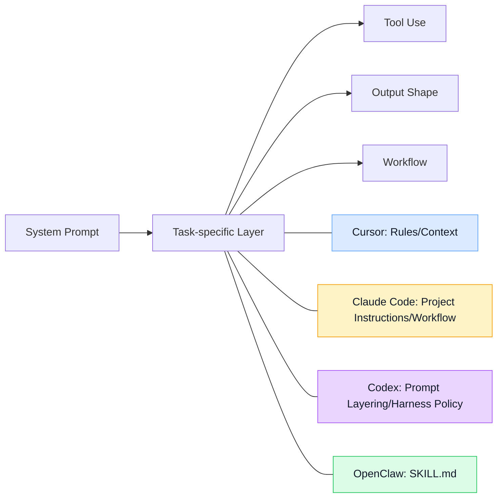
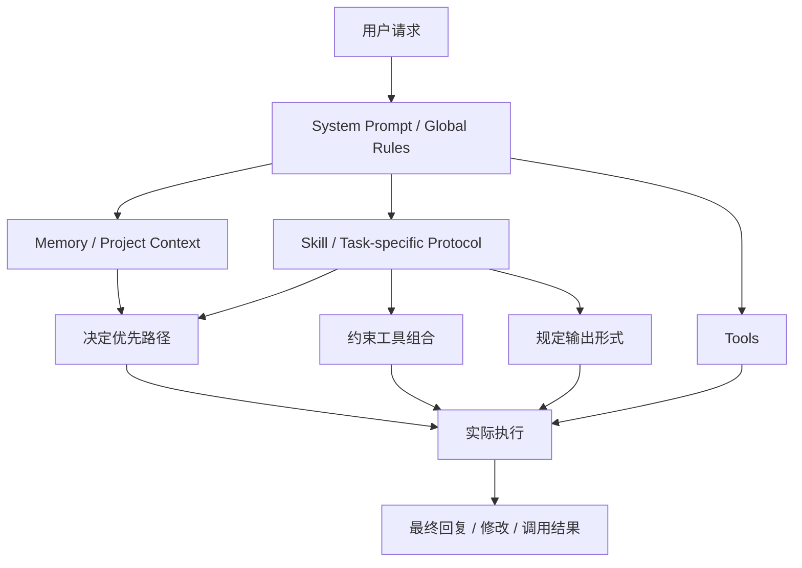

## 写在前面

这篇笔记想回答的，不是“某个具体产品怎么用”这种局部问题，而是一个更上层的机制问题：

> 在 agent / vibe coding / coding assistant 的语境里，**SKILL** 到底是什么？
> 它和 system prompt、tools、memory 分别是什么关系？
> 不同系统里那些看起来“像 skill”的东西，到底是不是同一类机制？

这里会以 **OpenClaw** 作为主要观察对象，再横向看 **Cursor、Claude Code、Codex** 这几类环境中与 skill 相近的机制。

我这里说的“SKILL”，并不预设它一定是某个产品里的官方名词；很多系统未必真的把这个层叫做 skill，但仍然存在一个功能上相似的层：

- 它不直接等于 tool
- 它也不只是全局 system prompt
- 它更像一个 **按任务加载的能力说明、工作流模板、执行协议**

---

## 1. SKILL 是什么

### 1.1 一个直观定义

如果把 agent system 粗略拆成几层，那么可以这样理解：

- **system prompt**：全局身份、总规则、最高优先级行为边界
- **tools**：实际可调用的能力接口
- **memory**：持久信息与上下文回忆层
- **skill**：围绕某类任务组织出来的操作说明与策略模板

所以，SKILL 更接近下面这个定义：

> **SKILL 是针对某类任务的可复用执行模块。**
> 它通常描述：什么时候使用、该怎么做、优先用哪些工具、哪些情况不要这么做、输出应长什么样。

它本身未必直接“执行”，但它会强烈影响 agent 的执行路径。

---

### 1.2 SKILL 不是 tool

这是最容易混淆的一点。

tool 回答的是：

- 你**能做什么**
- 你有哪些外部操作接口
- 你能不能读文件、发消息、调用 CLI、编辑代码

skill 回答的是：

- 你**在什么情境下该怎么做**
- 这些工具应该以什么顺序组合
- 某类任务的推荐策略是什么
- 哪些动作是默认动作，哪些情况要避免

换句话说：

| 层 | 核心问题 | 例子 |
| --- | --- | --- |
| tool | 能做什么 | read / write / exec / message |
| skill | 怎么做某类事 | 总结链接、检查 GitHub PR、创建新 skill、诊断 node 连接 |

一个简单比喻：

- **tool 像手术器械**
- **skill 像手术流程卡片**

没有器械，流程卡片无法落地；只有器械，没有流程卡片，也可能不会高质量地完成任务。

---

### 1.3 SKILL 也不是 system prompt

system prompt 往往是全局性的。

它定义：

- agent 是谁
- 整体行为边界是什么
- 安全与权限原则是什么
- 工具使用的一般约束是什么

skill 则更局部、更按需：

- 只有命中特定任务时才会被拉进上下文
- 只在某一类任务范围内提供额外指导
- 往往更具体，更接近执行现场

可以把两者理解成：

- **system prompt = 宪法 / 总法**
- **skill = 某类事务的专项工作手册**

这也是 skill 很有价值的原因：

如果把所有专项知识都塞进全局 prompt，会导致：

- prompt 过长
- 不相关规则污染上下文
- 不同任务之间互相干扰

skill 提供了一种更经济的模块化方式。

---

### 1.4 SKILL 更像一种“任务作用域内的 prompt 模块”

从实现角度看，很多 skill 本质上都不是神秘新东西，而是：

- 一段可按条件加载的说明文本
- 绑定了特定任务模式的操作规程
- 与工具、目录、CLI 约定相配合的局部 prompt 扩展

所以如果非要从抽象层面概括，我会把它写成：

> **SKILL 是 task-scoped prompt module。**

但这个定义还不够完整，因为好的 skill 往往还会附带：

- trigger description
- when to use / when not to use
- tool routing hints
- execution order
- output convention
- failure / fallback guideline

也就是说，它不只是“补充几句提示”，而是一个更像 **任务协议** 的东西。

---

## 2. SKILL 在 runtime 里如何被选择和触发

### 2.1 一个抽象流程

一个典型的 skill 触发流程，可以抽象成下面这样：

```text
用户请求
-> runtime / agent 判断任务类型
-> 在候选 skill 中做匹配
-> 命中 skill 后把其内容载入上下文
-> agent 按 skill 约定组织工具调用与输出
```

如果再拆细一点，会更像：

```text
user request
-> classify task
-> match skill descriptions / trigger phrases / scope
-> load skill instructions
-> combine with system prompt + available tools + memory
-> execute
```

这说明 skill 不是在真空里工作，而是和以下几层共同构成最终行为：

- 全局 prompt
- 当前任务
- 当前工具集
- 项目上下文
- skill 指令
- memory / durable notes

---

### 2.2 显式触发与隐式触发

skill 触发通常分两类。

#### 显式触发

用户直接说：

- 用 summarize.sh
- 创建一个 skill
- 看下 GitHub PR
- 诊断 node pairing 问题

这时 skill 基本等于“用户点名调用某个能力包”。

#### 隐式触发

系统自己根据任务描述判断：

- 这看起来是在总结链接
- 这看起来是在处理 GitHub 操作
- 这看起来是在做健康检查
- 这看起来是在分析旧会话日志

于是自动选择某个 skill。

一个成熟的 skill system 往往更依赖第二种，因为它希望 agent 具备“识别任务类型并挂载专项协议”的能力。

---

### 2.3 触发之后实际发生了什么

很多时候，“触发 skill”并不意味着出现一个新的子进程或特殊运行时对象；更常见的情况是：

- 某份 `SKILL.md` 被读取
- 其中的说明被纳入当前对话上下文
- agent 从中继承额外的任务约束

也就是说，skill 常常表现为：

- **上下文注入**
- **操作策略覆盖**
- **局部执行规范激活**

而不是一个独立的 executable artifact。

不同系统之间的差异也主要体现在这里：

- 有的系统把 skill 主要做成“指令文本”
- 有的系统把它进一步做成“命令模板 / 可安装包 / 可发现插件”

---

## 3. SKILL 和 system prompt / tools / memory 的关系

### 3.1 SKILL 与 system prompt：全局规则 vs 局部协议

system prompt 通常负责：

- agent 的角色身份
- 安全规则
- 总体行为边界
- 对工具、权限、回复风格的全局约束

skill 则负责：

- 某类任务的具体策略
- 某类任务的推荐路径
- 某类任务下的例外与禁忌

所以它们的关系不是替代关系，而是嵌套关系。

可以写成：

```text
system prompt
  └─ skill (task-specific)
       └─ concrete tool decisions
```

skill 经常是全局规则之下的“可插拔专项模板”。

---

### 3.2 SKILL 与 tools：能力接口 vs 工作流编排

tool 是能力接口，skill 是面向任务的组织层。

例如同样拥有：

- read
- write
- exec
- message

不同 skill 会让 agent 走出完全不同的路径：

- 总结 skill 会偏向读取源材料、抽取重点、压缩表达
- GitHub skill 会偏向 `gh` CLI、issue / PR 查询、review 流程
- healthcheck skill 会偏向检查系统状态、安全暴露面、OpenClaw 配置

所以 skill 更像：

> **把一组通用工具重新排列成某类任务的专用工作流**

---

### 3.3 SKILL 与 memory：知道什么 vs 该怎么做

memory 和 skill 的边界也很值得区分。

memory 更偏向：

- 持久事实
- 项目背景
- 偏好
- 之前做过的决定
- todo / 历史记录

skill 更偏向：

- 面对某类任务时应采取的策略
- 推荐的工具顺序
- 风险和例外处理
- 输出结构

所以可以把它们概括成一句：

- **memory 回答：你知道什么**
- **skill 回答：你该怎么做**

当然两者会互相补充：

- skill 提供任务协议
- memory 提供任务上下文

一个没有 memory 的 skill 会很机械；
一个没有 skill 的 memory 会很“知道很多，但不会干活”。

---

## 4. OpenClaw 里的 SKILL：一个显式、模块化的实现

### 4.1 OpenClaw 把 skill 做成了显式对象

在 OpenClaw 中，skill 不是隐喻，而是一个明确存在的概念。

从当前观察看，它有几个鲜明特征：

1. skill 有明确的名字、描述、位置
2. 每个 skill 以 `SKILL.md` 为核心承载文件
3. agent 在回答前，会先扫描 available skills 的 name + description
4. 如果恰好有一个 skill 明显匹配任务，就先读取它的 `SKILL.md`
5. skill 中会进一步规定：
   - 什么时候用
   - 什么时候不要用
   - 推荐命令
   - 推荐工具
   - 操作顺序
   - 限流 / 风险 / fallback

这意味着 OpenClaw 的 skill 机制不是“模型自己随便发挥出来的能力”，而是一个带有明确入口条件的专项协议层。

---

### 4.2 OpenClaw skill 的本体更像 markdown-based protocol module

它的一个很有意思的设计是：

- skill 本体是 markdown
- 既对人可读，也能被 agent 读入
- 可以携带 metadata、安装说明、触发短语、使用方式

这让它同时具备两种属性：

- **知识文档**
- **运行时指导模块**

这点和很多 purely-config-based 的系统不同。OpenClaw skill 更像一个“写在 markdown 里的任务协议说明书”。

---

### 4.3 OpenClaw 的 skill 触发机制

OpenClaw 当前的逻辑更接近：

1. 先扫描 available skills 的 description
2. 选择最具体、最匹配的 skill
3. 读取该 skill 的 `SKILL.md`
4. 再按 skill 的指导调用工具或执行流程

一个关键点是：

> 并不是所有 skill 都要预先加载进上下文。

这是它模块化的核心优势。只有在某类任务上，某个 skill 才进入当前上下文。

这比把所有专项知识压进 system prompt 更节省上下文预算，也更利于维护。

---

### 4.4 OpenClaw skill 的边界感很强

OpenClaw skill 通常不仅说“该做什么”，也说：

- **不适合什么时候用**
- 这类任务不要误用到哪里去
- 应该优先用什么一等工具
- 不要通过 exec 模拟消息发送等不必要绕路

这一点很重要。

因为好的 skill 不只是“提供能力”，它还承担：

- 避免误触发
- 避免错误路线
- 把 agent 从模糊选择中拉回到最佳路径

从这个角度看，skill 是一种 **约束性增强模块**。

---

## 5. `npx skill` 实际上是什么

### 5.1 它指向的是一个 npm CLI，不是 OpenClaw 的 skill 运行时

直接跑 `npm view skill` 和 `npx skill --help` 之后，可以确认几件事：

1. npm 上确实有一个包叫 `skill`
2. 当前版本是 `1.0.2`
3. 它的描述是：`CLI for installing skill packages into .codebuddy/skills`
4. 它的仓库是：`https://github.com/tonglei100/skill`
5. 它的帮助文本明确写的是“Download a skill package into .codebuddy/skills”

这已经足够说明：

> 这里的 `npx skill`，首先是一个**安装器**，不是一个 agent runtime 里的“技能执行层”。

---

### 5.2 它默认服务的是 CodeBuddy / Vercel Labs 那套 skill 包生态

把 npm 包内容解出来再看源码和 README，可以进一步确认：

1. 默认远程地址是：
   `https://github.com/vercel-labs/agent-skills/tree/main`
2. 它接受的包名格式是：
   `skills/<name>`
3. 典型用法是：
   - `npx skill skills/demo`
   - `npx skill skills/research-helper`
   - `npx skill skills/web-design-guidelines`
4. 安装目标目录固定是当前项目下的：
   `.codebuddy/skills/`

也就是说，它做的事很具体：

> 把远程仓库里的一个 skill 目录下载到本地项目的 `.codebuddy/skills/` 里。

这个动作更接近包安装或内容同步，而不是 agent 当场“触发某个 skill 并执行一套工作流”。

---

### 5.3 从实现上看，它本质上是一个远程目录安装器

从 `skill@1.0.2` 的 `dist/cli.mjs` 可以直接看到，这个 CLI 的核心流程大致是：

1. 把 `skills/<name>` 规范化成一个相对路径
2. 用默认 base URL 拼出远程 GitHub 地址
3. 尝试从远程 skill 目录里拉文件
4. 校验里面至少包含 `SKILL.md`
5. 原子性地写入当前项目的 `.codebuddy/skills/<name>`

它支持的远程布局也能从源码和 README 里直接看出来：

1. 只有一个 `SKILL.md` 的单文件 skill
2. 带 `index.json` 或 `manifest.json` 的多文件 skill
3. 直接递归抓取 GitHub 目录树的多文件 skill

所以，`npx skill` 在机制上更准确的定义是：

> 一个把远程 AgentSkills 风格目录安装到本地项目里的 **skill package installer**。

而不是“skill 本身”。

---

### 5.4 它和 OpenClaw skill 有相似的文件形态，但不是同一个系统

这里有一个容易混淆、但非常关键的点。

相似之处确实存在：

1. 两边都使用 `SKILL.md`
2. 两边都把 skill 当成一个目录，而不只是单条 prompt
3. 两边都允许多文件 skill，而不是只有一个 markdown 文件

更准确的说法是：

1. `npx skill` 面向的是 `.codebuddy/skills/` 目录
2. 它默认拉的是 `vercel-labs/agent-skills` 这套仓库内容
3. OpenClaw 的 skill 则加载自 bundled / `~/.openclaw/skills` / `<workspace>/skills`
4. OpenClaw 还会在加载阶段根据 OS、二进制、env、config 做 eligibility gating
5. OpenClaw 原生提供 `openclaw skills list/info/install/update/check` 这一整套技能管理命令

所以它们不是一个 runtime，也不是同一个安装体系。

更准确的关系是：

> 它们共享了相近的 **AgentSkills / `SKILL.md` 文件形态**，但处在不同产品和不同工作流里。

换句话说，名字相像不是巧合，机制也确实有亲缘关系；但不能把 `npx skill` 直接等同于 OpenClaw 的 skill 系统。

---

## 6. 不同 vibe coding 环境中的 skill-like mechanism

这一节只做一件事：把几套常见环境里承担“任务专项化”职责的对象，放到同一张表上看。

核心问题不是“谁更强”，而是：

> 当系统需要把通用 agent 拉向某一类具体任务时，真正起作用的那一层是什么。

---

### 6.1 Cursor：任务专项化更多落在 rules、instructions 和编辑器上下文上

如果只看产品表面，Cursor 并没有把 `skill` 做成 OpenClaw 这种显式对象。

更容易观察到的几个层是：

- project rules / user rules
- custom instructions
- 当前工作区、当前文件、选中代码、引用文件
- agent mode 与工具可用性
- 外接 MCP / integrations

这意味着 Cursor 的“任务专项化”并不是通过一个独立 `SKILL.md` 文件完成的，而是通过几种对象共同完成：

1. 规则层决定默认行为边界
2. 编辑器上下文决定当前任务的语义重心
3. 工具与集成决定可执行路径

因此，如果一定要在 Cursor 里找一个最接近 skill 的层，它更像是：

> rules + instructions + editor context 的组合体

这和 OpenClaw 的区别不在于“有没有专项化”，而在于“专项化是集中成一个对象，还是分散在多层里”。

---

### 6.2 Claude Code：更接近项目指令、命令工作流和会话中的任务习惯

Claude Code 这类 coding agent 环境里，也能看到一层很明显的任务专项化机制，但载体和 OpenClaw 不一样。

更接近这一层的对象通常是：

- 项目级 instructions
- 命令工作流 / slash command
- 工具使用约定
- 会话内逐渐稳定下来的任务操作习惯

换句话说，Claude Code 里确实存在“做某类任务时优先走哪条路径”的结构，但这个结构未必被命名为 skill，也未必收拢成单个文件实体。

更适合描述它的说法是：

> 任务专项化被拆散在项目指令、命令入口、工具约定和会话行为里。

所以它与 OpenClaw 的差异，主要不是能力差异，而是信息架构差异：

1. OpenClaw 把专项协议收进一个显式 skill
2. Claude Code 更像把这层分布在项目规则和操作流里

---

### 6.3 Codex：任务专项化更多表现为 prompt layering、tool policy 和 harness 约束

Codex 这一侧更明显的特征是：

- system / developer prompt layering 很强
- tool policy 与 harness 约束直接塑造执行路径
- session 级约束会显著改变行为
- 明面上通常没有一个统一叫 `skill` 的对象

因此，用 `skill` 这个词去看 Codex，真正该看的不是文件名，而是：

1. 哪些约束在重排工具使用顺序
2. 哪些提示层在缩窄任务解法空间
3. 哪些 harness 规则在把通用模型压成某种固定工作模式

从这个角度说，Codex 当然也有“任务专项化层”；只是这一层更像运行时结构，而不是一个可列举、可单独维护的内容对象。

这也是它和 OpenClaw 的关键差别：

- OpenClaw：专项层以 `SKILL.md` 这类对象显式出现
- Codex：专项层更多分散在 prompt、tool policy、harness 和 session 约束中

---

### 6.4 OpenClaw：显式 skill registry + markdown protocol module

OpenClaw 是这几个里最“把 skill 当成独立层”来设计的。

它的优势在于：

- 可枚举
- 可维护
- 可文档化
- 可按需触发
- 可明确写出使用边界
- 可对 agent 行为做专项约束

这使得 OpenClaw 的 skill 非常适合：

- 特定任务频繁复用
- 明确需要某套流程模板
- 某类任务需要强约束和高一致性
- 想让 agent 在不同专项任务之间有清晰切换

从信息架构角度看，这种设计非常干净。

---

## 7. 横向对比表

### 7.1 机制定位对比

| 维度 | Cursor | Claude Code | Codex | OpenClaw |
| --- | --- | --- | --- | --- |
| 专项化层是否被显式命名 | 没有统一的独立 skill 对象 | 没有统一的独立 skill 对象 | 通常不以 skill 对象出现 | 明确以 skill 出现 |
| 更接近哪类载体 | rules / instructions / editor context | project instructions / command workflow / tool conventions | prompt layering / tool policy / harness constraints | `SKILL.md` + skill metadata |
| 任务专项化主要落在哪里 | 规则层与当前编辑器上下文 | 项目指令与命令工作流 | runtime 约束与提示层组织 | 可读取的专项协议对象 |
| 是否容易单独列举和维护 | 一般 | 一般 | 较弱 | 强 |
| 与 OpenClaw 的主要差别 | 专项化分散在多层 | 专项化分散在项目操作流 | 专项化偏运行时结构 | 专项化被实体化成模块 |

---

### 7.2 抽象层级对比



这个图想表达的是：

- 四者都存在某种“任务专项化层”
- OpenClaw 把这一层实体化成了可以列举和维护的对象
- 其他几家更多把这一层分散在 rule、instruction、prompt、tool policy 或 harness 里

---

## 8. 一个更清晰的图：SKILL 在 agent stack 里的位置



这张图的核心意思是：

- skill 不在最底层执行
- skill 也不在最顶层统治一切
- skill 处在一个很中间但很关键的位置：
  - 它连接任务理解
  - 它重排工具使用
  - 它把通用 agent 拉向专项 agent

---

## 9. 结论

### 9.1 skill 是一个“中层抽象”

如果把 agent system 只看成：

- prompt
- tools
- memory

会遗漏一个非常关键的层：

> **任务专项化层**

skill 就是这个层最典型的名字之一。

它的价值在于：

- 让 agent 不必每次从零推理某类任务怎么做
- 让专项经验可复用
- 让行为约束可模块化维护
- 让系统不必把所有知识堆到全局 prompt

---

### 9.2 “有没有 skill”不重要，重要的是“这个层有没有被设计出来”

不同产品对这个层的命名不同：

- 有的叫 skill
- 有的叫 rules
- 有的叫 instructions
- 有的藏在 runtime / harness policy 里

所以讨论时更准确的问法应该是：

> 这个系统是否有一个**按任务加载的专项行为层**？

而不是只问：

> 它有没有一个叫 skill 的文件？

---

### 9.3 OpenClaw 的特色，是把这个层做得非常显式

> OpenClaw 的 skill 机制，把 agent 中本来常常隐式存在的一层，明确地实体化了。

这会带来几个直接好处：

- 更容易维护
- 更容易审查
- 更容易做任务边界管理
- 更适合沉淀专项能力
- 更适合做“一个 agent 支持很多任务，但不污染全局 prompt”的架构

---

## 10. 后续可以补的点

`npx skill` 这一块已经不需要再停留在定义辨析上。

后面更值得继续补的是这两块：

### 10.1 把不同系统里的 skill-like object 拆到更细

重点是：

- Cursor rules / project instructions 的实际载体和优先级
- Claude Code 的项目指令、命令工作流、slash command 到底怎么分层
- Codex 的 prompt layering、harness policy、ACP 会话约束分别落在哪一层
- 哪些对象是用户可编辑的，哪些其实只是 runtime 内部机制

### 10.2 补一张更具体的产品映射表

比如：

| 系统 | 官方名词 | 实体载体 | 触发方式 | 更像哪一层 |
| --- | --- | --- | --- | --- |
| Cursor | rules / instructions | 配置 / 规则 | 项目与上下文 | 任务规则层 |
| Claude Code | instructions / workflow | 项目指令 / 命令 | 任务语境 | 行为模板层 |
| Codex | 无统一显式 skill | prompt + harness | runtime 组织 | 隐式任务专化层 |
| OpenClaw | skill | `SKILL.md` | skill matching | 显式 task module |

---

## 一句总结

> **SKILL 不是 tool，也不是 memory，更不是整个 system prompt。**
> 它是 agent system 中负责“把一类任务做成可复用执行协议”的那一层。  
> OpenClaw 把这一层做成了明确的 `SKILL.md` 模块；而 Cursor、Claude Code、Codex 往往也有类似层，只是更隐式、分散或弱命名。
