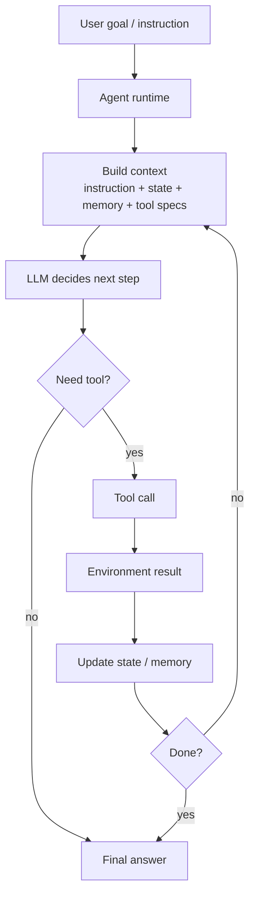
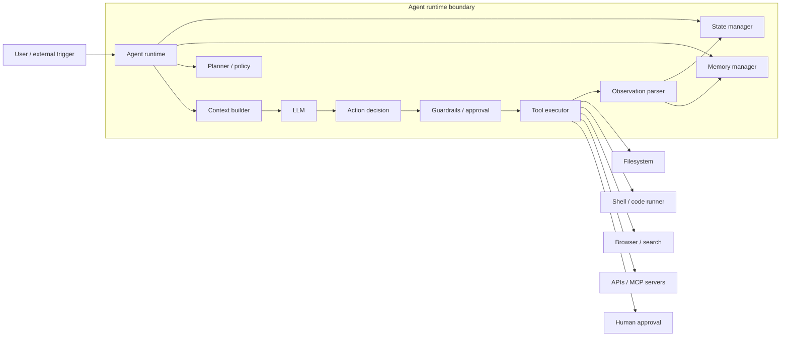

## 写在前面

这篇先不追某个具体框架，而是想把 **agent architecture** 这个 concept 搞清楚。

我现在对 agent 的最小定义是：

> Agent = LLM + tools + memory + state + control loop + environment feedback

普通 chatbot 更像是：

```text
user input -> model -> text output
```

而 agent 更像是：

```text
goal -> observe -> think/plan -> act -> observe result -> continue/stop
```

所以 agent 的重点不只是“模型更聪明”，而是：把一个不稳定的推理核心，包进一个可以观察、行动、记忆、纠错的系统外壳里。

---

## 1. 最小 agent loop

最小的 agent loop 可以画成这样：



用伪代码写就是：

```python
state = init_state(goal)

while not state.done:
    context = build_context(goal, state, memory, tools)
    decision = model(context)

    if decision.type == "final":
        break

    result = execute_tool(decision.tool_call)
    state = update_state(state, decision, result)
```

这里最重要的不是某个 prompt 写法，而是 **closed loop**：

- 模型每次只决定下一步
- 工具把动作落到外部环境
- 环境结果再回到上下文里
- runtime 决定是否继续、暂停、请求批准或结束

如果没有这个 loop，所谓 agent 很可能只是一个会输出 JSON 的 chatbot。

---

## 2. 核心组件

### 2.1 Model

LLM 在 agent 里通常负责：

- 理解目标
- 分解任务
- 选择工具
- 读懂工具返回
- 总结当前状态
- 判断任务是否完成

但 LLM 本身没有真实行动能力。它最多只能“提出一个动作”，真正的副作用要由 runtime 或 tool executor 执行。

所以我更愿意把 model 看成：

> decision engine, not the whole agent

这也是为什么只讨论模型能力不够。一个 agent system 的质量，往往取决于 model 外面的控制层。

### 2.2 Tools

Tools 是 agent 影响外部世界的接口。

常见 tool：

- file read / write
- shell command
- browser / search
- database query
- GitHub / Slack / Notion API
- code execution
- internal business API

工具设计里比较关键的是：

- tool name 是否表达清楚
- 参数 schema 是否严格
- 返回结果是否足够结构化
- 失败信息是否可恢复
- 是否需要 human approval
- 是否有权限边界

这部分可以和 [[computer_sci/llm/agent/model_context_protocol_mcp|Model Context Protocol MCP]] 连起来看。MCP 解决的主要不是“模型怎么推理”，而是 agent runtime 如何标准化接入外部 tools / resources / prompts。

### 2.3 Memory

Memory 不是一个单一东西，至少可以拆成几层：

| 类型 | 作用 |
| --- | --- |
| short-term memory | 当前上下文窗口里的对话和工具结果 |
| working memory | 当前任务状态、计划、TODO、临时发现 |
| long-term memory | 用户偏好、项目约定、历史决策 |
| external memory | 文件系统、数据库、向量库、知识库 |

很多 agent 失败不是因为不会推理，而是因为状态管理太差：

- 忘记原始目标
- 重复做已经做过的事
- 误以为某个动作已经执行
- 把旧 observation 当成当前事实

所以 memory 的关键不是“存得越多越好”，而是：

> 让 agent 在下一步行动时看到正确的、足够少的、可验证的状态。

### 2.4 State

State 是 agent runtime 对当前任务的显式记录。

它可能包括：

- 当前目标
- 已完成步骤
- 当前计划
- 工具调用历史
- 当前文件 / 页面 / workspace
- 错误信息
- approval 状态
- token / cost / time budget
- 是否允许联网、写文件、执行命令

State 和 memory 有重叠，但关注点不同：

- memory 更像“可回忆的信息”
- state 更像“当前执行机的寄存器”

没有 explicit state 的 agent 很容易变成“每一步都重新猜自己在哪里”。

### 2.5 Planner

Planner 负责决定“接下来怎么做”。

常见形态：

- no explicit planning：模型直接下一步行动
- plan-and-execute：先写计划，再逐步执行
- dynamic planning：执行过程中不断改计划
- hierarchical planning：高层任务拆成多个子任务或子 agent

我现在的理解是：

> Planning 是降低任务复杂度；acting 是把计划接到真实环境。

简单任务可以不显式 planning；复杂任务如果没有 planning，agent 很容易在局部 action 里迷路。

### 2.6 Executor

Executor 负责真正执行动作。

例如：

- 调用 tool
- 写文件
- 跑测试
- 发消息
- 查询数据库
- 创建 PR

这层不应该完全交给模型自由发挥。更合理的是：

- model 产出 intent / tool call
- runtime 校验 schema 和权限
- executor 执行
- result 被结构化回传

这也是 [[computer_sci/llm/agent/ai_code_agent_hooks|AI Code Agent Hooks]] 有价值的地方：hook 可以在 tool use 前后插入安全、审计、格式化、检查等机制，让执行过程更像工程系统。

---

## 3. 一个更完整的 agent runtime

如果把上面的组件放在一起，架构大概是：



这个图里我觉得最该注意的是 **runtime boundary**。

真正的 agent product 不是让 LLM 直接拿到所有工具，而是 runtime 在中间做：

- context selection
- tool registration
- permission control
- state persistence
- approval workflow
- execution logging
- error recovery
- budget control

模型只是其中一个组件。

---

## 4. 常见控制模式

### 4.1 ReAct

ReAct 可以理解成：

```text
Thought -> Action -> Observation -> Thought -> ...
```

它的优点是简单，而且很自然地适配 tool calling。模型看到 observation 后再决定下一步。

缺点也明显：

- 容易慢
- 容易循环
- 对复杂任务缺少全局结构
- 每一步都依赖模型保持方向感

### 4.2 Plan-and-Execute

Plan-and-execute 更像：

```text
Goal -> Plan -> Execute step 1 -> Execute step 2 -> Re-plan if needed -> Final
```

适合：

- coding task
- research task
- multi-step data workflow
- 长链路自动化

但 plan 不能太死。环境反馈可能推翻初始计划，所以好的 runtime 要允许 re-plan。

### 4.3 Reflection / Critic

Reflection 是让 agent 对自己的输出或行动做检查：

```text
draft -> critique -> revise
```

适合：

- 写作
- code review
- reasoning-heavy task
- safety-sensitive task

不过 reflection 不是免费午餐。它会增加 token、延迟和复杂度，而且 critic 也可能错。

### 4.4 Multi-agent

Multi-agent 通常会把不同角色拆开：

- planner
- researcher
- coder
- reviewer
- executor

听起来很强，但我现在会更谨慎看它：

> Multi-agent 不一定更智能，很多时候只是把 prompt、state、handoff 和 debug 问题放大了。

适合 multi-agent 的场景通常是：

- 任务天然有多角色边界
- 每个角色需要不同工具权限
- 需要独立审查
- 需要并行探索

如果只是为了“看起来更 agentic”，单 agent + 清晰 state 可能更稳。

---

## 5. 三个架构层级

### Level 1: Prompted Agent

只有 prompt + tools。

特点：

- 容易 demo
- 容易理解
- 不太稳定
- 缺少持久状态和审计

很多 toy agent 都停在这一层。

### Level 2: Runtime Agent

有明确 runtime：

- tool registry
- memory manager
- state machine
- approval system
- error handling
- logging

Coding agent、browser agent、research agent 通常需要到这一层才真正可用。

### Level 3: Product Agent

面向真实用户和业务环境：

- auth / RBAC
- audit log
- human-in-the-loop
- rollback
- monitoring
- evals
- cost control
- deployment
- incident handling

真正难的地方往往在 Level 3。

一个 agent demo 可能只需要 100 行代码；一个生产 agent 需要回答“它失败时怎么办、越权时怎么办、用户如何知道它做了什么、如何回滚”。

---

## 6. 常见 failure modes

Agent 常见失败模式：

| Failure mode | 表现 |
| --- | --- |
| goal drift | 做着做着忘记原始目标 |
| tool misuse | 工具选错、参数错、误解返回结果 |
| infinite loop | 一直重复无效动作 |
| hallucinated state | 以为自己已经做了某件事 |
| context pollution | 历史太长，关键信息被淹没 |
| over-planning | 计划很多，但不执行 |
| under-observation | 不检查工具结果，直接继续猜 |
| unsafe action | 执行不可逆或越权操作 |
| hidden dependency | 成功依赖某个没被记录的外部条件 |

这些问题大多不是单靠换更强模型就能解决的。它们更像系统设计问题。

---

## 7. 一些设计原则

我现在会用这些原则检查一个 agent 架构：

- Make state explicit.
- Keep tools small and typed.
- Prefer observable actions.
- Require approval for irreversible actions.
- Separate planning from execution when task is complex.
- Give the model enough context, but not everything.
- Log every action.
- Make failure recoverable.
- Treat memory as curated state, not a dumping ground.
- Add evals before trusting repeated automation.

更短一点：

> Agent architecture is control engineering around an unreliable reasoning core.

---

## 8. 和已有概念的关系

这篇可以和几篇现有 note 放在一起看：

- [[computer_sci/llm/agent/model_context_protocol_mcp|MCP]]：外部 tools / resources / prompts 怎么接入 agent runtime
- [[computer_sci/llm/agent/agent_SKILL_mechanism|SKILL]]：某类任务的可复用执行协议
- [[computer_sci/llm/agent/ai_code_agent_hooks|Hooks]]：agent 生命周期里的安全、审计和自动化插槽
- [[computer_sci/llm/agent/chat_to_agent_connector|Chat-to-Agent Connector]]：chat 平台如何变成 agent trigger
- [[computer_sci/llm/agent/agent_frameworks_overview|Agent Frameworks Overview]]：这些架构思想在不同框架里如何落地

---

## 9. My mental model

我现在会这样总结：

> Agent 不是一个“会自己干活的模型”，而是一个围绕模型搭出来的行动系统。

更工程一点：

> Agent 架构的核心，不是让 LLM 变成万能大脑，而是给它一个可以观察、行动、记忆、约束、纠错的 runtime。
