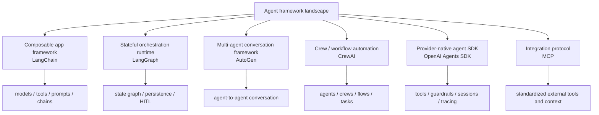
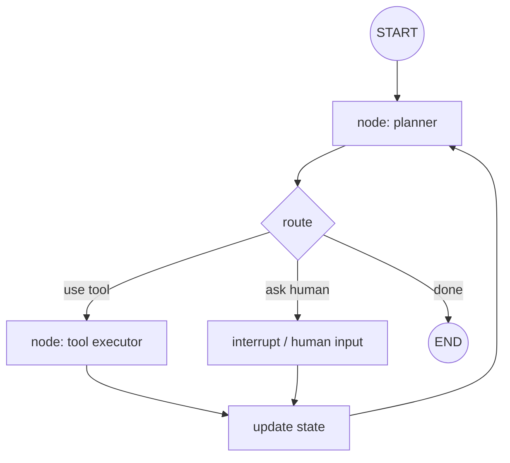
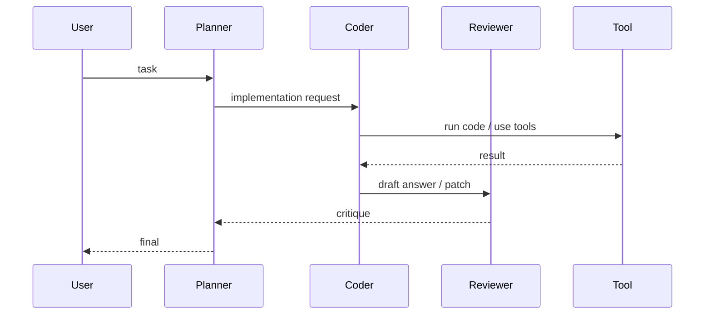
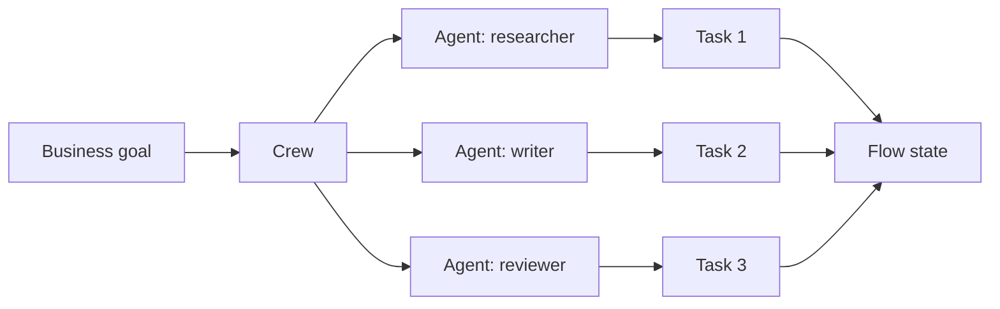
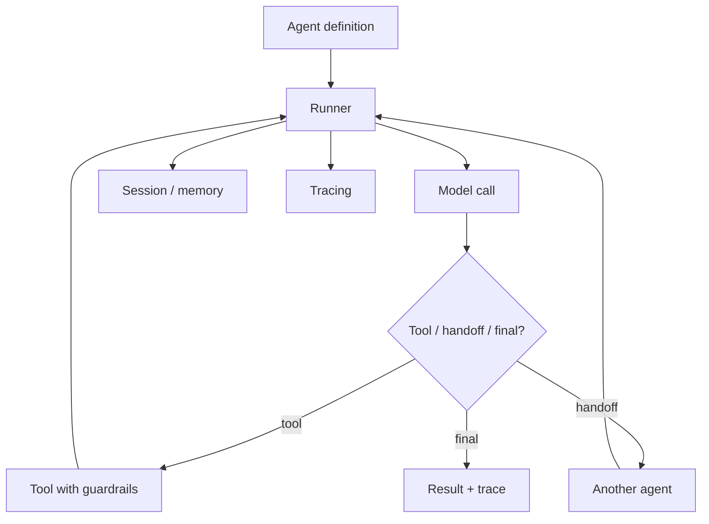

## 写在前面

这篇接在 [[computer_sci/llm/agent/agent_architecture_overview|Agent Architecture Overview]] 后面，目的不是马上选一个框架下注，而是先建立一张地图：

> 不同 agent framework 到底在帮我解决 agent architecture 里的哪一层问题？

我先把框架分成几类：

这张图里最容易混淆的是：有些东西是 **framework**，有些是 **runtime**，有些是 **protocol**，有些是 **product platform**。

---

## 1. 先按架构层分类

### 1.1 Integration layer

这一层解决：

- 外部工具怎么暴露给 agent
- 数据源怎么读
- tool schema 怎么描述
- connector 怎么复用

典型代表：

- [[computer_sci/llm/agent/model_context_protocol_mcp|MCP]]
- provider function calling
- framework-specific tool abstraction

MCP 更像 integration protocol，不是完整 agent framework。

### 1.2 Agent loop / app framework

这一层解决：

- prompt / model / tool 如何组合
- tool calling loop 怎么跑
- chain / runnable / agent abstraction 怎么写
- 快速搭一个 LLM app

典型代表：

- LangChain
- OpenAI Agents SDK
- provider SDKs

### 1.3 Orchestration runtime

这一层解决：

- 状态如何持久化
- 长任务如何恢复
- 中途如何 human-in-the-loop
- 多步骤流程如何可视化、可调试、可部署

典型代表：

- LangGraph
- AutoGen Core
- CrewAI Flows

### 1.4 Multi-agent coordination

这一层解决：

- 多个 agent 如何对话
- 谁负责规划，谁负责执行，谁负责 review
- handoff 怎么发生
- agent team 怎么组织

典型代表：

- AutoGen AgentChat
- CrewAI Crews
- LangGraph subgraphs / supervisor pattern

---

## 2. LangChain

LangChain 更像 LLM app 的基础组件层。

它长期提供：

- model integration
- prompt templates
- tools
- retrievers
- chains / runnables
- prebuilt agents

在 agent 语境里，我更愿意把 LangChain 看成：

> 适合快速组合 LLM application components 的 framework。

但如果任务变成长时间运行、复杂状态、人类审批、可恢复执行，LangChain 本身就不是最核心的抽象了。LangChain 官方文档也把 LangGraph 放在更底层的 agent orchestration runtime 位置：LangChain 提供 agent framework 和集成组件，LangGraph 负责 durable execution、streaming、human-in-the-loop、persistence 这类 orchestration 能力。[1]

什么时候适合先看 LangChain：

- 做 RAG
- 做普通 tool calling app
- 快速接很多模型和工具
- 需要大量现成 integration
- agent loop 不复杂

什么时候要小心：

- 业务状态复杂
- 需要恢复长任务
- 需要精确控制流程
- debug 成本比 demo 速度更重要

---

## 3. LangGraph

LangGraph 是我目前最想重点理解的框架之一，因为它直接对应 [[computer_sci/llm/agent/agent_architecture_overview|agent architecture]] 里的 state / runtime / control loop。

官方把它描述成一个 low-level orchestration framework and runtime，用于构建、管理和部署 long-running、stateful agents。[1]

它强调的能力包括：

- persistence
- fault tolerance
- streaming
- interrupts
- human-in-the-loop
- memory
- subgraphs
- deployment

LangGraph 的核心心智模型是：

它和简单 agent loop 的区别是：

- state 是一等公民
- graph 明确描述控制流
- node 可以是 LLM、tool、普通函数或子图
- 可以 checkpoint 和 resume
- 可以在中间插入 human approval

我对它的初步判断：

> LangGraph 适合用来学习 “agent as stateful workflow” 这个方向。

如果只是写一个很薄的 chatbot，LangGraph 可能偏重；但如果要做 code agent、research agent、数据处理 agent，它的抽象更接近真实问题。

---

## 4. AutoGen

AutoGen 的主线是 multi-agent conversation。

现在的官方文档把它拆成几块：[2]

- **AgentChat**：构建 conversational single-agent / multi-agent app 的 Python framework
- **Core**：event-driven programming framework，用于 scalable multi-agent AI systems
- **Extensions**：连接外部服务和其他库，比如 MCP、OpenAI Assistant API、Docker code executor、gRPC runtime
- **Studio**：不用写代码快速 prototype agent 的 web UI

这说明 AutoGen 不只是“几个 agent 聊天”的 demo，而是在往 event-driven multi-agent runtime 方向走。

AutoGen 的典型 mental model：

什么时候适合看 AutoGen：

- 想研究 multi-agent conversation pattern
- 任务天然可以拆成多个角色
- 需要 agent-to-agent message passing
- 想做 research prototype
- 需要 event-driven distributed agent runtime

什么时候要小心：

- 多 agent 增加 debug 难度
- 角色 prompt 很容易变成表演
- state 和责任边界不清楚时会互相甩锅
- 对简单任务可能过度设计

---

## 5. CrewAI

CrewAI 更偏 “team / workflow automation” 的表达方式。

官方文档把它放在 collaborative AI agents、crews、flows 这个语境里，并强调 agents、crews、flows、guardrails、memory、knowledge、observability 等能力。[3]

它的几个核心词：

- **Agents**：带 role / goal / tools / memory 的执行者
- **Tasks**：具体要完成的工作
- **Crews**：多个 agents 协作
- **Processes**：sequential / hierarchical / hybrid
- **Flows**：更可控的 event-driven workflow，可管理 state、persist execution、resume long-running workflows

可以这么理解：

CrewAI 的优势是表达上很贴近业务自动化：

- 谁负责什么
- 按什么流程跑
- 哪些 task 需要 guardrail
- 哪些 flow 需要触发器和恢复

什么时候适合看 CrewAI：

- 想快速建 multi-agent workflow
- 业务上确实有角色/任务划分
- 想把 agent 接到 Slack、Gmail、Salesforce 这类业务触发器
- 更关心 automation 交付，而不是研究底层 runtime

什么时候要小心：

- “给 agent 分角色”不等于系统就可靠
- crew 的自然语言配置可能隐藏控制流复杂度
- 对底层执行语义和状态边界仍然要自己理解

---

## 6. OpenAI Agents SDK

OpenAI Agents SDK 是 provider-native agent SDK。

从官方文档目录看，它直接覆盖 agent product 常见部件：[4]

- agents
- models
- tools
- guardrails
- running agents
- streaming
- orchestration
- handoffs
- human-in-the-loop
- sessions
- context management
- MCP
- tracing
- realtime / voice agents

它的意义不只是“更方便调用 OpenAI 模型”，而是把 agent runtime 里的很多横切能力打包成 SDK 级抽象。

我会这样理解：

什么时候适合看：

- 主要使用 OpenAI 模型
- 想要 provider-supported tool / guardrail / tracing / session abstraction
- 想理解现代 agent SDK 的标准部件
- 想把 MCP、handoff、human-in-the-loop 放进一个统一 SDK

什么时候要小心：

- provider-native SDK 可能和特定模型生态绑定更深
- 如果需要强跨模型可移植性，要留意抽象边界
- 生产系统仍然需要自己设计权限、数据边界、evals 和 observability

---

## 7. 一个选型表

| 目标 | 优先看 |
| --- | --- |
| 快速做一个 LLM app / RAG / tool calling demo | LangChain |
| 学习 stateful agent runtime | LangGraph |
| 做可恢复、可中断、可观察的长任务 agent | LangGraph |
| 研究多 agent 对话和协作 | AutoGen |
| 做业务自动化里的角色/任务/流程编排 | CrewAI |
| 基于 OpenAI stack 做 agent product prototype | OpenAI Agents SDK |
| 标准化接入外部工具和数据源 | MCP |

我自己的学习顺序会是：

1. 先用 [[computer_sci/llm/agent/agent_architecture_overview|Agent Architecture Overview]] 建 mental model
2. 看 LangGraph，理解 state graph / checkpoint / interrupt
3. 看 OpenAI Agents SDK，理解 provider-native runtime 怎么组织 tools / handoffs / tracing
4. 看 AutoGen，理解 multi-agent message passing
5. 看 CrewAI，理解业务 workflow automation 的抽象
6. 回头把 MCP 作为 tools/context 接入层补完整

---

## 8. 不要被 framework 名字带偏

我觉得比较危险的学习方式是：

> 先选框架，再反过来接受它对 agent 的定义。

更稳的方式应该是：

1. 先搞清楚 agent architecture 的基本组件
2. 再问某个 framework 强化了哪一层
3. 看它牺牲了什么控制权
4. 用一个小任务跑通
5. 再决定要不要继续深入

框架不是 agent 的本体。框架只是把 loop、state、tools、memory、handoff、observability 这些东西做成某种风格的 API。

---

## References

[1] [LangGraph overview - Docs by LangChain](https://docs.langchain.com/oss/python/langgraph/overview)

[2] [AutoGen - official documentation](https://microsoft.github.io/autogen/stable/)

[3] [CrewAI Documentation](https://docs.crewai.com/)

[4] [OpenAI Agents SDK](https://openai.github.io/openai-agents-python/)

