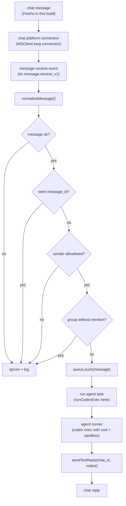

## 起因

这次我只是想做一个很小的入口：在飞书里发一句话，让本地 Codex 到指定 repo 里跑一次任务，再把结果发回飞书。

一开始我把这个东西叫成 `Agent Socket`，后来想想这个名字有点大。更普通一点，它就是一个 **Chat-to-Agent connector**：前面可以是飞书、Slack、Discord，后面也不一定非得是 Codex，可以是任何一个本地或远程 agent runner。

第一版我不想碰长期会话，也不想先设计 MCP / memory / skill 那些层。先把这条最短路径跑通：

```text
Feishu text message
-> local service
-> codex exec
-> Feishu reply
```

真正要小心的地方在中间那层 local service。它不能把飞书消息原样丢给 Codex，至少要先知道这条消息是谁发的、是不是文本、是不是重复、群聊里是不是在叫 bot。

## 跑通的链路

最后的链路长这样：



代码拆得也很直：

- `index.ts` 接飞书事件，把几个模块串起来
- `message.ts` 把飞书 event 压成内部消息
- `config.ts` 读 env，也顺手限制 sandbox
- `codex.ts` 包一层 `codex exec`
- `reply.ts` 负责发回飞书，长输出就切块

## 入口先用飞书长连接

### 为什么不用 webhook

我没有做公网 webhook。原因很简单：本地调试 webhook 很烦，得先处理 callback URL，常常还要开 ngrok。飞书 SDK 里的 long connection 对这个小项目刚好够用。

### 只订阅一类事件

入口代码大概是：

```ts
const eventDispatcher = new Lark.EventDispatcher({}).register({
  'im.message.receive_v1': async (data: unknown) => {
    const message = normalizeMessage(data as Parameters<typeof normalizeMessage>[0]);
    // gates...
    queue.push(message);
  },
});

const wsClient = new Lark.WSClient({
  appId: config.feishuAppId,
  appSecret: config.feishuAppSecret,
  domain: config.feishuDomain,
  autoReconnect: true,
});

await wsClient.start({ eventDispatcher });
```

这里只订阅 `im.message.receive_v1`。我不想第一版就把它做成通用飞书 bot，只要它能接文本消息就行。

## 先把飞书消息压扁

### 内部消息结构

飞书给的 event 很大，但我后面其实只需要这些东西：

```ts
{
  messageId,
  chatId,
  chatType,
  senderOpenId,
  text,
  mentionedBot,
}
```

所以 `message.ts` 里先做 `normalizeMessage()`。这一步会顺便丢掉不是文本的消息，缺字段的也直接返回 `null`。

### 从 content 里取 text

文本内容还要从 `message.content` 里 parse 出来：

```ts
function parseTextContent(content: string | undefined): string | null {
  if (!content) {
    return null;
  }
  try {
    const parsed = JSON.parse(content) as { text?: unknown };
    return typeof parsed.text === 'string' ? parsed.text : null;
  } catch {
    return null;
  }
}
```

### 去掉 mention key

群聊里还有一个细节：mention bot 的时候，正文里会混进 mention key。我不想把这坨东西一起交给 Codex，所以又做了一次 stripping：

```ts
function stripMentionKeys(text: string, mentions: Array<{ key?: string }>): string {
  return mentions
    .reduce((current, mention) => {
      if (!mention.key) {
        return current;
      }
      return current.replaceAll(mention.key, ' ');
    }, text)
    .replace(/\s+/g, ' ')
    .trim();
}
```

这样群里发：

```text
@bot inspect this repo
```

真正传给 Codex 的就是：

```text
inspect this repo
```

这不是复杂的 prompt rewrite，只是把飞书平台自己的噪声去掉。

## 几个 gate

### 入口处先挡掉不该跑的消息

我后来觉得这几行比 `codex exec` 本身更关键：

```ts
if (!message) {
  logger.warn('ignored empty or unsupported message');
  return;
}
if (deduper.seen(message.messageId)) {
  logger.info('ignored duplicate message', { messageId: message.messageId });
  return;
}
if (!isAllowedSender(message.senderOpenId, config.allowedOpenIds)) {
  logger.warn('ignored unauthorized sender', {
    messageId: message.messageId,
    senderOpenId: message.senderOpenId,
  });
  return;
}
if (message.chatType === 'group' && !message.mentionedBot) {
  logger.info('ignored group message without bot mention', { messageId: message.messageId });
  return;
}
```

这里先挡四件事：

- 解析不出来的消息
- 飞书重送造成的重复消息
- 不在 allowlist 里的用户
- 群聊里没有 mention bot 的普通聊天

### allowlist

allowlist 用的是 `FEISHU_ALLOWED_OPEN_IDS`。这个地方我不想偷懒，因为后面接的是本地 Codex，不是一个只会回笑话的聊天机器人。

### group mention

群聊 mention 现在还是简化版。因为我没单独配 bot 自己的 open_id，所以只要 event 里有 mentions metadata，就当作是在叫 bot。这个对第一版够用，但它不是严格的 bot identity check。

### dedupe

dedupe 也是内存版。这个服务现在就是单实例本地跑，先不用 Redis。

## 为什么中间放一个 queue

### 事件回调不要卡住

收到飞书消息以后，我没有直接在 event handler 里跑 Codex，而是先丢进队列：

```ts
queue.push(message);
```

worker 里再执行：

```ts
const output = await runCodexExec(message.text, {
  cwd: config.codexCwd,
  model: config.codexModel,
  sandbox: config.codexSandbox,
  timeoutMs: config.codexTimeoutMs,
});
```

这个 queue 没有很高级。它只是让我不要在飞书事件回调里卡几分钟。Codex 任务慢的时候，入口仍然可以很快把消息处理完。

### 并发先保守

`WORKER_CONCURRENCY` 默认是 `1`。对这个项目来说我觉得刚好。一个本地 repo 同时被多个 Codex 任务改来改去，反而更容易乱。

## 先用 codex exec

### 一条消息就是一次任务

第一版没有做 Codex session，只是包了一层 `codex exec`：

```ts
const args = ['exec', '--cd', options.cwd];
if (options.model) {
  args.push('--model', options.model);
}
args.push('--sandbox', options.sandbox, prompt);
```

这个选择很笨，但好处是清楚。一条飞书消息就是一次 Codex 任务，跑完就结束。

### 暂时放弃的能力

缺点也摆在这里：

- 不记得上一条消息
- 不知道飞书 thread 历史
- 没法自然 `/cancel`
- 没有 streaming status

但我暂时不想为了这些把第一版变复杂。

## 执行边界写硬一点

### 固定 cwd 和 sandbox

这里我主要盯三个 env：

```text
CODEX_CWD
CODEX_SANDBOX
CODEX_TIMEOUT_MS
```

`CODEX_CWD` 决定 Codex 在哪个 repo 里跑：

```ts
const args = ['exec', '--cd', options.cwd];
```

`CODEX_SANDBOX` 只让它是：

```text
read-only
workspace-write
```

如果填了别的，比如 `danger-full-access`，启动时直接报错：

```ts
function parseSandbox(value?: string): 'read-only' | 'workspace-write' {
  if (!value) {
    return 'workspace-write';
  }
  if (value === 'read-only' || value === 'workspace-write') {
    return value;
  }
  throw new Error('CODEX_SANDBOX must be read-only or workspace-write');
}
```

这个限制有点粗，但我宁愿第一版粗一点。这个入口来自飞书消息，不应该让聊天窗口变成本机高权限执行入口。

### timeout 和 buffer

子进程这里也加了 timeout 和 buffer：

```ts
execFile(
  'codex',
  args,
  {
    cwd: options.cwd,
    timeout: options.timeoutMs,
    maxBuffer: 1024 * 1024 * 10,
    env: {
      ...process.env,
      NO_COLOR: '1',
    },
  },
  // ...
);
```

这只能算基本保护，但至少不会让一条消息无限跑下去。

## 发回飞书

### 回到原来的 chat

Codex 返回以后，用原来的 `chat_id` 发回去：

```ts
await sendTextReply(client, message.chatId, output);
```

### 长输出切块

飞书文本消息不能太长，所以我在 `reply.ts` 里按 3500 字符切：

```ts
const DEFAULT_MAX_TEXT_CHARS = 3500;
```

长输出会带上 `[1/3]` 这种前缀。这个处理放在 `reply.ts` 里比较自然，因为它只是飞书出口的格式问题，不是 Codex 任务本身的问题。

## 现在它还不是 agent 平台

### 当前定位

这个项目现在更像：

```text
IM-triggered one-shot Codex runner
```

我不会把它说成完整 agent 平台。它没有 session map，没有 memory，没有 MCP client，也没有 command layer。

### 后面再说的东西

后面真要继续做，比较自然的方向是把 `codex exec` 换成 `codex mcp-server`，然后用 `chat_id` 或 `chat_id + sender_open_id` 维护会话。再往后才是 `/cancel`、`/status`、rate limit、approval before write 这些东西。

目前这版对我来说已经够用：聊天消息进来，先过一层很薄的 normalization 和 gatekeeping，再在固定 cwd / sandbox / timeout 里跑一次 agent task，最后把结果发回原 chat。
