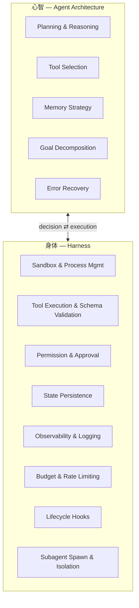
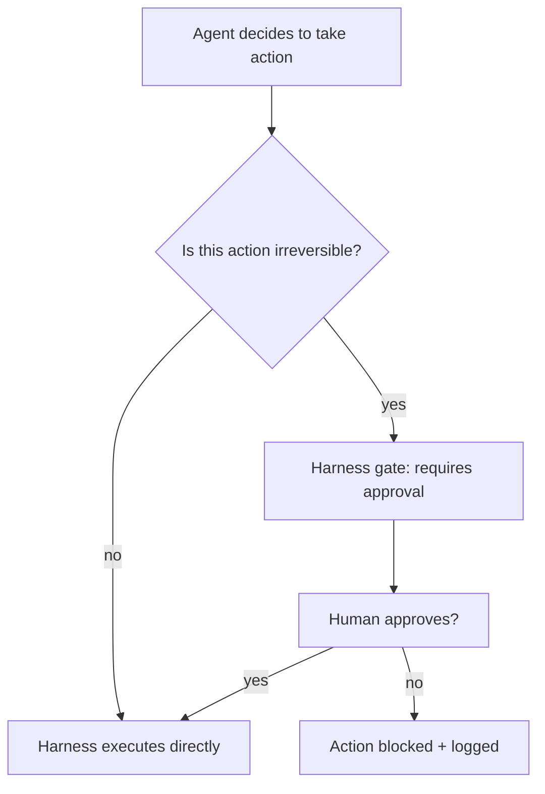
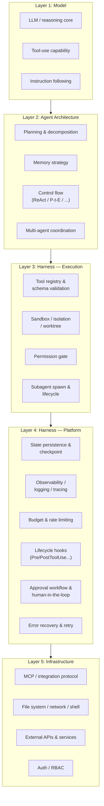
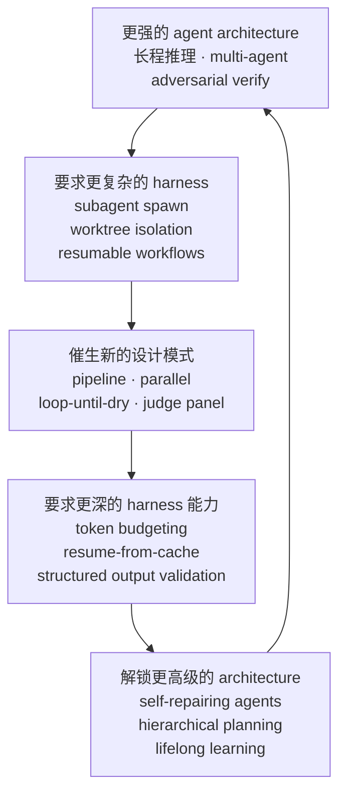
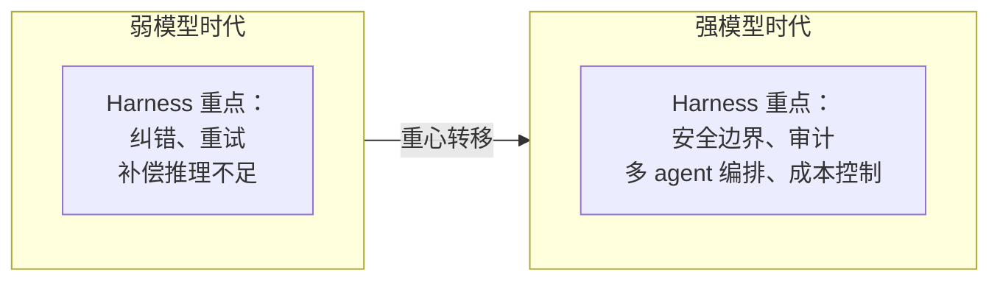

## 写在前面

写完 [[computer_sci/llm/agent/agent_architecture_overview|Agent Architecture Overview]] 之后，有一个问题一直没展开：

> Agent architecture 描述了一个 agent 怎么思考、怎么规划、怎么选工具——但这一切到底**跑在什么上面**？

你当然可以说"跑在代码里"。但这个回答太浅了。

真正的问题是：**那个负责执行 agent 决策的运行时基础设施——它自己有没有架构？它和 agent architecture 是什么关系？它是 agent architecture 的一部分，还是独立于它的另一层东西？**

这篇尝试回答这个问题。我把它称为 **harness engineering**——构建 agent 运行时的那门工程学。

---

## 1. The Mind-Body Duality

最直接的切入方式是一个比喻：

> **Agent architecture 回答"这个 agent 怎么思考"，harness 回答"这个 agent 凭什么能思考"。**

没有 harness，architecture 只是纸上的设计。没有好的 architecture，harness 只是一堆工程胶水。真正的价值产生在两者的**交界处**——那里是 agent 的"实际能力上限"被定义的地方。

但这只是比喻。真实情况比比喻复杂得多——因为那条分界线本身就不清楚。

---

## 2. The Blurred Boundary

最大的迷惑来源：**有些东西看起来同时属于两边**。

### 2.1 Tool-use：模型能力还是基础设施？

`tool_use` 这个能力：

- 从 **model / architecture** 角度看：它是模型的推理能力——理解何时调用什么工具、如何组装结果、如何从错误中恢复
- 从 **harness** 角度看：它是运行时基础设施——定义工具 schema、执行沙箱、权限门控、结果序列化与回传

同一件事，两层视角。如果你只从 architecture 角度设计 tool-use，你会得到一个"模型知道该用什么工具但 runtime 不知道如何安全执行"的系统。反过来，只从 harness 角度设计，你会得到一个"工具很多但模型不知道何时该用哪个"的系统。

真正的 tool-use 系统**卡在中间**：模型决定 *what*，harness 保证 *how*。

### 2.2 Permission & Approval：谁的决策？

Permission 逻辑本身是 harness 层的。但**什么算 "irreversible"、什么需要 approval、什么可以自动放行**——这些判断既依赖 agent architecture 的设计（这个 agent 的信任边界在哪里？），也依赖 harness 的能力（harness 能不能区分 `git commit` 和 `rm -rf /`？）。

所以你会看到：
- Agent architecture 定义了**信任模型**（这个 agent 被授权做什么）
- Harness 实现了**执行模型**（这个 agent 实际能做什么）
- 两者的 gap 就是 risk surface

这也是为什么 [[computer_sci/llm/agent/ai_code_agent_hooks|AI Code Agent Hooks]] 那么重要——hook 本质上是 harness 暴露给外部世界的"介入点"，让你在 architecture 定义的信任边界上插入额外的检查逻辑。

### 2.3 Context Management：architecture 的策略 vs harness 的机制

Agent architecture 决定**上下文管理策略**：
- 哪些记忆应该保留
- 什么时候压缩、总结、丢弃
- 如何在不同轮次间传递状态

Harness 提供**上下文管理机制**：
- 上下文窗口的实际大小和 token 计数
- Prompt cache 的命中与失效
- 文件内容的实际读取和截断
- System prompt 的注入与分层

策略是 architecture 的事，机制是 harness 的事。但机制的上限直接限制了策略的有效性——如果你的 harness 不支持 prompt caching，architecture 里设计的"缓存友好型上下文管理"就只是纸上谈兵。

---

## 3. The Full Stack：五层模型

如果强行把 agent 系统拆成层，我目前看到至少五层：

这个分层里最值得注意的是：**Layer 3 和 Layer 4 都属于 harness，但它们解决的问题不同**。

- **Layer 3 (Execution Harness)**：让 agent 的决策能真正执行——把 "我想读文件" 变成一次真实的文件读取
- **Layer 4 (Platform Harness)**：让 agent 系统作为一个整体可运维——可观测、可恢复、可审计、可预算控制

大多数 agent demo 只做到 Layer 3。大多数 agent 产品必须做到 Layer 4。

---

## 4. Co-evolution：互相驱动的飞轮

这不是一个单向关系。Harness 和 agent architecture 之间存在一个**共同演化**的飞轮：

### 4.1 一个具体例子：Workflow 编排

看 Claude Code 的 Workflow 系统是怎么演化出来的：

| 阶段 | Architecture 需求 | Harness 需要提供 |
|------|-------------------|------------------|
| 1. 单 agent | 模型直接回答 | 基本的 tool call 循环 |
| 2. 并行探索 | 同时从多个角度调查 | subagent spawn + 并发管理 |
| 3. Pipeline | 一个 agent 的输出是下一个的输入 | 阶段间状态传递 + 错误隔离 |
| 4. Adversarial verify | 多个 judge 独立投票 | parallel barrier + schema-validated 结果 |
| 5. Loop-until-dry | 一直找到没有新发现为止 | resumable workflow + 去重状态 |
| 6. Token-budgeted loop | 在预算内做尽可能多的工作 | budget tracking + 硬上限 |

每一步，architecture 的创新**首先要求** harness 提供新的原语；有了新的原语之后，architecture 才能设计出更复杂的模式。

这不是"先有鸡还是先有蛋"——这是**共生**。

### 4.2 另一个例子：Isolation

早期的 agent 不需要 isolation——反正只有一个 agent，直接在当前环境跑就行。

当 multi-agent 和 vibe-coding 场景出现后，问题变了：
- 多个 agent 同时写文件会冲突
- Agent 的探索性修改不能污染主分支
- 需要在不信任 agent 的情况下让它"大胆尝试"

architecture 层给出的答案是 **worktree isolation**：每个 agent 在自己的 git worktree 里跑，干净、可丢弃。但这个答案只有在 harness 能 spawn worktree、管理生命周期、在完成后自动清理时才能落地。这就是 [[computer_sci/vibe_coding/git_worktree_introduction|Git Worktree]] 在 agent 场景下的新意义。

---

## 5. Harness as Platform Engineering

如果把这个视角推到极致：

| 时代 | "心智" | "身体" | 对应工程学科 |
|------|--------|--------|-------------|
| 传统软件 | 业务逻辑 | OS + 运行时 | 操作系统工程、容器编排 |
| AI Agent 时代 | Agent Architecture | Harness | **Harness Engineering** |

Harness engineering 本质上是 **AI agent 时代的平台工程**。你不只是在调 API——你在构建 agent 的"操作系统"：

- **Syscalls** → Tools（定义 agent 能做什么）
- **Process model** → Subagents（定义 agent 如何分解和并行）
- **Permission model** → Allow/Deny/Ask（定义 agent 的信任边界）
- **Isolation** → Sandbox / Worktree（定义 agent 的安全边界）
- **Scheduler** → Orchestrator / Workflow engine（定义 agent 任务的执行顺序）
- **Observability** → Logging / Tracing / Evals（定义我们如何理解 agent 的行为）

这不是类比。随着 agent 系统变得越来越复杂，这些能力的工程化程度会越来越接近 OS 内核的工程标准。

---

## 6. Design Tensions：Architecture 和 Harness 的拉扯

它们不是 always aligned 的。有几个天然的张力：

### 6.1 Expressiveness vs Safety

- Architecture 想给模型**更多自由度**——"让模型自己判断，它足够聪明"
- Harness 必须保证**安全边界**——"模型越聪明，越不能把不可逆操作的最终决定权交给它"

这个张力是**不可消除的**。你只能在不同场景下选择不同的平衡点。

### 6.2 Generality vs Performance

- Architecture 想要**通用抽象**——"所有工具都用同一个 function-calling 协议，所有 subagent 都走同一个 spawn 接口"
- Harness 需要**性能优化**——"这个工具是高频调用的，需要专门的执行路径；这个 subagent 不需要完整的 worktree isolation，共享内存就够了"

通用性让 architecture 保持简洁，但性能要求让 harness 不断引入特化路径。好的 harness 设计是在通用抽象下**隐藏特化**，而不是为了通用而牺牲性能。

### 6.3 Autonomy vs Observability

- Architecture 追求**自主性**——"agent 应该能自己处理错误、自己恢复、自己决定下一步"
- Harness 需要**可观测性**——"但如果 agent 做错了，我们必须知道它什么时候做的、为什么做的、怎么恢复"

这个张力解释了为什么 logging 必须放在 harness 层而不是 architecture 层：log 的来源必须独立于模型。如果让模型自己记"我刚才做了什么"，你永远分不清它是真的做了还是在 hallucinate。Harness 提供的 log 是**独立于模型的第三方证据**。

### 6.4 Stateless Design vs Stateful Reality

- Architecture 倾向于**无状态设计**——"每次推理都是 pure function of context"
- Harness 必须处理**有状态现实**——文件系统变了、进程跑了一半、之前的 tool call 有副作用

这个张力在 multi-agent 场景下尤其尖锐：多个 agent 共享同一个文件系统、同一个 git 仓库、同一个 shell 环境，它们的 action 互相影响。Harness 必须在 architecture 看到的"干净状态"和物理世界真实的"脏状态"之间做翻译。

---

## 7. What Shifts When Models Get Stronger?

一个自然的问题是：随着模型越来越强，harness 的重要性会下降吗？

我的判断是：**不会下降，但重心会转移。**

当模型不够强时，harness 大量精力花在**补偿推理缺陷**上——retry、fallback、手动纠正 tool call、修复格式错误。

当模型足够强时，这些补偿需求下降，但**新的需求出现**：
- 更强的模型能策划更复杂的 multi-step 计划 → harness 需要更可靠的长时间执行和恢复
- 更强的模型能做更危险的决策 → harness 需要更精细的权限控制
- 更强的模型跑得更贵 → harness 需要更智能的 budget 管理
- 更强的模型被更多用户使用 → harness 需要生产级的 observability 和审计

所以 harness 不会消失——**它的角色从 "保姆" 变成了 "基础设施"**。

---

## 8. 设计原则

从 harness engineering 的角度，我现在会用这些原则检查一个 agent 运行时：

**Execution 层：**
- Tool execution is a harness responsibility, not a model responsibility.
- Every tool call goes through schema validation before execution.
- Irreversible actions always pass through an approval gate.
- Subagent isolation is a first-class concern, not an afterthought.

**Platform 层：**
- Log everything at the harness level, independently of the model.
- State persistence and checkpoint must survive process restart.
- Budget enforcement must be hard, not advisory.
- Hooks are the extension points — the harness should expose them at every lifecycle boundary.

**Architecture 接口层：**
- The model decides *what*; the harness guarantees *how*.
- The architecture defines trust boundaries; the harness enforces them.
- Context strategy lives in architecture; context mechanics live in harness.
- Don't let the architecture assume harness capabilities that don't exist. Don't let the harness constrain architecture to the lowest common denominator.

---

## 9. My Mental Model

如果只能留一句话：

> **Harness engineering is the operating system of the agent era — it provides the syscalls (tools), process model (subagents), permission model (allow/deny/ask), isolation (sandbox/worktree), and observability (logging/tracing) that turn a reasoning core into a real, accountable, safe agent system.**

更哲学一点：

> Agent architecture 和 harness engineering 不是上下层关系，而是一个**共生系统**的两个视角。Architecture 回答 "这个系统如何思考"，harness 回答 "这个系统如何行动"。思考没有行动是空的，行动没有思考是瞎的。**真正好的 agent 系统，是让这两者在同一套设计语言里协同演化。**

更短：

> **Architecture designs the mind. Harness builds the body. The product lives at their interface.**

---

## 10. 和已有概念的关系

这篇可以和以下 note 放在一起看：

- [[computer_sci/llm/agent/agent_architecture_overview|Agent Architecture Overview]]：agent 的"心智"——这篇是"身体"
- [[computer_sci/llm/agent/agent_frameworks_overview|Agent Frameworks Overview]]：不同框架在 architecture 和 harness 两层各做了什么选择
- [[computer_sci/llm/agent/ai_code_agent_hooks|AI Code Agent Hooks]]：harness 对外的生命周期扩展点
- [[computer_sci/llm/agent/agent_SKILL_mechanism|Agent SKILL Mechanism]]：skill 是 architecture 层还是 harness 层的概念？（答案是：它卡在中间——skill 改变模型的 reasoning，但需要 harness 来加载和注入）
- [[computer_sci/llm/agent/model_context_protocol_mcp|MCP]]：harness Layer 5 的标准化——如何把外部能力接进来
- [[computer_sci/llm/agent/chat_to_agent_connector|Chat-to-Agent Connector]]：harness 的 ingress 层——外部世界如何触发 agent
- [[computer_sci/vibe_coding/git_worktree_introduction|Git Worktree Introduction]]：harness isolation 的一个具体机制
