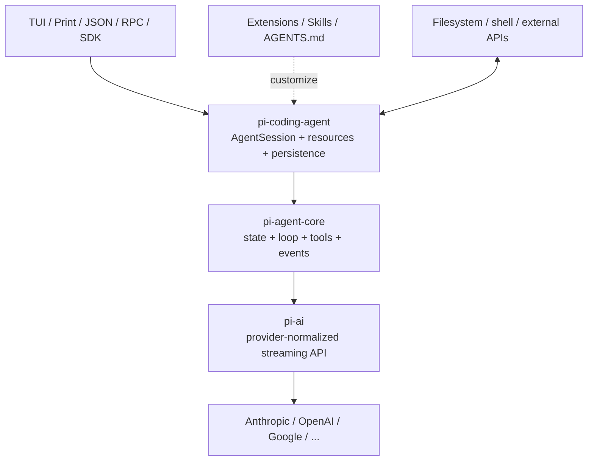
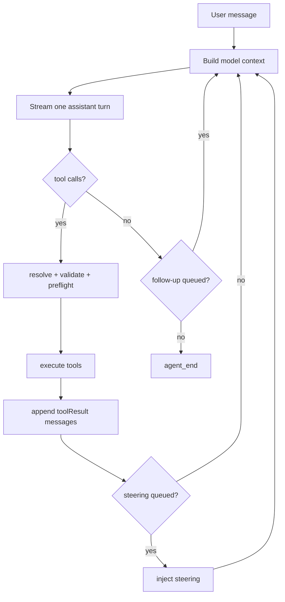
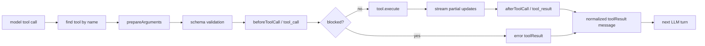
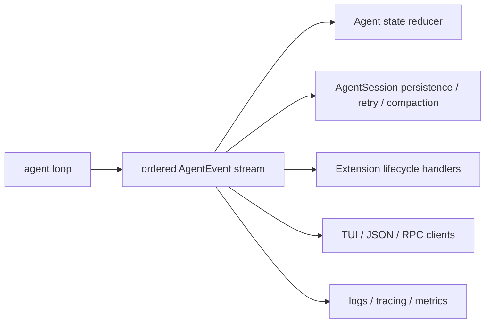

## 写在前面

在 [[computer_sci/llm/agent/agent_architecture_overview|Agent Architecture Overview]] 里，我留下过一个很具体的问题：

> Runtime 的状态机、事件循环、工具注册，到了真实框架里到底长什么样？

Pi 很适合拿来回答它。它不是另造一种 agent theory，而是一个刻意保持 **minimal、model-agnostic、self-extensible** 的 coding agent harness：默认只给模型 `read`、`bash`、`edit`、`write` 四个工具，把 sub-agent、plan mode、MCP、permission popup 等更有争议的能力留给 extension 或外部环境。[1](#ref-1)

所以这篇不把 Pi 当作又一个需要背 API 的产品，而把它当成一台拆掉外壳的机器：

- 从 `agent loop` 看 agent 最小闭环
- 从 `AgentState` / `AgentContext` / `SessionEntry` 看 state 和 memory 的区别
- 从 tool pipeline 看 model decision 如何变成真实副作用
- 从 event stream 看 UI、持久化与 hooks 如何挂到运行时
- 从 coding harness 看 Skills、`AGENTS.md`、compaction、RPC 怎样叠在核心之上
- 最后再用这些具体部件回看 [[computer_sci/llm/agent/agent_frameworks_overview|Agent Frameworks Overview]] 里的主流框架抽象

> 版本快照：本文按 2026-07-14 的 `earendil-works/pi` `0.80.6`、commit `0e6909f` 阅读。旧的 `badlogic/pi-mono` 地址会跳转到新仓库，旧的 `@mariozechner/*` npm scope 已迁移为 `@earendil-works/*`。[2](#ref-2)

---

## 1. 先把 Pi 的边界说清楚

“Pi Agent”容易混指三个层级：

| 名称 | 它实际负责什么 | 不负责什么 |
| --- | --- | --- |
| `pi-ai` | 统一不同 provider 的模型、消息、streaming、tool-call 格式 | 不跑 agent loop |
| `pi-agent-core` | stateful tool loop、消息转换、事件流、steering / follow-up | 不提供 coding 产品体验 |
| `pi-coding-agent` | tools、session、compaction、Extensions、Skills、TUI / JSON / RPC / SDK | 不内置完整 sandbox、MCP、multi-agent orchestration |
| `pi-tui` | terminal UI 与 differential rendering | 不理解 agent 语义 |

稳定主干可以画成：



这里的关键不是包名，而是 **separation of concerns**：

- provider 差异被压在 `pi-ai`
- agent 的闭环被压在 `pi-agent-core`
- coding-specific state 和 product behavior 被放进 `pi-coding-agent`
- UI 只是 event 的消费者，不是 agent 本身

这正好把 [[computer_sci/llm/agent/harness_engineering_and_agent_architecture|Harness Engineering 与 Agent Architecture 的关系]] 里的 “mind / body” 再拆细了一层：model 是 decision engine，core loop 是神经反射，coding harness 才是带会话、资源发现与交互界面的身体。

---

## 2. Pi 的最小 Agent Loop

### 2.1 最小闭环不是 `prompt -> answer`

`pi-agent-core` 的公开入口有两类：

- `agentLoop(prompts, context, config)`：把新 prompt 加入上下文再开始
- `agentLoopContinue(context, config)`：不加新消息，从现有 user / tool result 后继续，适合 retry

真正的核心可以压成下面这段伪代码：[3](#ref-3)

```ts
emit("agent_start")

while (true) {                         // follow-up loop
  while (hasToolCalls || hasSteering) {
    injectQueuedMessages()
    assistant = await streamModel(buildLlmContext())

    if (assistant.error || assistant.aborted) break

    toolResults = await executeToolCalls(assistant.toolCalls)
    append(toolResults)
    emit("turn_end")

    refreshModelPromptAndToolsForNextTurn()
    if (shouldStopAfterTurn()) break
    steering = drainSteeringQueue()
  }

  followUps = drainFollowUpQueue()
  if (followUps.empty) break
}

emit("agent_end")
```



这仍然是 [[computer_sci/llm/agent/agent_architecture_overview#41-react|ReAct]] 的工程化版本：一次 model turn 只决定下一批 action，observation 作为 `toolResult` 回到 transcript，再进行下一轮推理。Pi core 没有显式 planner、graph node 或 critic；如果需要它们，就在 prompt、tool、extension 或更外层 orchestrator 里表达。

### 2.2 `turn` 是最重要的执行单位

Pi 对 turn 的定义很实在：

```text
one assistant response + tool calls requested by it + their tool results
```

它不是一整次用户任务。一个 task 可以经历很多 turn：

```text
user
-> assistant(tool: read)
-> toolResult
-> assistant(tool: edit, bash)
-> toolResults
-> assistant(final text)
```

这使得三个层次不会混在一起：

- `message`：一条 user / assistant / toolResult 记录
- `turn`：一次 model 决策和由它直接触发的动作
- `agent run`：从 prompt 到没有 tool / steering / follow-up 为止

很多 framework 的术语不同，但实际 runtime 基本都需要类似边界，否则 retry、计费、tracing、HITL 和 persistence 都不知道该落在哪一级。

### 2.3 Steering 和 follow-up 是两种不同的队列

Pi 没有在工具执行一半时硬切断当前 turn：

- **steering**：当前 assistant turn 和它已经发出的 tool calls 完成后，下一 turn 优先注入
- **follow-up**：agent 本来要结束时才注入
- **abort**：用 `AbortSignal` 取消当前 run，是另一条控制路径

这比一句 “支持用户中途插话” 精确得多。它说明 human-in-the-loop 不一定是 approval dialog，也可以是 **在确定的 consistency boundary 上重新取得控制权**。

---

## 3. State、Context、Message、Session 不是一回事

这是读 Pi 最值得带回其他框架的区分。

| 对象 | 主要内容 | 生命周期 | 谁消费 |
| --- | --- | --- | --- |
| `AgentState` | system prompt、model、thinking level、tools、messages、streaming 状态 | 当前进程中的 mutable runtime state | `Agent` / UI |
| `AgentContext` | system prompt、messages、tools 的一次 snapshot | 一次 loop / turn | agent loop |
| `AgentMessage` | LLM 消息 + app 自定义消息 | 当前 transcript | harness、UI、转换器 |
| provider `Message` | 只有 provider / LLM 能理解的消息 | 单次模型请求 | `pi-ai` / model API |
| `SessionEntry` | message、model change、compaction、label 等 JSONL entry | 跨进程、可恢复 | `SessionManager` |

### 3.1 Live state 不等于 durable state

`AgentState` 里最核心的是：

```ts
{
  systemPrompt,
  model,
  thinkingLevel,
  tools,
  messages,
  isStreaming,
  streamingMessage,
  pendingToolCalls,
  errorMessage,
}
```

这里没有向量数据库，也没有一个叫 `memory` 的神秘模块。对 Pi 来说，最基础的 working memory 就是 transcript + 当前工具/模型状态；跨进程记忆则由 session JSONL 承担。[4](#ref-4)

这让 [[computer_sci/llm/agent/agent_architecture_overview#23-memory|Memory]] 和 [[computer_sci/llm/agent/agent_architecture_overview#24-state|State]] 的区别变得具体：

- state 是“现在执行机处在哪”
- transcript 是“本轮推理能回看什么”
- session log 是“系统真实发生过什么”
- model context 是“这一次实际给模型看什么”

它们可以相关，但绝不能默认相等。

### 3.2 Context 是投影，不是历史本身

Pi 每次调用模型前走两道边界：[5](#ref-5)

```text
AgentMessage[]
  -> transformContext()     // 剪枝、注入、extension 修改
  -> AgentMessage[]
  -> convertToLlm()         // 过滤 UI-only 类型、转换 custom message
  -> provider Message[]
  -> LLM
```

这条 pipeline 很重要，因为真实 application transcript 往往包含模型不应该或不能直接看到的东西：

- UI notification
- session label
- extension private state
- `!!` 执行但明确排除出 context 的 shell output
- compaction / branch summary 这类 app-specific message

所以 context engineering 不是“把更多内容塞进 prompt”，而是维护一个显式 projection：

```text
durable history != app transcript != current model context
```

这与 [[computer_sci/llm/agent/harness_engineering_and_agent_architecture#23-context-managementarchitecture-的策略-vs-harness-的机制|Context Management：策略 vs 机制]] 完全接上：删什么、总结什么是策略；在每次 provider call 之前可靠地执行 transform / convert，是 harness 机制。

---

## 4. Tool Call 不是“模型直接调用工具”

模型只输出一个 tool-call content block。Pi 真正的 action pipeline 是：[3](#ref-3)



几个实现细节很能说明“实际框架”在解决什么：

1. **先找注册表，再校验 schema**：不存在或参数不合法时，不执行副作用，而是生成 error observation 让模型恢复。
2. **preflight 与 execution 分开**：`beforeToolCall` 在参数验证后运行，可以 block；这就是 [[computer_sci/llm/agent/ai_code_agent_hooks|AI Code Agent Hooks]] 里的 `PreToolUse` 对应物。
3. **tool output 也能 streaming**：长命令执行时，UI 不必等完整结果。
4. **默认并行，但有顺序约束**：同一 assistant message 里的 calls 会先逐个 preflight，再并发执行；只要其中一个 tool 标为 sequential，整批顺序执行。
5. **并发完成顺序不污染 transcript 顺序**：completion event 可以按真实完成时间发出，但最终 `toolResult` 按 assistant 原始 call 顺序写入，保证下一次模型输入稳定。
6. **截断的 tool call 一律不执行**：如果 assistant 因 output token limit 停在 `length`，即使残缺 JSON 勉强能 parse，Pi 仍把这一批 calls 全部判错，避免用静默缺参执行真实动作。
7. **post-hook 可以改结果**：`afterToolCall` 能改 content / details / error flag；tool 也可返回 `terminate: true`，告诉 loop 不必自动再问一次模型。

这就是 “the model decides *what*; the harness guarantees *how*” 的源码形态。工具 schema、权限 gate、并发语义、错误 normalization 和事件顺序，都不是模型智力的一部分。

---

## 5. Event Stream 是 Pi 的脊柱

Pi core 不直接绑定 TUI 或数据库，而是发一组结构化事件：[5](#ref-5)

```text
agent_start / agent_end
turn_start / turn_end
message_start / message_update / message_end
tool_execution_start / tool_execution_update / tool_execution_end
```



`Agent` 自己像一个 reducer：收到 `message_end` 就把完整消息放进 state，收到 tool start / end 就维护 `pendingToolCalls`。订阅者按注册顺序被 await，因此 session 持久化可以成为 tool preflight 前的 barrier，而不是“后台迟早会写”。

这给 [[computer_sci/llm/agent/harness_engineering_and_agent_architecture|Harness Engineering]] 里的 execution logging 一个很具体的答案：

> 不要让模型在最终答案里回忆自己做过什么；让 runtime 在事件边界记录实际发生过什么。

事件流还解耦了产品形态。同一个 `AgentSession` 可以被 terminal、print、JSON event stream、stdin/stdout RPC 或 Node SDK 使用；[[computer_sci/llm/agent/chat_to_agent_connector|Chat-to-Agent Connector]] 后端真正需要接的，不一定是某个 terminal process，也可以是 SDK 或 RPC 这一层。

---

## 6. 从 Agent Core 到 Coding Harness

只有 loop 还不是一个可长期使用的 coding agent。`pi-coding-agent` 在 core 外面加了一个 `AgentSession`，负责 lifecycle、session history、model state、auto-compaction、extension dispatch 与 resource loading。[6](#ref-6)

### 6.1 System prompt 是组装出来的

Pi 的 system prompt 不是一段永远不变的字符串。它由这些输入组装：[7](#ref-7)

- 当前启用的 tools 与 tool-specific guideline
- global / parent / current directory 的 `AGENTS.md` 或 `CLAUDE.md`
- `.pi/SYSTEM.md` / `APPEND_SYSTEM.md`
- 已发现 Skills 的 name、description、location
- 当前 date 与 cwd
- Extensions 在 `before_agent_start` 做的动态改写

这与本项目自己的 `.agents/` coordination layer 很相似，但要注意职责不同：

- `AGENTS.md` 是长期 project policy
- Skill 是按任务发现、需要时再读取的 protocol module
- Extension 是真正运行的 TypeScript code，可注册 tool / command / event handler / UI
- prompt template 只是用户输入的可复用展开

Pi 对 Skill 的实现尤其能验证 [[computer_sci/llm/agent/agent_SKILL_mechanism|Agent SKILL Mechanism]] 的判断：startup 时主要把 skill metadata 放进 system prompt，模型判断相关后再用 `read` 打开完整 `SKILL.md`；显式 `/skill:name` 则直接把内容展开进用户消息。[8](#ref-8)

换句话说，Skill 的 “lazy loading” 主要是 **context loading policy**，并不是启动另一个特殊 runtime。

### 6.2 Session 是 append-only tree

Pi session 使用 JSONL，每个 entry 带 `id` / `parentId`，因此一份文件就能保存分叉树：[9](#ref-9)

```text
user A
└─ assistant B
   ├─ toolResult C
   │  └─ assistant D        <- current branch
   └─ user E
      └─ assistant F        <- alternative branch
```

entry 不只保存 message，还保存：

- model change
- thinking-level change
- compaction
- branch summary
- custom extension entry
- label / session metadata

所以 `SessionManager` 不是简单的 chat history array。它更接近一个 append-only event log + tree projector：完整历史留在磁盘，当前 branch 再被投影成 `AgentMessage[]`。

这也解释了为什么 “memory = vector database” 太窄。对 coding agent 来说，可恢复 session、model change、branch、tool result 与 compaction boundary 本身就是重要的 episodic memory。

### 6.3 Compaction 改的是 model view，不是抹掉 history

当 context 快到上限，Pi 会选择 cut point，把较早 history 总结成 `compactionSummary`，保留较新的 turns；完整 JSONL 并不删除。[10](#ref-10)

```text
full durable session
  -> choose active branch
  -> apply latest compaction summary
  -> keep messages after cut point
  -> convert to provider messages
```

这是一个很漂亮的 separation：

- **storage truth**：完整、可回看、可重新分支
- **context truth**：有损、为当前 model request 服务

compaction 因此不是 long-term memory 的同义词，而是 context window management。它可能保存决策和进度，但它仍然会丢信息，不能代替 durable session log。

### 6.4 Extensions 才是 Pi 真正的插件 / Hook 层

Extension 可以注册：[11](#ref-11)

- custom tool
- slash command / shortcut / flag
- provider
- message renderer / TUI component
- `context` transform
- `tool_call` block / argument mutation
- `tool_result` rewrite
- session / compaction / model / input lifecycle handler

因此 Pi 的 extension 不是只给 UI 加按钮，而是跨越了 policy、action、lifecycle、presentation 四层。它与 [[computer_sci/llm/agent/ai_code_agent_hooks|Hooks]] 的关系是：

```text
Extension = 可加载代码模块
Hook/Event = Extension 挂入 runtime 的生命周期位置
Tool = Extension 可以注册的一类模型能力
```

三者不是同义词。

---

## 7. Pi 的 minimalism 是架构选择，不是功能缺失表

Pi 官方明确选择不把下面这些能力放进 core：[1](#ref-1)

| Pi 默认不内置 | 它建议放在哪里 | 这个选择说明什么 |
| --- | --- | --- |
| MCP | CLI + README / Skill，或 MCP extension | integration protocol 不是 agent loop 的必要条件 |
| sub-agents | extension、额外 Pi process、tmux | multi-agent coordination 不是单 agent core 的必要条件 |
| permission popup | extension 或容器 / VM / OS policy | UI approval 与真正 isolation 应分开 |
| plan mode | file / prompt / extension | planner 可以是产品策略，不必写死进 runtime |
| built-in TODO | `TODO.md` 或 extension | working memory 的表达留给用户/模型选择 |
| background bash | tmux 等外部 process manager | 不在 core 里复制成熟系统能力 |

这个选择对我已有的笔记有两点修正。

第一，[[computer_sci/llm/agent/model_context_protocol_mcp|MCP]] 是标准 integration layer，不是 agent 成立的必要条件。Pi 用本地 CLI + readable docs 也能形成 tool-use system；如果真的需要 MCP，可以由 extension 把 server tools 映射进 Pi tool registry。

第二，[[computer_sci/llm/agent/harness_engineering_and_agent_architecture|Harness Engineering]] 里列的 permission、sandbox、subagent isolation 是生产级 harness 的重要设计维度，但不是所有 harness 都必须在进程内实现。Pi 的答案是：它本身默认继承启动用户的 filesystem / process / network 权限，project trust 只控制是否加载本地配置与 extension，**不是 sandbox**。真正 isolation 应交给 container、VM 或 policy-controlled sandbox。[12](#ref-12)

这不是安全能力“自动存在”，而是 trust boundary 被明确画在了 Pi process 外面。用 Pi 时如果忘记这点，minimalism 会直接变成风险。

---

## 8. 用 Pi 回看主流 Agent Framework

Pi 最有价值的地方，是让框架宣传页上的名词落到可执行部件。一个实际 agent framework 无论 API 怎么命名，通常都绕不开下面七个问题：

| 必答问题 | Pi 的答案 | 其他框架常见答案 |
| --- | --- | --- |
| 模型差异怎么隔离？ | `pi-ai` provider adapter | model client / provider adapter |
| 谁决定下一步？ | LLM 在 implicit ReAct loop 里生成 tool call / final | runner、graph node、workflow step |
| state 放哪里？ | `AgentState` + transcript | typed graph state、run context、session |
| context 怎么形成？ | transform -> convert -> provider message | middleware、prompt builder、memory policy |
| action 怎么执行？ | tool registry + schema + hooks + executor | tool node、function tool、action server |
| 如何观察与恢复？ | event stream + JSONL session tree + compaction | tracing、checkpoint、durable execution |
| 怎么扩展？ | Extensions + Skills + prompt templates | middleware、plugin、MCP、decorator、node |

把 Pi 放进 [[computer_sci/llm/agent/agent_frameworks_overview|Agent Frameworks Overview]] 的地图，它更接近：

> **thin agent loop + practical coding harness**

而不是：

- LangGraph 那种 explicit state graph / durable workflow runtime
- AutoGen 那种 agent-to-agent message system
- CrewAI 那种 role / task / crew business abstraction
- provider-native SDK 那种 handoff / guardrail / tracing 打包体验

### 8.1 Pi vs. graph runtime

Pi 的 control flow 主要藏在一个 `while` loop 里；LangGraph 类框架把 control flow 变成显式 graph。

```text
Pi:
  model -> tools -> model -> ... -> final

Graph runtime:
  node A -> conditional edge -> node B -> checkpoint -> interrupt -> resume
```

Pi 更容易看到 agent 的最小本体，也更容易自由改造；graph runtime 对长任务恢复、确定性 branching、human interrupt 更强，但需要维护 graph state 和 node contract。

### 8.2 Pi vs. multi-agent framework

Pi 不把 “多个角色互相聊天” 当成默认抽象。这提醒我：

> sub-agent 应该是任务确实需要的 process / responsibility boundary，而不是 agent 产品看起来高级的装饰。

单 agent + 好工具 + 清楚 context 经常已经足够。只有当 isolation、并行、不同权限/模型、独立 context window 的收益超过 coordination cost 时，multi-agent 才值得进入 core design。

### 8.3 Pi vs. workflow automation

Pi loop 是 open-ended：下一步主要由模型根据 observation 决定。固定审批链、SLA、补偿事务、定时任务等业务流程，最好由外层 workflow engine 控制，再把 Pi 当一个可调用 worker，而不是让 transcript 独自承担业务状态机。

这也给 [[computer_sci/llm/agent/chat_to_agent_connector|Chat-to-Agent Connector]] 一个升级方向：connector 负责 ingress / identity / queue，Pi SDK 或 RPC 负责单次 agent run，业务 workflow 负责 retry、schedule、approval 和最终 delivery。不要把所有责任塞进 prompt。

---

## 9. 我从 Pi 得到的框架阅读法

以后再读一个“主流 agent framework”，我会按下面顺序，而不是先看 quick start：

1. **找 loop**：什么条件触发下一次 model call，什么条件真正结束？
2. **找 message boundary**：application state 如何变成 provider messages？
3. **找 tool boundary**：schema validation、permission、timeout、concurrency、error normalization 在哪？
4. **找 state owner**：model、runner、session store，究竟谁是 source of truth？
5. **找 event / trace boundary**：记录的是模型自述，还是 runtime 事实？
6. **找 recovery semantics**：abort、retry、resume、checkpoint、compaction 各保留什么？
7. **找 extension boundary**：哪些是 core invariant，哪些允许 plugin 改写？
8. **找 trust boundary**：sandbox 真在哪里，还是其实根本没有？

如果这八个问题回答不出来，即使会写框架 API，也还没有真正理解它的 architecture。

---

## 10. 推荐的 Pi 源码阅读顺序

如果要继续从实现学习，而不是停在这篇总结，我会按这个顺序：

1. `packages/agent/src/types.ts`：先认清 state、context、tool、event 的 contract。[5](#ref-5)
2. `packages/agent/src/agent-loop.ts`：看真正的 loop、tool pipeline 与 queue drain point。[3](#ref-3)
3. `packages/agent/src/agent.ts`：看 state reducer、subscriber barrier、abort 与 queue API。[4](#ref-4)
4. `packages/coding-agent/src/core/sdk.ts`：看 provider auth、resource loader 与 Agent 如何被组装。[6](#ref-6)
5. `agent-session.ts`：看 persistence、extension、retry、compaction 怎样消费 core events。[6](#ref-6)
6. `system-prompt.ts` + `messages.ts`：看 context files、Skills 与 custom messages 怎么进入 model view。[7](#ref-7)
7. `session-format.md` + `compaction.md`：看 durable history 与 context projection 如何分离。[9](#ref-9) [10](#ref-10)
8. `extensions.md`：最后再看 Pi 如何把有争议的产品能力移到扩展层。[11](#ref-11)

这个顺序本身也代表一种学习原则：

> 先读 invariant，再读 orchestration；先读 runtime truth，再读 UI feature。

---

## 11. My mental model

如果只留一句话：

> **Pi 把 agent 的不可再分核心收缩为：规范化的 model stream、可投影的 message context、tool-execution loop、显式 runtime state 与有序 event stream；其余能力尽量作为 harness service、extension 或外部系统叠加。**

它让我对“最小 agent”的定义也更精确了：

```text
minimal agent runtime
= model boundary
+ context projection
+ tool loop
+ state owner
+ event / cancellation semantics
```

而一个实际可用的 coding agent 还要继续加：

```text
coding agent product
= minimal runtime
+ durable sessions
+ context files / skills
+ compaction
+ extension lifecycle
+ UI / RPC / SDK ports
+ an explicit external security boundary
```

这篇因此既是 [[computer_sci/llm/agent/agent_architecture_overview|Agent Architecture Overview]] 的源码落地，也是 [[computer_sci/llm/agent/harness_engineering_and_agent_architecture|Harness Engineering]] 的具体 case study；它还把 [[computer_sci/llm/agent/agent_SKILL_mechanism|Skill]]、[[computer_sci/llm/agent/ai_code_agent_hooks|Hooks]]、[[computer_sci/llm/agent/model_context_protocol_mcp|MCP]] 和 [[computer_sci/llm/agent/chat_to_agent_connector|Connector]] 放回同一台真实机器里，不再只是平行概念。

---

## References

<a id="ref-1"></a>[1] Pi, [Coding Agent README: Philosophy](https://github.com/earendil-works/pi/blob/0e6909f050eeb15e8f6c05185511f3788357ddb3/packages/coding-agent/README.md#philosophy).

<a id="ref-2"></a>[2] Pi, [Monorepo packages and package scope](https://github.com/earendil-works/pi/tree/0e6909f050eeb15e8f6c05185511f3788357ddb3/packages).

<a id="ref-3"></a>[3] Pi, [`agent-loop.ts`](https://github.com/earendil-works/pi/blob/0e6909f050eeb15e8f6c05185511f3788357ddb3/packages/agent/src/agent-loop.ts).

<a id="ref-4"></a>[4] Pi, [`agent.ts`](https://github.com/earendil-works/pi/blob/0e6909f050eeb15e8f6c05185511f3788357ddb3/packages/agent/src/agent.ts).

<a id="ref-5"></a>[5] Pi, [`pi-agent-core` types and message flow](https://github.com/earendil-works/pi/blob/0e6909f050eeb15e8f6c05185511f3788357ddb3/packages/agent/src/types.ts).

<a id="ref-6"></a>[6] Pi, [Coding Agent SDK and `AgentSession`](https://github.com/earendil-works/pi/blob/0e6909f050eeb15e8f6c05185511f3788357ddb3/packages/coding-agent/docs/sdk.md).

<a id="ref-7"></a>[7] Pi, [`system-prompt.ts`](https://github.com/earendil-works/pi/blob/0e6909f050eeb15e8f6c05185511f3788357ddb3/packages/coding-agent/src/core/system-prompt.ts) and [`messages.ts`](https://github.com/earendil-works/pi/blob/0e6909f050eeb15e8f6c05185511f3788357ddb3/packages/coding-agent/src/core/messages.ts).

<a id="ref-8"></a>[8] Pi, [Skills documentation](https://github.com/earendil-works/pi/blob/0e6909f050eeb15e8f6c05185511f3788357ddb3/packages/coding-agent/docs/skills.md).

<a id="ref-9"></a>[9] Pi, [Session file format](https://github.com/earendil-works/pi/blob/0e6909f050eeb15e8f6c05185511f3788357ddb3/packages/coding-agent/docs/session-format.md).

<a id="ref-10"></a>[10] Pi, [Compaction and branch summarization](https://github.com/earendil-works/pi/blob/0e6909f050eeb15e8f6c05185511f3788357ddb3/packages/coding-agent/docs/compaction.md).

<a id="ref-11"></a>[11] Pi, [Extensions documentation](https://github.com/earendil-works/pi/blob/0e6909f050eeb15e8f6c05185511f3788357ddb3/packages/coding-agent/docs/extensions.md).

<a id="ref-12"></a>[12] Pi, [Security: project trust and sandbox boundary](https://github.com/earendil-works/pi/blob/0e6909f050eeb15e8f6c05185511f3788357ddb3/packages/coding-agent/docs/security.md).
