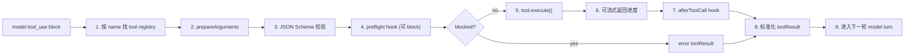
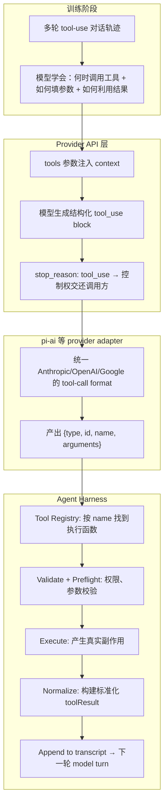

## 写在前面

在 [[computer_sci/llm/agent/pi_agent_architecture|Pi Agent Architecture]] 的讨论里，有个问题一直没有单独展开：

> `tool_use` 到底是怎么回事？LLM 为什么能输出它？provider 怎么把它交给 agent？agent 又怎么把它变成真实的副作用？

这三个问题背后是一条完整的逻辑链：**训练 → API → Harness**。每一层都有自己的职责和不变量，但很多讨论把它们混在一起——要么把 `tool_use` 当成"模型突然学会的魔法"，要么只讲 API format 而跳过训练怎么赋予模型这个能力。

这篇把这条链从头到尾梳一遍。

---

## 1. 先澄清 role ≠ content block type

Anthropic Messages API 只有三种 role：

| role | 职责 |
|---|---|
| `user` | 用户输入、tool result |
| `assistant` | 模型输出（文本、thinking、tool call） |
| `system` | 指令、约束 |

`tool_use` 不是第四个 role。它是 **assistant message 里的一种 content block**：

```json
{
  "role": "assistant",
  "content": [
    { "type": "text",    "text": "我先查一下配置文件。" },
    { "type": "tool_use", "id": "toolu_01...", "name": "read", "input": { "path": "..." } }
  ]
}
```

同样地，`tool_result` 也不是 "tool role"，而是 user message 里的一个 block。

OpenAI 的做法不同——它引入了 `role: "tool"` 专用于 tool result，`role: "assistant"` 里带 `tool_calls` 数组。两种 API 设计都能表达相同语义，只是组织方式不同。而正因为有这些差异，agent harness 需要 `pi-ai` 这样的 provider adapter 层来统一。

---

## 2. 训练阶段：模型是怎么"学会"调用工具的

### 2.1 不是训练时就有 `tool_use` 这个 API type

一个很常见的误解：模型训练时 API 已经定了，所以训练数据里直接就有 `{"type": "tool_use", ...}` 这种标签。

实际情况是反过来的。

训练时模型接触的不是 JSON format，而是**工具调用的行为模式**。训练数据里包含大量这样的多轮对话轨迹：

```text
User: 帮我看看 /home/jude/config.json 里有什么

Assistant (第一步): 我需要先读取这个文件。
<tool_call>
  tool: read
  input: path="/home/jude/config.json"
</tool_call>

Tool result: {"name": "jude", "port": 8080}

Assistant (第二步): 文件里有三个字段：name=jude, port=8080, debug=true。
```

经过大量此类训练，模型学到了两件事：

1. **什么时候该调用工具而不是凭记忆回答**（比如当前文件内容不是训练数据里有的、需要实时信息）
2. **调用工具后如何把结果融入下一步推理**（而不是把 tool result 当成对话直接回复）

它学的是"我需要一个工具 + 我知道传入什么参数 + 我会根据结果继续推理"这个**行为模式**，不是某一种特定的 JSON 格式。

### 2.2 从结构化意图到 API format

模型本质上只会做一件事：**预测下一个 token**。

训练让它学会在某些上下文中输出结构化的"调用意图"——这些意图在训练数据里可能是 XML、Python function call、自然语言描述，或任何结构化标记。

当模型通过 API 提供服务时，provider 做的事是：

> **system prompt 里注入当前可用工具的 JSON Schema 描述，让模型在推理时把"调用意图"填入这个已知的格式模板。**

换句话说：训练赋予模型"调用工具"的行为能力；API 给它一个标准化的格式容器。

这跟 "模型训练时就有 `tool_use` type" 是两回事。

---

## 3. API 层：Provider 怎么把工具能力暴露给模型

### 3.1 tools 参数 = 把工具描述注入 prompt

每次 API 请求的 `tools` 数组，provider 会在预处理阶段把它们变成模型可理解的上下文：

```python
response = client.messages.create(
    model="claude-opus-4-8",
    max_tokens=16000,
    tools=[
        {
            "name": "read",
            "description": "Read the contents of a file at the given path.",
            "input_schema": {
                "type": "object",
                "properties": {
                    "path": {"type": "string", "description": "Absolute path to the file"}
                },
                "required": ["path"]
            }
        }
    ],
    messages=[{"role": "user", "content": "What's in /home/jude/config.json?"}]
)
```

这组工具定义会以某种形式进入模型的上下文（具体形式由 provider 内部实现决定，但逻辑上等价于告诉模型"你现在有这些工具可用，调用时按以下 schema 输出"）。

渲染顺序是 `tools → system → messages`。这也是 prompt caching 的物理前提——工具列表需要放在前缀的稳定部分。

### 3.2 模型决定调用 → API 返回 tool_use block

当模型根据上下文判断需要调用工具，它产出一条 assistant message，其中包含 `type: "tool_use"` 的 content block，而不是一段文本描述"我应该调用 read"：

```json
{
  "role": "assistant",
  "stop_reason": "tool_use",
  "content": [
    {"type": "tool_use", "id": "toolu_01VxzQ...", "name": "read", "input": {"path": "/home/jude/config.json"}}
  ]
}
```

三个关键信号：

- `stop_reason: "tool_use"` → API 停止生成，控制权交还调用方
- `tool_use.id` → 唯一标识，用于 tool result 配对
- `tool_use.input` → 已解析的 JSON 对象（不是需要再次解析的字符串）

### 3.3 流式 vs 非流式

流式场景下，上述 block 不是一次性返回的，而是通过 SSE 按 chunk 推流：

```text
event: message_start        → {message: {id, model, ...}}
event: content_block_start  → {content_block: {type: "tool_use", id: "toolu_01...", name: "read"}}
event: content_block_delta  → {delta: {type: "input_json_delta", partial_json: "{\"path\":\"/home"}}
event: content_block_delta  → {delta: {...partial_json: "/jude/config.json\"}"}}
event: content_block_stop   → {}
event: message_delta        → {delta: {stop_reason: "tool_use"}, usage: {...}}
event: message_stop         → {}
```

Harness 可以选择在 `partial_json` 阶段就展示（像 Code 里 spin "Reading config.json..."），也可以等到 `content_block_stop` 之后组装完整 input 再执行。

### 3.4 不同 provider 的差异（这就是 pi-ai 存在的原因）

| | Anthropic | OpenAI |
|---|---|---|
| tool call 所在位置 | assistant message 的 `content[]` 中，type=`tool_use` | assistant message 的 `tool_calls[]` 中，包含 `function.name` + `function.arguments` |
| tool result 的 role | 挂在 `user` message 里，type=`tool_result` | 独立 `role: "tool"` |
| tool call id | `id` 字段 (toolu_...) | `id` 字段 (call_...)  |
| arguments | JSON object（已解析） | JSON string（需 `json.loads`） |

这就是 [[computer_sci/llm/agent/pi_agent_architecture|Pi Agent Architecture]] 里 `pi-ai` 层要做的事情：把不同 provider 的 tool-call representation 统一成 `{type: "toolCall", id, name, arguments}` 这一个内部格式，让 `pi-agent-core` 不关心里面到底是 Anthropic 还是 OpenAI 产的。

---

## 4. Harness 层：Tool Call 怎么变成真实副作用

模型只是输出了一个"调用意图"。让它产生真实副作用，是 harness 的责任。这就是 [[computer_sci/llm/agent/pi_agent_architecture#4-tool-call-不是模型直接调用工具|Pi Agent 的 tool pipeline]]：



每一步都是在"模型意图"外面加一层工程保证：

| 步骤 | 解决什么问题 |
|---|---|
| **找注册表** | 模型可能幻觉出不存在的 tool name |
| **Schema 校验** | 模型可能传错参数类型、缺少必填项 |
| **Preflight hook** | 权限 / 确认 / stale-file 检查 |
| **Execute** | 真实的副作用——改文件、发请求、跑命令 |
| **Post-hook** | 改写结果、标记 error、或 `terminate` 跳过下一轮 |
| **标准化** | 无论成功失败，都变成模型可消费的统一 observation |

### 4.1 Preflight hook：副作用发生前的 runtime gate

Preflight hook（在 Pi 里对应 `beforeToolCall`）运行在 **tool 已找到、参数已通过 Schema 校验之后，`execute()` 之前**。这个位置很重要：

- 放在 Schema 校验之后，hook 拿到的是结构完整、类型基本正确的参数，不需要处理任意脏 JSON。
- 放在 `execute()` 之前，hook 才有机会在文件被改、命令被跑、请求被发出之前阻止动作。

它通常能看到这类上下文（具体字段因 harness 而异）：

```text
toolCallId + toolName + validatedArguments
+ session / cwd / permission context
+ 当前工作区或资源状态
```

然后返回三类逻辑结果：

```text
allow   → 原参数继续进入 execute
block   → 不执行，生成带原因的 error toolResult
rewrite → 改写参数后继续（仅部分 harness 支持；改写后应再次校验）
```

常见检查包括：

- **权限与确认**：这个工具或参数是否需要用户批准。
- **路径与 sandbox 边界**：目标是否位于允许的 workspace，是否触碰敏感目录。
- **危险操作识别**：删除、覆盖、force push、执行不可信脚本等。
- **stale-state 检查**：模型读取文件后，文件是否已被其他进程修改；写入所依赖的版本是否仍然有效。
- **业务不变量**：资源状态是否允许当前动作、请求是否超过额度、是否重复提交非幂等操作。
- **审计信息**：在真正执行前记录“谁准备对什么做什么”。

概念上的控制流可以写成：

```ts
const args = validate(tool.schema, prepareArguments(call.input))
const decision = await beforeToolCall({ call, args, context })

if (decision.blocked) {
  return errorToolResult(call.id, decision.reason)
}

const finalArgs = decision.updatedArgs
  ? validate(tool.schema, decision.updatedArgs)
  : args
const rawResult = await tool.execute(finalArgs)
```

被 block 最好不要直接炸掉整个 agent loop，而是生成与原 `toolCallId` 配对的错误 observation。这样模型下一轮会明确知道“调用没有执行以及为什么”，可以改参数、换方案或请求授权。

但 preflight hook 不是绝对安全边界。它只能拦截自己覆盖到的工具路径，而且 hook 脚本本身也可能有 bug、超时或配置未加载。真正的安全仍需同时依靠 permission、最小权限和 sandbox。更完整的区分见 [[computer_sci/llm/agent/ai_code_agent_hooks#5-hook-vs-permission-vs-sandbox|Hook vs permission vs sandbox]]。

### 4.2 Post-hook：副作用之后的 observation transformer

Post-hook（在 Pi 里对应 `afterToolCall`）运行在 `tool.execute()` 完成之后、结果被标准化并写回 transcript 之前。它处理的重点不再是“允不允许执行”，而是：

> **这次执行结果应该怎样被记录，以及模型下一轮应该看到什么。**

它通常可以接触原始 tool call、validated arguments、执行结果或异常，以及 session context，并完成：

- **结果改写与标准化**：把不同工具的原始输出整理成统一 content / details。
- **错误归类**：设置 error flag，区分业务失败、工具异常、超时和用户拒绝。
- **截断与脱敏**：限制超长 stdout，移除 secret、token 或不应进入模型上下文的数据。
- **追加诊断信息**：把 lint error、生成文件提示、下一步修复建议加入 observation。
- **审计与 metrics**：记录耗时、退出码、修改路径、调用成功率。
- **触发后处理**：例如文件写入后运行 formatter 或相关检查；这类后处理本身也是新的副作用，仍应受自己的权限和错误策略约束。

概念上的数据流是：

```ts
let result
try {
  result = await tool.execute(args)
} catch (error) {
  result = normalizeExecutionError(error)
}

result = await afterToolCall({ call, args, result, context })
return normalizeToolResult(call.id, result)
```

Post-hook **不能撤销刚才已经发生的副作用**。如果 `write` 已经覆盖了文件，post-hook 返回 error 只会让 transcript 记录这次操作失败或需要修复，不会让文件自动恢复。需要回滚时，必须由工具自身提供 transaction / undo，或者由 harness 显式执行补偿操作。

Pi 还允许 post-hook 改写 content、details 和 error flag；工具结果可携带 `terminate: true`，让 loop 不再自动发起下一轮模型请求。这里的 `terminate` 也只是控制后续 agent loop，既不是 rollback，也不会取消已经完成的工具执行。

### 4.3 两个 hook 的责任边界

| | Preflight / beforeToolCall | Post / afterToolCall |
|---|---|---|
| 触发时机 | Schema 校验后、执行前 | 执行后、写回 transcript 前 |
| 能否阻止原工具副作用 | 可以 | 不可以，副作用已经发生 |
| 主要输入 | 调用信息、validated args、运行时上下文 | 调用信息、args、结果/异常、运行时上下文 |
| 主要输出 | allow / block，部分实现支持 rewrite | 改写结果、标错、脱敏、诊断、审计 |
| 失败时的理想表现 | 返回 error toolResult，让模型恢复 | 保留原始执行事实并返回标准化错误 |
| 不能替代 | permission、sandbox、最小权限 | transaction、rollback、可靠审计存储 |

所以两者不是对称的“执行前后各跑一次脚本”：**preflight 决定动作能否跨过副作用边界，post-hook 决定副作用发生后如何形成可靠 observation。**

核心原则：

> **模型决定 What，harness 保证 How。**

工具的 schema、权限 gate、并发语义、截断处理、错误 normalization，全是 harness 的职责，不是模型的智力范畴。

---

## 5. 完整的逻辑链：训练 → API → Harness



## 6. 一个修正我自己的细节

我之前以为 "tool_use 是训练阶段就有的角色/type"，但其实不是。

- **训练**让模型学会了"调用工具"这个**行为模式**——它知道什么时候该调用、怎么填参数、怎么利用结果。
- **API** 把这个行为模式装进一个标准化的 format（`type: "tool_use"` content block）。
- **Provider adapter**（`pi-ai`）把不同 API 的 format 差异统一成一个内部表示。
- **Harness**（`pi-agent-core`）拿到这个统一意图，把关注册、校验、权限、执行、错误转换全部搞定。

所以 `tool_use` 不是"模型突然会了"，而是一条跨层的流水线：训练能力 → API 表达 → adapter 统一 → harness 执行。丢了任何一层，tool use 要么没有、要么不安全、要么不可移植。

---

## 7. 再往前想一步

这条逻辑链还隐含一个对 [[computer_sci/llm/agent/agent_architecture_overview|Agent Architecture Overview]] 的细化：

- "LLM + tools" 这个常见的 agent 定义，实际已经跨了三层：模型本身、provider 的 tool-call format、harness 的 tool execution pipeline。
- 如果 agent 框架的 tool system 只做 "收到 tool_use → 调函数 → 返回结果"，那它漏了 schema validation、preflight gate、error normalization 和 concurrency semantics。
- 这些不是"锦上添花的安全检查"，而是保证 agent 在不可靠模型输出下仍能稳定运行的必要组件。

这也解释了为什么 Pi 要把 tool pipeline 写得那么重——不是因为过度设计，而是因为一个生产可用的 agent，tool call 和 tool execution 之间的每一步都是必要的。

---

## 8. 和已有概念的关系

这篇补上了 [[computer_sci/llm/agent/pi_agent_architecture|Pi Agent Architecture]] 里跳过的前半段：模型为什么能产 tool call，以及 provider API 怎么把它交到 harness 手上。Pi 那篇的重点在 harness 端——tool pipeline 怎么执行——但没有展开训练和 API 这两层。

对于 [[computer_sci/llm/agent/agent_architecture_overview|Agent Architecture Overview]]，这篇给了 "LLM + tools" 这个常见表述一个更具体的注解：这短短三个词实际上跨了模型训练、provider API、adapter 统一和 harness 执行四层，任何一层缺失都不是真正的 tool use。

对于 [[computer_sci/llm/agent/harness_engineering_and_agent_architecture|Harness Engineering]] 的 mind-body 框架，tool use 逻辑链说明了一个重要事实：**body（harness）不仅要执行 mind（模型）的决策，还要纠正它的错误**——幻觉出的 tool name、错误的参数类型、缺失的必填字段，全是在 harness 层被挡下来的。

---

## 9. My mental model

如果只留一句话：

> **Tool use 不是模型的一个开关，而是一条跨四层的流水线——训练赋予行为模式、API 提供格式容器、adapter 统一 provider 差异、harness 保证执行安全。模型决定 What，其余三层共同保证 How。**

这三层的责任不对称，但缺一不可：

```
Training   → 让模型"会说 tool 这种语言"
API        → 给这种语言一个标准化的语法
Adapter    → 把不同方言翻译成普通话
Harness    → 真的去执行，并兜底所有不可靠
```

<details class="socratic-learning-session">
<summary><span class="socratic-marker"></span>Socratic Learning - Tool Use 的上下文与执行边界 — 2026-07-21</summary>

<div class="socratic-summary">

- Source: [[computer_sci/llm/agent/tool_use_from_training_to_agent|Tool Use：从训练到 Agent 的完整逻辑链]]，以及 2026-07-21 围绕 role、context、tool call、Schema 与执行 hooks 的非正式问答。
- Sessions covered: 2026-07-21（非正式问答，不是正式 `/quiz`）。
- Key takeaways: `system` 承载高优先级指令与约束；`tools → system → messages` 是请求进入模型前的逻辑上下文组装顺序；`tool_use` 只是结构化调用意图；真实执行、校验与权限控制都属于 harness；Schema 是工具输入的结构合同；preflight 在副作用前决定 allow/block，post-hook 在副作用后决定如何形成模型可消费的 observation。
- Concepts that improved: 从“role 输出什么”推进到“上下文如何组装”，再区分模型的调用意图与 harness 的真实副作用，并理解 Schema、preflight、execute、post-hook 各自的边界。
- Recurring weak spots: 容易把 `system`、`tools` 当成模型输出，也容易把逻辑渲染顺序误解为工具执行顺序；还需持续区分 Schema 校验、preflight policy、permission、sandbox 与 rollback。
- Open questions: Provider 内部究竟如何序列化 `tools` 与 role 标记，不同 Provider 的高优先级指令层级如何对应，以及 hook 自身失败时 harness 应采用 fail-open 还是 fail-closed 策略。
- Suggested next focus: 用一轮完整的 `assistant tool_use → schema validation → preflight → execute → post-hook → user/tool_result → assistant` transcript，追踪每一步由谁产生、谁消费、哪里发生真实副作用。

</div>

<div class="socratic-qa">

### Concept: Role 与上下文组装

**Q:** 在 Tool Use 笔记里，`system` 这个角色主要输出什么？

**User answer:** 未回答（以提问形式展开）。

**AI-expanded answer:** 严格来说，`system` 不是模型的输出角色，而是调用方提供给模型的高优先级上下文，主要承载身份设定、行为指令、限制条件与安全边界。模型输出通常属于 `assistant`；在 Anthropic 的表示中，文本、thinking 和 `tool_use` 都可以是 assistant message 内不同类型的 content block。

**Q:** `tools → system → messages` 到底是什么原理？

**User answer:** 未回答（以提问形式展开）。

**AI-expanded answer:** 这是一次模型请求在逻辑上的上下文组装顺序，不是工具执行顺序。Provider 先把可用工具及其 Schema 编码进上下文，再加入 system 指令，随后放入 user/assistant 的历史消息，最后让模型从 assistant 位置继续预测 token。模型能区分这些部分，是因为它们带有 Provider 定义的结构标记，而且模型在训练中学会了这些标记的语义。把相对稳定的 tools 与 system 放在前缀，也有利于 prompt caching；但具体序列化格式通常是 Provider 的内部实现。

**Q:** `system` role 里的 prompt 是不是 system prompt？它会不会变化？

**User answer:** 未回答（以提问形式展开）。

**AI-expanded answer:** 是的，`system` role 承载的指令通常就叫 system prompt。单次生成期间，它作为既定上下文不会被模型自行修改；不同 API 请求之间，调用方或 harness 可以原样复用，也可以根据运行模式、项目规则、权限状态和上下文压缩结果重新组装。成熟系统通常保持核心 system prompt 稳定，只动态加入必要上下文，以维持行为一致性并提高缓存命中率。客户端看到的 `system` 字段也不一定等于模型最终收到的全部高优先级指令，因为平台可能在外层追加自己的规则。

### Concept: Tool use 与 Harness

**Q:** `tool_use` 是否只是调用意图，真正实现仍然由 harness 工程负责？

**User answer:** “tool use只是一个调用意图吧，真正的实现还是要看harness工程去实现吧。”

**AI-expanded answer:** 正确。模型输出的 `tool_use` 只表达“调用哪个工具、建议传入什么参数”，本身不会读取文件、执行命令或访问 API。Harness 才会按工具名查找注册表、准备并校验参数、执行权限或确认检查、调用真实函数、处理超时和错误，再把结果标准化为 `tool_result` 交给模型继续推理。因此模型决定 What，harness 负责判断能否执行并保证 How。

### Concept: Schema 与执行前校验

**Q:** Schema 校验里的 Schema 是什么意思？

**User answer:** 未回答（以提问形式展开）。

**AI-expanded answer:** Schema 是数据的结构说明书或“格式合同”。工具的 JSON Schema 会声明输入是否必须是对象、允许哪些字段、字段的类型、哪些字段必填，以及枚举值、长度等限制。Harness 在执行前用它检查模型生成的参数，例如拒绝缺少必填 `path`、把数字传给字符串字段，或加入未允许字段的调用。不过，通过 Schema 只代表输入形状合法，不代表操作安全：`{"path":"/etc/passwd"}` 在类型上可能完全合规，但仍要由路径策略、sandbox 或权限 gate 判断是否允许读取。

### Concept: Preflight 与 Post-hook

**Q:** Preflight hook 和 post-hook 在 tool pipeline 中分别负责什么？

**User answer:** 未回答（请求补充详细版本）。

**AI-expanded answer:** Preflight hook 位于 Schema 校验之后、真实执行之前，负责检查权限、路径、危险参数、stale state 和业务不变量；它可以 allow 或 block，部分 harness 还允许 rewrite，但改写后的参数应再次校验。被 block 的调用应生成 error toolResult，让模型知道没有发生副作用并可以恢复。Post-hook 位于执行之后、结果写回 transcript 之前，负责规范化、标错、截断、脱敏、追加诊断与审计，也可能触发 formatter 等后处理。它无法撤销已发生的副作用；若需要 rollback，必须依靠 transaction、undo 或显式补偿操作。Hook 还不能替代 permission 与 sandbox，因为它只覆盖已接入的执行路径。

</div>

<hr class="socratic-provenance">

Generated by [PinkR1ver/socratic-learning](https://github.com/PinkR1ver/socratic-learning).

</details>
