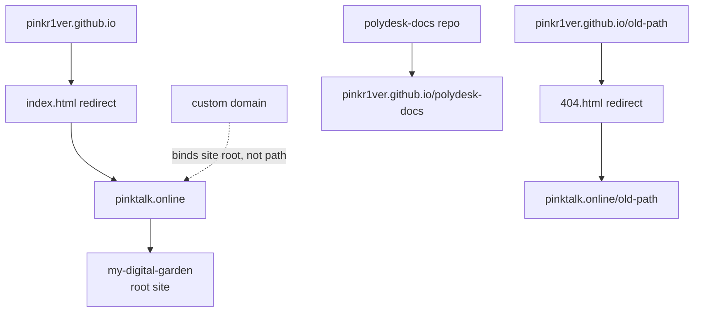

## 这次问题

我有三个站点/入口：

```text
pinktalk.online                    # 主站，来自 my-digital-garden
pinkr1ver.github.io                # GitHub user site
pinkr1ver.github.io/polydesk-docs  # Polydesk 文档，来自 project Pages
```

想做到的事情：

- `pinktalk.online` 继续给 `my-digital-garden` 当根域。
- `polydesk-docs` 用 GitHub Pages 托管。
- 访问旧的 `pinkr1ver.github.io` 时，尽量跳到 `pinktalk.online`。

## GitHub Pages 的基本模型

GitHub Pages 主要有两类 URL：[1]

```text
<owner>.github.io                 # user / organization site
<owner>.github.io/<repo-name>/    # project site
```

所以 `PinkR1ver/polydesk-docs` 默认会发布到：

```text
https://pinkr1ver.github.io/polydesk-docs/
```

这不是 `pinkr1ver.github.io` repo 里的一个文件夹，而是另一个 repo 的 Project Pages。

## custom domain 不是 path routing

一个关键点：GitHub Pages 的 custom domain 绑定的是某个 Pages site 的 root，不是某个 path。[2]

所以不能单独声明：

```text
PinkR1ver/polydesk-docs -> https://pinktalk.online/polydesk-docs/
```

如果想让这个路径成立，必须满足其中一种：

- `pinktalk.online` 绑定到 user site `pinkr1ver.github.io`，这样 project pages 会自然变成 `/polydesk-docs/`。
- 或者当前占用 `pinktalk.online` 的主站自己提供 `/polydesk-docs/` 目录。

这次不能用第一种，因为 `pinktalk.online` 根域要留给 `my-digital-garden`。

所以最后 Polydesk 文档保留在：

```text
https://pinkr1ver.github.io/polydesk-docs/
```

## 逻辑图



## 让旧 user site 跳到 pinktalk.online

`pinkr1ver.github.io` 旧站本身可以改成 redirect-only site。

做法：把 `PinkR1ver/pinkr1ver.github.io` 的发布分支清成只剩：

```text
index.html
404.html
.nojekyll
README.md
```

旧内容先备份到一个 branch。

### 根路径

`index.html` 负责：

```text
https://pinkr1ver.github.io/ -> https://pinktalk.online/
```

核心写法：

```html
<meta http-equiv="refresh" content="0; url=https://pinktalk.online/">
<script>
  window.location.replace("https://pinktalk.online/" + window.location.search + window.location.hash)
</script>
```

### 旧路径

`404.html` 负责旧路径：

```text
https://pinkr1ver.github.io/memory/
-> https://pinktalk.online/memory/
```

核心写法：

```html
<script>
  const target = "https://pinktalk.online"
    + window.location.pathname
    + window.location.search
    + window.location.hash
  window.location.replace(target)
</script>
```

注意：GitHub Pages 对不存在路径仍会返回 HTTP `404`，只是浏览器会执行 404 页面里的 JS 跳转。[3]

## 一个实际踩坑

不要把完整 HTML redirect 写进 `index.md`。

Jekyll 会把它当 Markdown 处理，可能输出成：

```html
<p>&lt;!doctype html&gt;</p>
```

这样浏览器看到的是文本，不会跳转。

正确做法是直接用 `index.html`。

## 最后记住

- `custom domain` 绑定的是 site root，不是任意 path。
- `Project Pages` 默认路径是 `/<repo-name>/`。
- 旧路径全跳转，需要让旧路径不存在，再用 `404.html` 接住。
- archive repo 只是只读，不会隐藏内容；private 才是隐藏，但可能影响 Pages。

## References

[1] [GitHub Docs: What is GitHub Pages?](https://docs.github.com/en/pages/getting-started-with-github-pages/what-is-github-pages)  
[2] [GitHub Docs: About custom domains and GitHub Pages](https://docs.github.com/en/pages/configuring-a-custom-domain-for-your-github-pages-site/about-custom-domains-and-github-pages)  
[3] [GitHub Docs: Creating a custom 404 page for your GitHub Pages site](https://docs.github.com/en/pages/getting-started-with-github-pages/creating-a-custom-404-page-for-your-github-pages-site)
