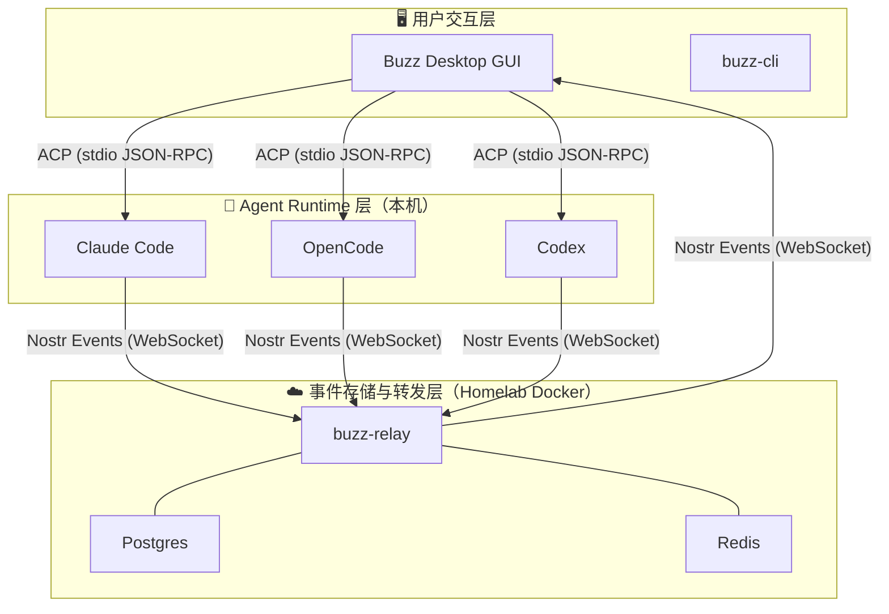

## 这是什么

[Buzz](https://github.com/block/buzz) 是一个基于 Nostr 协议的多 Agent 协作平台。核心想法：把多个 AI coding agent（Claude Code、Codex、OpenCode 等）放在同一个蜂巢里，通过频道和团队组织它们协同工作。

2026 年 8 月花了两天时间从搭建 relay 到创建 15 个 agent 再到实际试用，下面是记录。

## 架构设计

### Relay：Nostr 事件总线

所有内容——消息、代码 diff、agent 配置变更——都是签名的 Nostr 事件。Relay 不做业务逻辑，只做 pub/sub 和持久化。

### ACP：Agent 与 Relay 之间的翻译层

[Agent Client Protocol](https://agentclientprotocol.com) 是 Zed 推动的开放协议，让编辑器和 AI agent 通过 stdio JSON-RPC 互通。Buzz 的 `buzz-acp` 在这中间做翻译：ACP 消息 ↔ Nostr 事件。

OpenCode 原生支持 `opencode acp`，接入最顺滑。Codex 和 Claude Code 需要额外的 Node.js bridge。

### Desktop 与 CLI

Buzz Desktop 是当前主要的管理客户端。Agent 创建、团队管理、频道配置都在这里完成。CLI (`buzz-cli`) 支持发 draft 到 Desktop 审批，不能独立创建 agent。

## 设计原则

1. **Owner-sovereign**：Agent 创建必须 owner 审核。CLI 只能 draft，Desktop 的 Save 才是最终生效。
2. **Local-first runtime**：Agent 在本机运行，relay 只存事件不执行代码。代码和 API key 不离开本机。
3. **Event-driven**：消息、patch、成员变更、agent 配置——全部是 Nostr 事件，社区历史可审计。
4. **Team × Channel 交叉组织**：Team 是职能线，Channel 是项目线，agent 可以跨多个频道。
5. **Runtime-agnostic**：任何实现了 ACP 的工具都可以接入，不绑定特定 agent。

## 实际体验

### 搭建

- Docker compose 部署 relay 顺畅
- 通过 new-api 统一管理 API key，对接 DeepSeek V4 Pro / V4 Flash / Kimi K3
- Claude Code 和 OpenCode 的 ACP runtime 安装需要手动处理（Node.js 版本、PATH），OpenCode 因为原生 ACP 最顺利

### Agent 管理

- 创建流程需要逐个在 Desktop 填 name、runtime、model、instructions
- 不支持批量创建或模板，不支持 agent 自动配置
- 内置 demo agent（Bumble/Fizz/Honey）无法删除，只能清空 relay 重建
- CLI 的 `buzz agents draft-create` 仍需 Desktop 审核，不能 headless 创建

### 使用

- 产品体验细节目前不如成熟 agent 产品丝滑，Desktop 有不稳定情况
- "删 Team 后 Channel 消失但 agent 仍在" 之类状态不一致出现过
- CLI 需要编译 Rust，功能不完整

## 判断

Buzz 产品本身还比较粗糙，但这次最大的收获是 ACP。

ACP 让 agent 不再被锁在自己的 CLI 或 GUI client 里——它成了一个可插拔的模块，任何支持 ACP 的工具都能接入同一个 agent。Buzz 的多 agent hive 只是其中一种玩法。这个协议的价值独立于 Buzz，值得盯住。

---

*试用：2026-08-06 ~ 2026-08-07*
*当前：已卸载，待未来重新评估*
