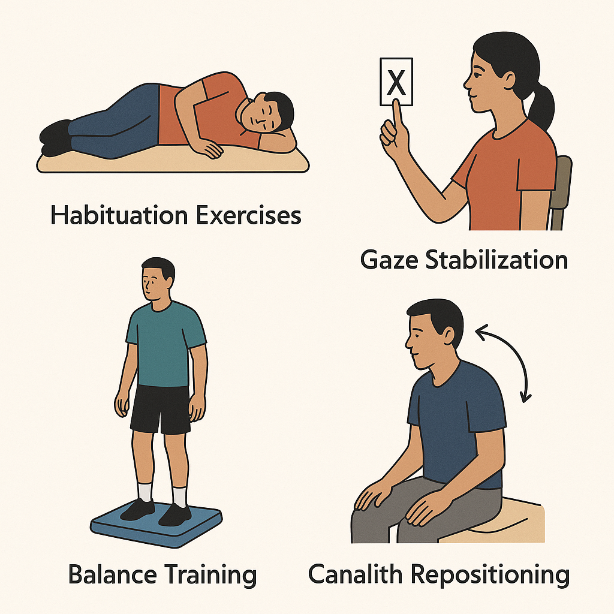
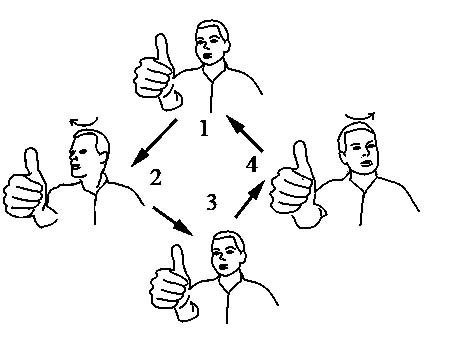
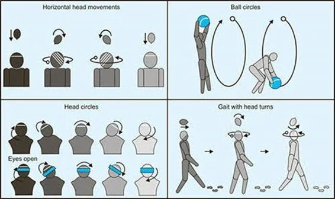
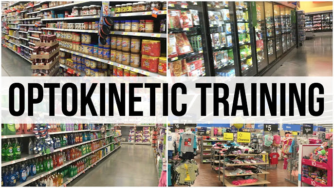

前庭康复（Vestibular Rehabilitation Therapy, VRT）是利用中枢神经系统的可塑性，让大脑重新校准前庭、视觉和本体感觉之间的关系。它解决的是眩晕患者在急性期之后最难被药物解决的部分：转头视物模糊、走路不稳、视觉运动敏感、活动回避、跌倒风险和长期生活质量下降。

从设备产品角度看，前庭康复的核心机会不是替代医生做诊断，而是把训练过程从“口头布置 + 患者自己练”变成“可量化、可反馈、可远程随访”的闭环。院内设备主要承担评估、分型、诱发和安全挑战；院外设备主要承担依从性、动作质量、症状记录和长期趋势监测。

## 为什么眩晕患者需要康复

### 1. 眩晕的后果不只是不舒服，而是功能系统崩掉

前庭系统的作用不是单纯感知“晕不晕”，而是参与三个关键功能：

| 功能 | 对应症状 | 康复要解决的问题 |
| :--- | :--- | :--- |
| 稳定视线 | 转头时看东西糊、跳动、读字困难 | 提升或替代前庭眼反射（VOR），改善 gaze stability |
| 稳定姿势 | 站不稳、走路偏、暗处或复杂地面更差 | 训练视觉、本体感觉和前庭输入的重新加权 |
| 适应运动环境 | 超市、车流、人群、屏幕滚动诱发头晕 | 通过习服和视觉运动训练降低敏感性 |

所以康复的价值在于恢复“能看清、能走稳、敢活动”。如果只依赖止晕药，症状可能短期减轻，但患者仍然会回避运动；而长期回避会进一步削弱平衡能力、降低心肺耐力、增加跌倒风险，并形成焦虑-眩晕-活动减少的循环。

### 2. 外周前庭损伤需要中枢代偿，代偿依赖运动输入

前庭神经炎、迷路炎、单侧前庭切除或听神经瘤术后等情况，会造成一侧或双侧前庭输入下降。身体需要通过三个机制重建稳定性：

- **Adaptation（适应）**：让残余前庭功能和 VOR 重新校准，典型训练是 VOR x1 / VOR x2。
- **Substitution（替代）**：用视觉、本体感觉、颈部感觉、预判性眼动等策略补偿缺失的前庭输入。
- **Habituation（习服）**：反复、可控地暴露于诱发头晕的动作或视觉刺激，让症状反应逐渐降低。

APTA 神经物理治疗临床实践指南把有症状的单侧或双侧外周前庭低功能作为前庭康复的核心适应人群，并给出强推荐：只要患者仍有眩晕/头晕、转头视物模糊、失衡或跌倒等症状，就应考虑前庭物理治疗。[^apta-cpg][^apta-summary]

### 3. 康复可以补上“诊断之后”和“复位之后”的空白

BPPV（耳石症），这时康复训练可以作为后续功能恢复部分。

慢性眩晕、PPPD（persistent postural-perceptual dizziness，持续性姿势-知觉性头晕）、前庭偏头痛和老年平衡障碍也是类似逻辑：诊断和药物处理是基础，但患者最终需要重新回到真实环境，面对转头、走路、超市货架、交通、人群、屏幕和双任务行走。康复项目把这些触发因素拆成可控刺激，逐步训练患者耐受。

### 4. 居家训练是效果瓶颈，也是设备机会

传统前庭康复很依赖患者每天在家练习。问题是医生很难知道：

- 患者有没有练。
- 练习时头动速度、幅度和频率是否达标。
- 训练是否诱发了适度症状，还是过强导致患者放弃。
- 患者在哪类场景最容易失衡或头晕。
- 训练几周后，DHI评分、ABC评分、动态视敏度、步态和跌倒风险是否真的改善。

这正是“康复设备”的核心产品价值：不是只做一个视频播放器，而是把处方、动作质量、症状反应和远程随访整合起来。

## 哪些病人最需要前庭康复

| 患者类型 | 典型表现 | 康复重点 | 设备机会 |
| :--- | :--- | :--- | :--- |
| 外周前庭低功能 | 转头视物模糊、走路不稳、暗处更差、头动诱发头晕 | VOR 适应训练、替代策略、平衡和步态训练 | 头动速度、眼动稳定、动态视敏度和训练剂量监测 |
| BPPV 复位后残余症状 | 复位后仍有头晕、害怕翻身/低头/转头、活动信心下降 | 平衡训练、习服训练、生活动作再暴露 | 复位后随访、残余症状追踪、复发风险提示 |
| PPPD / 视觉运动敏感 | 商场、人群、屏幕滚动、交通环境诱发长期头晕不稳 | 视觉运动分级暴露、感觉重加权、降低回避行为 | VR/视觉刺激场景、症状评分、恢复时间和依从性记录 |
| 前庭偏头痛 / 梅尼埃病稳定期 | 发作间期仍有运动敏感、姿势不稳、活动回避 | 发作间期功能恢复、视觉运动耐受、平衡训练 | 发作日记、触发因素记录、稳定期训练计划 |
| 脑震荡后与老年平衡障碍 | 读屏困难、双任务走路差、跌倒恐惧、综合平衡下降 | 视觉-前庭训练、步态和平衡、双任务和跌倒预防 | 步态、转身、活动量、近跌倒事件和平衡反馈 |

### 1. 外周前庭低功能患者：证据最明确

这是 VRT 最核心的人群，包括：

- **急性/亚急性单侧前庭低功能**：例如前庭神经炎、迷路炎后，患者仍有自发性眩晕后的失衡、转头视物模糊和步态不稳。
- **慢性单侧前庭低功能**：急性期过去超过 3 个月，仍然存在运动诱发头晕、走路不稳、暗处或复杂环境困难。
- **双侧前庭低功能**：常见表现是双侧 VOR 缺失导致 oscillopsia（走路或转头时视物跳动/模糊）、黑暗环境失衡、跌倒风险高。
- **术后或医源性前庭损伤**：如听神经瘤术后、迷路切除术后、耳毒性药物后。

这类患者最需要的是 gaze stabilization、替代策略、平衡和步态训练。指南中也特别强调，康复应针对患者的具体 impairment 和活动受限，而不是只给一套泛化眼球运动练习。[^asha-summary]

### 2. BPPV 复位后仍有残余症状的人

BPPV 患者首先应该做相应半规管的复位手法，对于复位后仍有残余头晕、害怕转头、步态不稳、老年跌倒风险或多次复发的人，可以加入平衡训练、习服训练和生活动作再暴露。

需要区分的是：BPPV 的“复位治疗”解决耳石位置问题；VRT 解决复位后残留的运动敏感、姿势控制和活动信心问题。把二者混为一谈，会导致产品定位不清。

### 3. PPPD、视觉依赖和视觉运动敏感人群

PPPD患者常常在直立、运动、复杂视觉环境中症状加重。典型触发包括商场、超市货架、地铁人流、电脑屏幕滚动、开车或坐车。此类患者通常不只是“前庭器官坏了”，而是感觉整合和威胁预测系统变得过度敏感。

康复重点是：

- 逐级暴露于视觉运动刺激。
- 训练视觉-前庭-本体感觉重新加权。
- 降低回避行为。
- 与心理教育、睡眠、焦虑管理和必要药物协同。

VR、optokinetic 视觉刺激、沉浸式环境和移动场景模拟在这一类人群中很有产品价值，因为它们可以把“超市/车流/人群”这种真实但难以控制的刺激变成可调参数。

### 4. 前庭偏头痛和梅尼埃病：稳定期更适合康复

这两类疾病具有波动性。急性发作期患者眩晕、恶心、呕吐明显，此时重点通常是医学处理、发作控制和安全；如果在发作期强行做诱发训练，可能不但无效，还会降低依从性。

更适合康复的是：

- 发作间期仍有视觉运动敏感、姿势不稳和活动回避。
- 梅尼埃病进入“burn-out”或稳定阶段后残留单侧前庭低功能。
- 前庭偏头痛患者在药物、睡眠、诱因管理基础上仍存在运动敏感。

康复目标不是“治愈偏头痛/梅尼埃病本身”，而是改善发作间期功能和减少长期回避。

### 5. 脑震荡后、老年眩晕和平衡障碍患者

脑震荡后常见视觉-前庭症状，包括读屏困难、视觉运动敏感、头动后头晕、步态和双任务困难。老年患者则常常同时存在前庭衰退、视力下降、本体感觉下降、肌力下降、药物副作用和跌倒恐惧。

这类患者最需要综合型康复：

- 平衡和步态训练。
- 双任务训练。
- 肌力和耐力训练。
- 环境适应训练。

## 目前有哪些康复项目以及目的

*图：Vestibular Rehabilitation Therapy, VRT*

### 1. Gaze stabilization：视线稳定训练

**目的**：改善转头时视物清晰度，减少 oscillopsia（振动幻视），提高 VOR 功能或替代策略。

常见项目：

| 项目 | 做法 | 主要适用 |
| :--- | :--- | :--- |
| VOR x1 | 盯住固定目标，头左右/上下转动 | 单侧或双侧前庭低功能 |
| VOR x2 | 目标和头向相反方向移动 | 更高阶的动态视线稳定 |
| 动态视敏度训练 | 在头动中识别字母/符号 | 转头视物模糊、步行中看不清 |
| 替代性凝视策略 | 训练预判性扫视、颈部感觉和视觉线索 | 双侧前庭低功能或残余 VOR 很差者 |

*图：VOR Exercise*

APTA 的资料明确提示，不应把单纯 voluntary saccade（主动扫视） 或 smooth pursuit（平滑追踪） 当成外周前庭低功能的 gaze stabilization 主训练；更有效的是 adaptation 和 substitution 类型的 gaze stability exercise。[^apta-summary]

### 2. Habituation：习服训练

**目的**：降低特定动作或视觉刺激诱发的眩晕反应。它不是避免症状，而是在安全范围内“适度诱发、快速恢复、逐渐进阶”。

常见项目：

- Brandt-Daroff 或 Cawthorne-Cooksey 类动作。
- 反复转头、低头、抬头、弯腰、翻身。
- 从坐位到站位、从静态到动态、从睁眼到闭眼。
- optokinetic 刺激、滚动条纹、移动人群、超市场景等视觉运动刺激。

*图：Habituation Exercise*

Cawthorne-Cooksey exercises 的核心目标是让患者逐步耐受异常平衡信号，同时训练眼头分离、日常姿势平衡、协调性和自然运动。ENT UK 建议这类练习通常每天三次，每次约 10 分钟，但实际处方仍需要根据患者症状和安全性调整。[^entuk-cawthorne]

### 3. Balance and gait：平衡与步态训练

**目的**：提升姿势控制、感觉重加权、步行稳定性和跌倒防护能力。

常见项目：

- 静态平衡：窄基底站立、半串联/串联站立、单脚站立。
- 感觉挑战：泡沫垫、闭眼、视觉冲突背景、头动。
- 动态平衡：重心转移、跨步、转身、上下台阶。
- 步态训练：边走边转头、变速走、绕障碍、双任务行走。
- 跌倒预防：反应性踏步、保护性跨步、环境风险教育。

这部分最适合用力板、IMU、摄像头、压力传感器和可视化反馈设备量化，因为训练效果并不只体现在“晕不晕”，还体现在重心控制、步态稳定、步速、转身质量和双任务成本。

### 4. Visual motion / optokinetic training：视觉运动训练

**目的**：改善视觉依赖和视觉运动敏感，尤其适合 PPPD、前庭偏头痛发作间期、脑震荡后和复杂环境不耐受人群。

常见做法是通过播放视频让患者逐步适应复杂场景：

- 条纹、点阵、流场、隧道、车流、超市货架。
- VR/AR 中的移动环境。
- 从低速度、低对比度、小视野逐步进阶到高速度、高复杂度、大视野。

*图：[optokinetic training Video](https://www.youtube.com/playlist?list=PLgX4XeDMTsGmALf-ye0a2l38HpGAUbw8N)*

VR/AR 系统综述显示，VR/AR 作为传统前庭康复的辅助形式，短期内可能进一步降低 DHI 评分，但研究质量和人群异质性仍然限制了结论强度。[^vr-meta] 因此产品上更稳妥的定位是“提升动机、依从性、场景控制和可量化反馈”，而不是宣称 VR 单独替代临床康复。

### 评估指标：康复闭环必须量化

一个完整康复系统通常需要跟踪四类指标：

| 类型 | 例子 | 价值 |
| :--- | :--- | :--- |
| 主观症状 | DHI、VAS、Visual Vertigo Analog Scale、症状日记 | 看患者感受和生活影响 |
| 视线稳定 | Dynamic Visual Acuity、Gaze Stabilization Test、头动速度 | 看 VOR/替代策略改善 |
| 平衡步态 | mCTSIB、SOT、FGA、TUG、Mini-BESTest、步速、转身 | 看跌倒风险和动态控制 |
| 训练过程 | 完成率、头动频率/幅度、诱发症状等级、恢复时间 | 看依从性和剂量是否达标 |

设备量化的关键不是把所有指标都测一遍，而是找到与具体训练目标对应的最小指标集。

## 目前有哪些康复设备

## 院内设备

| 设备类型 | 代表设备/产品 | 主要用途 | 适合场景 | 优势 | 局限 |
| :--- | :--- | :--- | :--- | :--- | :--- |
| 基础治疗设备 | 治疗床、瑜伽垫、泡沫垫、BOSU、台阶、锥桶、弹力带、镜子、节拍器、字母卡、视靶、步态带、保护吊带 | VOR 训练、习服训练、平衡训练、步态训练、跌倒预防 | 基层康复、常规门诊、治疗师一对一训练 | 便宜、灵活、易普及，是任何智能设备进入临床前必须兼容的现实环境 | 量化能力弱，训练质量主要依赖治疗师观察 |
| CDP / 力板系统 | Bertec CDP/IVR、Bertec Portable、NeuroCom SMART EquiTest、静态平衡仪 | 评估和训练姿势控制、重心轨迹、稳定性边界、感觉组织能力 | 医院眩晕中心、康复科、平衡专科中心 | 可量化重心和姿势摇摆，可控制视觉/本体/前庭输入冲突，适合平衡和跌倒风险训练[^bertec-cdp] | 价格高、占地大，通常需要治疗师保护，不适合大规模居家 |
| VR / IVR 康复系统 | Interacoustics / Virtualis BalanceVR、KineQuantum、舒瑞 G1 前庭康复训练仪 | 视觉运动敏感训练、PPPD 分级暴露、前庭偏头痛发作间期训练、复杂环境平衡步态训练 | 专科门诊、康复中心、医院内训练室 | 可把超市、人群、车流、optical flow 等触发场景做成可控刺激；BalanceVR 明确支持 adaptation、substitution 和 habituation 模块[^balancevr][^interacoustics-vr] | 可能诱发 cybersickness 或过强症状；软件刺激参数差异大，需严格分级和监测 |
| 动态平台、跑台和安全吊带 | 动态平衡平台、跑台、减重步态训练系统、安全吊带 | 转头走、变速走、视觉干扰走、坡度/速度变化、双任务走、跌倒风险训练 | 大型康复中心、神经康复科、跌倒高风险患者训练 | 把真实行走中的失衡放进可保护环境，治疗师可以更大胆地训练复杂步态任务 | 更偏大型康复中心，成本和空间要求高，不适合基层和家庭 |

## 院外/居家设备

院外设备可以分成两类：一类是真正给患者带回家的训练/监测工具，另一类是“轻量化、可下沉”的诊间或社区设备。国外产品更容易看到完整的“医生端处方 + 患者端训练 + 传感器反馈 + 远程监测”闭环；国内公开资料中，前庭康复产品更多集中在院内 VR 训练仪、医院采购和 App/小程序化康复平台，真正硬件化的居家闭环产品还比较少。

| 类型 | 设备图 | 国外产品例子 | 国内产品/公开资料例子 | 能解决的问题 |
| :--- | :--- | :--- | :--- | :--- |
| 处方 + App + 传感器闭环 |    | Vertigenius：医生端开处方，患者 App 训练，耳后头动传感器记录动作质量和依从性。[^vertigenius][^vertigenius-how] | 医脉通“前庭康复中心”小程序、眩晕小站 App：更偏线上评估、视频训练、症状记录。[^yimaitong-vrt][^xuanyun-app] | 居家训练指导、依从性、训练剂量、远程随访 |
| BPPV 居家复位辅助 |  | DizzyFIX：头戴式半规管模型，用可视化方式指导患者完成粒子复位动作；FDA 510(k) 文件把它描述为家庭 BPPV 治疗辅助设备。[^dizzyfix-fda][^dizzyfix-jama] | 国内更多是医院 BPPV 诊疗椅/手法复位宣教，公开可查的消费级复位辅助硬件较少 | 降低居家复位动作做错的风险 |
| VOR / 视线稳定数字训练 | — | VORtrain：用于 VOR x1 / VOR x2 的可定制 gaze stabilization 工具，可用于诊间或居家处方。[^vortrain] | 前庭训练 VR App、眩晕康复操视频/小程序：能提供训练内容，但动作质量量化较弱。[^vrt-vr-app] | 视线稳定训练、训练节奏控制 |
| 可穿戴平衡反馈 |  | BalanceBelt：腰带式触觉反馈设备，面向双侧前庭低功能/严重平衡障碍，通过振动提示身体倾斜方向。[^balancebelt][^balancebelt-mi] | 国内有类似面向前庭低功能的日用触觉反馈腰带，但还未公开 | 日常行走稳定、空间定向补偿 |
| 家用/便携力板和平衡训练 |  | BTrackS：便携力板 + Assess Balance 软件，可做平衡评估和训练协议。[^btracks] | 国内静态平衡仪在医院眩晕中心已有应用报道，但通常是院内设备。[^jz-balance] | 重心、姿势摇摆、平衡训练量化 |
| VR 场景化训练 |   | KineQuantum、XRHealth、Neuro Rehab VR、REAL System 等：提供 VR 康复、平衡、功能任务和场景训练。[^kinequantum][^xrhealth][^neurorehabvr][^real-system] | 舒瑞 G1 前庭康复训练仪：VR 场景下的前庭康复方案，公开产品页显示有训练反馈、评估和康复工作站；但更偏院内设备。[^shray-g1][^shray-purchase] | 视觉运动敏感、PPPD、步态/平衡和动机提升 |

### 1. 纸质处方、视频课程和 App：最低门槛

这是目前最常见的居家康复形式。医生或治疗师给患者一组动作，患者回家照做，App 或视频只负责提醒和演示。

问题在于无法量化：

- 不知道患者动作是否做对。
- 不知道头动速度/幅度是否达标。
- 不知道症状诱发是否过强或过弱。
- 缺少医生端随访数据。

### 2. 手机和可穿戴 IMU

手机和 IMU 可以记录头部角速度、转头幅度、训练频率、步数、步态、转身和跌倒风险。对于 VOR x1、VOR x2、转头走、步态训练和日常活动监测，这是一条很现实的低成本路线。

对应产品：

- **Vertigenius**：典型形态是耳后 head sensor + 手机 App + 医生端 portal。患者在家练习时，传感器记录头动，App 给即时反馈，医生端查看进度、依从性和结果。[^vertigenius-how][^vertigenius-prescription]
- **Sword Health / Thrive**：不是专门前庭设备，但其数字物理治疗方案使用 motion sensors 和 computer vision 做远程动作反馈，并把 vertigo/平衡问题纳入远程物理治疗场景；可作为“院外 PT 平台如何做动作质量闭环”的参考。[^sword-vertigo]

可测指标：

- 头动速度是否达到目标。
- 左右/上下头动是否对称。
- 每日训练次数和时长。
- 步态速度、转身、活动量。
- 训练后症状评分和恢复时间。

局限：

- 只看 IMU 不知道眼睛是否跟上。
- 佩戴位置影响数据质量。
- 患者可能忘记佩戴或佩戴错误。

### 3. 家用摄像头/眼动采集

居家眼动采集可以把 VRT 从“只看头动”推进到“看头眼配合”。例如在 VOR 训练中同时记录眼球是否保持注视、是否出现补偿性扫视、眨眼/丢帧是否影响结果。

目前这种形态的产品还没在市场有出现。

机会：

- 目前国外成熟院外产品更多是“头动传感器 + App”，真正家用眼动采集闭环还没像 Vertigenius 这类产品一样形成清晰标杆。
- 国内可参考“眩晕小站”这种症状记录和前庭康复平台，以及此前前庭筛查/居家监测产品构思中提到的头戴式眼动采集方向；但公开市场上仍缺少低成本、患者可自用、医生可复核的标准化近眼视频设备。

挑战：

- 光照、眼镜、睫毛、瞳孔定位和头动伪影。
- 医疗级准确性与消费级成本之间的权衡。
- 数据隐私和患者可用性。

### 4. 消费级 VR/AR

消费级 VR/AR 可以在家中提供视觉运动、头动和场景暴露训练。它的潜力在于把康复游戏化，提高依从性，并模拟超市、交通、人群、楼梯、隧道等真实触发场景。

对应产品：

- **KineQuantum**：明确把 VR 用于 vestibular rehabilitation，包含习服、眼稳定和平衡训练，产品页强调可替代传统 optokinetic sphere 等笨重设备。[^kinequantum]
- **XRHealth / Neuro Rehab VR / REAL System**：更广义的 VR 康复平台，覆盖平衡、功能任务、ADL、认知等训练；对前庭康复的启发是场景化、沉浸式、可追踪，但不一定都是专门为前庭疾病设计。[^xrhealth][^neurorehabvr][^real-system]
- **国内舒瑞 G1 前庭康复训练仪**：VR 场景下完整 VRT 前庭康复方案，具备训练反馈、训练后评估和康复工作站；从采购中标信息看，医院采购价约 34.68 万元人民币，说明当前国内 VR 前庭康复更偏院内专科设备。[^shray-g1][^shray-purchase]

### 5. 家用平衡板和压力垫

平衡板、压力垫、Wii Balance Board 类设备可以做重心反馈、左右负重、稳定性边界和游戏化训练。它们适合低风险患者的居家平衡训练，但需要注意安全保护，尤其是老年患者和跌倒风险患者。

对应产品：

- **BTrackS Balance Plate + Assess Balance Software**：便携力板系统，产品页显示可用于 balance assessment 和 rehabilitation，包含测试和训练 protocol。它比大型 CDP 轻，但仍更适合治疗师指导下使用。[^btracks]
- **国内静态平衡仪**：医院报道中已用于眩晕中心前庭康复，通过平衡板与计算机游戏连接完成训练；但这仍属于院内/门诊形态，不是典型家用设备。[^jz-balance]

### 6. 远程康复平台

远程康复平台的目标不是单个硬件，而是把治疗师、患者和数据连接起来：

- 医生端开处方。
- 患者端按计划训练。
- 设备采集头动、眼动、平衡和症状。
- 系统自动提示风险、依从性下降和进阶时机。
- 随访时生成趋势报告。

对于眩晕康复，这比单点设备更重要，因为 VRT 的疗效高度依赖个体化处方和持续调整。

目前最值得参考的产品逻辑是 Vertigenius：医生先做评估和个体化处方，患者端在家训练，传感器和 App 记录训练质量，医生端远程查看数据并调整计划。国内医脉通“前庭康复中心”也在往“线上评估 - 专家定制 - 智能训练 - 远程监督”的方向走，目前还停留在平台发布康复信息和小程序服务，还看不到专用硬件传感器闭环。[^vertigenius][^yimaitong-vrt]

## 设备机会总结

院内场景更适合做高质量评估和高强度、安全可控训练：

- 用 CDP/力板/VR 诱发并量化问题。
- 在治疗师保护下做更难的平衡和视觉冲突训练。

院外场景更适合做频繁、低成本、长期的康复闭环：

- 提醒患者训练。
- 监测训练剂量。
- 评估动作质量。
- 记录症状反应。
- 帮助医生远程调整计划。

### 最有产品潜力的切入点

| 切入点 | 为什么有价值 | 可能数据 |
| :--- | :--- | :--- |
| VOR 训练质量监测 | 传统居家 VOR 很难知道头动是否达标、眼睛是否稳定 | 头动速度、目标保持、补偿性扫视、训练完成率 |
| 视觉运动敏感分级暴露 | PPPD/前庭偏头痛/脑震荡后人群痛点明显 | 场景参数、症状评分、恢复时间 |
| 居家发作期眼震记录 | 发作性眩晕常常到医院已缓解 | 眼震视频、时间戳、触发场景、症状日志 |
| 跌倒风险和平衡训练 | 老年和双侧前庭低功能患者风险高 | 重心、步态、转身、近跌倒事件 |
| 医生端康复报告 | 临床需要低成本随访证据 | DHI/ABC 趋势、训练剂量、客观指标变化 |

## 康复设备构思

*图：一体化居家前庭康复设备概念。主体是一个方形手机/小平板形态的计算终端，只集成摄像头与投影功能；头戴 IMU、身体 IMU 与平衡板作为可选配件，通过无线连接接入同一套训练系统。*

<!-- 

  
   
  <em>图：一体化居家前庭康复设备概念。主体是一个方形手机/小平板形态的计算终端，只集成摄像头与投影功能；头戴 IMU、身体 IMU 与平衡板作为可选配件，通过无线连接接入同一套训练系统。</em>

 -->

这个构思的核心不是单独做一个 App、VR 头显或平衡板，而是做一个小型计算终端，把居家前庭康复的感知、投影训练和数据整合起来。主机本身只负责两件事：摄像头捕捉患者姿态和眼动，投影仪输出训练靶点和 optokinetic training video；头戴 IMU、身体 IMU、平衡板等配件都作为无线选配模块，用于增强头动、身体运动和重心数据。这样同一套系统可以根据不同患者需求切换训练模式，例如外周前庭低功能患者做 VOR/gaze stabilization，PPPD 或视觉运动敏感患者做视觉刺激，老年和平衡障碍患者做平衡板和步态训练。

[^apta-cpg]: APTA, [Vestibular Rehabilitation for Peripheral Vestibular Hypofunction: An Updated Clinical Practice Guideline](https://www.apta.org/patient-care/evidence-based-practice-resources/cpgs/vestibular-rehabilitation-for-peripheral-vestibular-hypofunction-an-evidence-based-clinical-practice-guideline-cpg), 2022.
[^apta-summary]: Academy of Neurologic Physical Therapy / APTA, [Updated Evidence-Based Clinical Practice Guideline for Peripheral Vestibular Hypofunction summary PDF](https://neuropt-website-documents.s3.amazonaws.com/docs/default-source/cpgs/vestibular-update/apta-s-evidence-based-clinical-practice-guideline-for-peripheral-vestibular-hypofunction-2022-vs2_262f3ddd-7ee5-4855-ba0a-8c753466fb67.pdf?sfvrsn=b665c43_4), 2022.
[^asha-summary]: ASHA Evidence Maps, [Summary of the updated clinical practice guideline for vestibular rehabilitation for peripheral vestibular hypofunction](https://apps.asha.org/EvidenceMaps/Articles/ArticleSummary/84b2bb3c-252a-ed11-8137-005056834e2b).
[^bppv-guideline]: AAO-HNS, [Clinical Practice Guideline: Benign Paroxysmal Positional Vertigo (Update)](https://www.entnet.org/quality-practice/quality-products/clinical-practice-guidelines/bppv/), 2017.
[^entuk-cawthorne]: ENT UK, [Cawthorne-Cooksey exercises](https://www.entuk.org/patients/conditions/93/cawthornecooksey_exercises/).
[^vr-meta]: Heffernan A, Abdelmalek M, Nunez DA. [Virtual and augmented reality in the vestibular rehabilitation of peripheral vestibular disorders: systematic review and meta-analysis](https://www.nature.com/articles/s41598-021-97370-9). *Scientific Reports*, 2021.
[^bertec-cdp]: Bertec, [CDP/IVR](https://www.bertec.com/products/cdp-ivr).
[^balancevr]: Interacoustics, [BalanceVR: Vestibular rehabilitation system](https://www.interacoustics.com/balance-testing-equipment/balancevr).
[^interacoustics-vr]: Interacoustics, [Balance rehabilitation systems](https://www.interacoustics.com/balance-testing-equipment/balance-rehabilitation-systems).
[^vertigenius]: Vertigenius, [Vestibular Therapy Device & Platform](https://vertigenius.com/).
[^vertigenius-how]: Vertigenius, [How It Works](https://vertigenius.com/how-it-works/).
[^vertigenius-prescription]: Vertigenius, [Exercise Prescription in Vestibular Therapy](https://vertigenius.com/exercise-prescription-in-vestibular-therapy/).
[^dizzyfix-fda]: FDA, [DizzyFIX 510(k) Summary K081602 PDF](https://www.accessdata.fda.gov/cdrh_docs/pdf8/K081602.pdf), 2008.
[^dizzyfix-jama]: Bromwich et al., [Efficacy of a New Home Treatment Device for Benign Paroxysmal Positional Vertigo](https://jamanetwork.com/journals/jamaotolaryngology/fullarticle/496538), *JAMA Otolaryngology*, 2008.
[^vortrain]: Sonia Vovan, [VORtrain - Gaze Stabilization Exercises for Vestibular Rehab](https://soniavovan.com/vortrain).
[^eye-rehab]: Google Play, [Vision Therapy Dizziness Rehab / Eye Rehab](https://play.google.com/store/apps/details?hl=zh&id=app.mistral.eyerehab).
[^balancebelt]: BalanceBelt, [How BalanceBelt Works](https://balancebelt.net/en/how-it-works/).
[^balancebelt-mi]: Maastricht Instruments, [BalanceBelt](https://maastrichtinstruments.nl/portfolio/balancebelt/).
[^btracks]: Balance Tracking Systems, [BTrackS Assess Balance System](https://balancetrackingsystems.com/product/btracks-assess-balance-system).
[^kinequantum]: KineQuantum, [Vestibular rehabilitation exercises in virtual reality](https://www.kinequantum.com/en/vestibulaire-vr).
[^xrhealth]: XRHealth, [Virtual Reality Physical Therapy](https://www.xr.health/us/products/physical-rehabilitation/).
[^neurorehabvr]: Neuro Rehab VR, [XR Therapy System](https://neurorehabvr.com/smart-therapy-complete-solution).
[^real-system]: Penumbra, [REAL y-Series rehabilitation platform launch](https://www.penumbrainc.com/penumbra-launches-first-hands-free-full-body-virtual-reality-based-offering-for-rehabilitation-expanding-real-system-platform/).
[^shray-g1]: 皓业医疗, [G1型前庭康复训练仪](https://kmhykm.com/haoye/shray/67.html).
[^shray-purchase]: 阳光易招公共资源交易平台, [洛阳市中医院前庭康复训练仪采购项目成交结果公告](https://www.sunbidding.com/yyzbgg/54129.jhtml), 2022.
[^yimaitong-vrt]: 腾讯新闻, [医脉通互联网医院发布前庭康复平台](https://news.qq.com/rain/a/20250528A080SC00), 2025.
[^xuanyun-app]: Apple App Store, [眩晕小站](https://apps.apple.com/cn/app/%E7%9C%A9%E6%99%95%E5%B0%8F%E7%AB%99/id6446917438).
[^vrt-vr-app]: 前庭眩晕症研究, [前庭康复训练VR 使用说明](https://www.ttbake.com/archives/useinfo).
[^sword-vertigo]: Sword Health, [Physical Therapy for Vertigo](https://swordhealth.com/articles/physical-therapy-for-vertigo).
[^jz-balance]: 锦州市中心医院, [眩晕症：静态平衡仪与前庭功能康复治疗](https://www.jzszxyy.com/xueke/info_1998.html).
