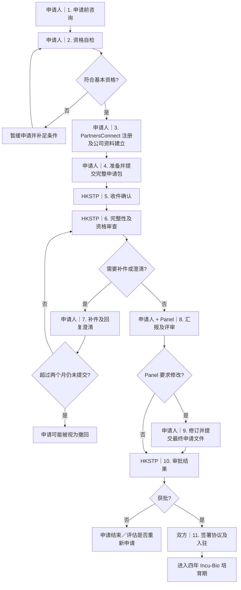

<!-- 
> 工作笔记，更新于 2026-07-13。
>
> 本文用于组织 Incu-Bio 申请工作，不代替 HKSTP 的正式通知、在线表格或协议。HKSTP 已于 2025-10-09 宣布升级 Incu-Bio 2.0，但截至本文更新时，官网公开下载的 Programme Guide 仍是 Version 9（2021-11-26）。递交前应向 HKSTP 确认最新版表格、资格条件和提交要求。 -->

## 一、申请总流程

各阶段应准备的文件、内容要求和风险见下文对应节点。

## 二、节点说明

### 1. 申请前咨询

**目标**

- 确认公司适用 Incu-Bio，而不是一般 Incubation Programme 或其他 HKSTP 项目。
- 索取当前有效的申请表、材料清单和 Incu-Bio 2.0 规则。
- 确认在线申请方法、Panel 时间安排及是否需要先与 Incu-Bio 团队沟通。

**建议准备**

- 一页公司简介：公司名称、成立日期、业务领域、核心技术及目标产品。
- 当前 Company Overview Presentation，官网 programme enquiry 表格偏好 PDF。
- 公司网站或项目链接（如有）。
- 希望咨询的问题清单，特别是本文末尾的“待 HKSTP 确认事项”。

**当前官方渠道**

- Programme enquiry：<https://www.hkstp.org/en/enquiry/programmes>
- Incu-Bio 官网：<https://www.hkstp.org/en/programmes/incubation/incu-bio>
- PartnersConnect：<https://partnersconnect.hkstp.org/>
- 当前官网公开邮箱：`enquiry.marketing@hkstp.org`
- Incu-Bio Version 9 Guide 专项邮箱：`incubio@hkstp.org`
- 电话：`+852 2629 1818`

**阶段输出**

- 最新 Application Form 及申请要求。
- 申请账户或明确的申请入口。
- 对资格边界和特殊公司结构的书面确认。

### 2. 资格自检

官网挂载的 Version 9 Guide 所列基本条件：

- **申请人是在香港注册并成立、股份有限公司形式的科技初创企业。**
- **申请日距离公司成立日不超过两年。**
- 从事诊断、治疗、医疗器械或其他生物医学领域的研发。
- 拟开发或商业化的技术及 IP 不侵犯第三方权利；使用第三方 IP 时，须取得并持续维持必要授权。
- 申请公司及其创始股东原则上不得曾经或正在参与 HKSTP、Cyberport 或 Hong Kong Design Centre 管理或共同管理的培育计划；例外须获 HKSTP 书面同意。
- **创始人合计直接或实益持有不少于 33% 的已缴股本，并在整个计划期间维持该比例。**
- **至少有两名全职员工，且员工均具备在香港合法工作的资格。**
- **至少 50% 的全职员工从事研发，并驻于 Hong Kong Science Park。**
- 如涉及实验室工作，研发人员须具备相应训练和技能，并遵守安全、法律及园区要求。
- 不得在 HKSTP 提供的场所从事零售活动。

<!-- **应作为最新版本待确认的条件**

- HKSTP 当前 programmes overview 将 Incubation/Incu-Bio 描述为企业估值不高于 USD 5 million，但 Incu-Bio 专页及 Version 9 Guide 没有清晰列为 Incu-Bio 独立硬性条件。
- 2025 年推出 Incu-Bio 2.0 后，是否仍严格采用“成立不超过两年”、33% 创始人持股及原有人员要求。
- “至少两名全职员工”和当前网页中“more than two full-time employees”的文字差异。
- 母公司、境外关联公司、大学 spin-off 或曾参加其他培育计划时的处理方法。 -->

**阶段输出**

- 已签字或内部确认的资格自检表。
~- 对任何灰色条件取得 HKSTP 书面回复。~

### 3. PartnersConnect 注册及公司资料建立

**需要完成**

- 在 PartnersConnect 建立 Incu-Bio 申请账户及公司档案。
- 由有权代表公司的人填写或提交申请。
- 确保线上资料与公司注册文件、股权图和申请正文完全一致。

**应预先整理的资料**

- 公司中英文名称、注册地址及联络资料。
- Business Registration Number、Company Number 和成立日期。
- 董事、股东、最终实益拥有人及授权代表资料。
- 员工人数、研发人员比例和工作地点。
- 公司简介、网站、所属生物医药领域及产品阶段。

**注意**

- PartnersConnect 有 Incu-Bio Registration/Application 指引，但公开页面主要以视频呈现；实际字段应以登录后页面为准。

### 4. 准备并提交完整申请包

完整申请包由三类主文件及 supporting documents 组成。详细逐项要求见第三部分。

**三类主文件**

1. Application Form。
2. Business Proposal。
3. Company Presentation Deck，包含 4-year Milestone Plan。

**Supporting documents 分组**

- 公司法定及治理文件。
- 股权、集团和组织架构文件。
- 财务文件。
- 团队、学历及雇佣文件。
- 技术验证、专利、IP 和合作协议。
- 法规、伦理、安全及其他补充文件。

其中，团队、学历、雇佣及 IP 文件有以下明确要求：

| 文件 | 是否必需 | 具体要求 |
| --- | --- | --- |
| 所有全职员工的 CV | 必需 | 每位全职员工都要提供；学历须列明课程、就读期间及院校，工作经历须列明职位、任职期间及职责 |
| 关键技术人员的学历证书 | 关键技术人员必需 | 提交证书副本；这里要求的是 key technical staff，不是所有员工 |
| 关键技术人员最近任职证明 | 关键技术人员必需 | 须与本次申请相关；HKSTP 文件没有进一步规定必须采用哪一种证明格式，宜在提交前确认可接受的文件类型 |
| 非股东全职员工的 employment letter | 有此类员工时必需 | 每位 non-shareholding full-time employee 都要提供，并须有雇主和雇员双方签名 |
| 专利申请／授权证明 | 如适用 | 提交 filing 或 grant certificate；较新的材料指南要求至少包括专利文件首页及保护范围（scope） |
| IP／研发合作协议 | 如适用 | 如申请人与研发合作机构之间涉及 IP、royalties 或申请公司产生的其他收入分配，须提交相关协议副本 |
| 尚在协商的 IP license | 如适用 | 如果 licensing agreement 仍在谈判，较新的材料指南要求提供与研发合作机构的相关 email conversation 作为参考 |
| 拟申请专利、奖项及已发表论文资料 | 如适用 | 提供 impending patents、awards 和 published scientific papers 的相关信息 |

<!-- **质量控制要求**

- 公司名称、人员职位、股权比例、产品名称和 milestone 日期在所有文件中一致。
- 所有证书在有效期内，扫描清晰并完整显示关键页。
- “当前状态”和“四年后计划”清楚区分。
- 所有技术、市场及 PoC 主张有证据支持。
- 对第三方、大学或合作机构拥有的 IP，明确所有权、授权范围、地域、期限及商业收益安排。
- 提交内容可能由 HKSTP、顾问及 Panel 在没有 NDA 的情况下审阅；披露应足以评审，但避免加入不必要的商业秘密。

**提交前检查**

- 确认 Application Form、Business Proposal、Company Presentation Deck、4-year Milestone Plan、全套 supporting documents，以及线上系统额外要求的声明或附件均已齐备。
- 授权代表、董事或所需签署人已完成签署。
- 文件名清晰，建议采用 `序号_类别_公司名_文件名_日期或版本`。
- PDF 可搜索、方向正确、没有密码保护。
- 记录每份文件的版本、提交日期及负责人。
- 保存系统确认页、确认邮件和最终提交文件的只读副本。 -->

**提交**

- 通过 PartnersConnect 或 HKSTP 当前指定的申请渠道提交完整申请包。
<!-- - 实际上传字段、文件格式及大小限制以提交时的线上系统为准。 -->

**阶段输出**

- 正式提交记录或申请编号。
- 一份与提交内容一致的内部申请档案。

### 5. HKSTP 收件确认

Version 9 Guide 规定 HKSTP 在收到申请后 **10 个工作日内**书面确认，确认内容应包括：

- 申请 reference number。
- 联络资料。
- 大约处理时间。

若 10 个工作日后仍未收到确认，应以提交记录向 HKSTP 跟进。

### 6. 完整性及资格审查

**HKSTP 主要检查**

- 是否提交所有必需文件。
- 是否满足申请资格。
- 公司、股权、团队、IP 和技术陈述是否一致可信。
- 是否需要进一步资料、澄清或尽职调查。

**申请人应准备**

- 可快速检索的申请档案和材料追踪表。
- 负责公司、财务、技术、IP、HR 和法规问题的联系人。
- 公司注册、股权、雇佣及 IP 原件或可验证副本。

**注意**

- HKSTP 可随时要求额外资料，不应把初始清单视为封闭清单。
- 故意误导或不准确的资料可能被调查，并可能影响申请或后续资格。

### 7. 补件及回复澄清

**常见补件方向**

- 缺少签署、证书过期或扫描不完整。
- 公司注册资料与股权图不一致。
- 控股公司的股东未穿透披露。
- IP 所有权、许可或合作收益安排不清楚。
- 全职身份、工作地点或雇佣关系证据不足。
- PoC、监管路径、市场数据或 milestone 缺乏证据。

**回复要求**

- 建立问题清单，逐条引用 HKSTP 的问题并逐条回答。
- 区分“解释”与“修订文件”；有修订时提交 clean version，并保留内部 redline。
- 每次提交记录日期、文件版本和未决问题。

**时间风险**

- Version 9 Guide 规定：如申请人延迟提交 HKSTP 要求的澄清、资料或文件超过 **两个月**，申请可能被视为撤回。

### 8. Assessment Panel 汇报及评审

**会议形式**

- Presentation Deck Template 建议安排为 **13 分钟 Presentation + 15 分钟 Q&A**。

**Deck 建议结构**

1. Company name and background。
2. Team members；顾问或 consultants（如有）。
3. Company vision and what the company does。
4. Existing technology hurdles / unmet need。
5. Core technology and comparison with existing technology or gold standard。
6. 每条 pipeline 的产品说明及 Proof of Concept data。
7. 每条 pipeline 的专利状态、所有权和保护范围。
8. Regulatory plan and target market。
9. Market landscape and competitor analysis。
10. Business model、客户、收入来源及风险。
11. 4-year Milestone Plan。
12. Appendix：Q&A 备用数据。

**不同产品类型建议准备的 PoC**

- Diagnostic：sensitivity、specificity、clinical data 等。
- Medical device：sensitivity、specificity、animal data、clinical data 等。
- Therapeutic：efficacy、toxicity、in-vitro、in-vivo、safety data 等。

**评分标准（Version 9，及格线 65）**

| 评审维度 | 权重 | 重点 |
| --- | ---: | --- |
| Innovation and Technology | 30% | 创新性、技术可靠性、IP 地位及策略 |
| Team/Personnel Competence | 20% | 技术与商业能力、资源、合作伙伴 |
| 4-year Milestone Plan | 20% | 技术及市场路线、交付物是否现实 |
| Business Model | 15% | 未满足需求、市场、客户、竞争优势、规模化 |
| Risk Assessment | 15% | 伦理、安全、技术、运营、财务及合作方风险 |

**现场准备**

- 13 分钟内可完成的主 Deck 和计时 rehearsal。
- 技术、商业、IP、法规和财务问题的明确答题人。
- Appendix 放详细实验数据、专利范围、市场依据、预算和 milestone 假设。
- 若发现 Panel member 与公司存在潜在利益冲突，应尽快书面通知 HKSTP。

### 9. 修订并提交最终申请文件

Panel 可能要求修改：

- 项目或产品范围。
- 预算及资源配置。
- 四年 milestone、交付物和时间表。
- 技术、法规或市场路线。
- Application Form 或其他 supporting documents。

**版本控制要求**

- 保留原提交版、Panel 意见、修订说明和最终版。
- 所有受影响文件同步更新，尤其是 Application Form、Business Proposal、Deck 和 Milestone Plan。
- 不要只修改 Deck，而让其他文件继续保留旧数字或旧时间表。

### 10. 审批结果

**获批时应确认**

- 最终获批的业务和研发范围。
- 承诺的 milestone 及 review schedule。
- 获批资助结构和可报销项目。
- 场地、实验室及入驻要求。
- 签约条件和需补交的成立／雇佣／保险／安全文件。

**未获批时**

- 请求可提供的反馈。
- 区分资格问题、材料不足、项目成熟度不足和评分竞争力问题。
- 如准备重新申请，先确认是否会被视为与既往 unsuccessful application substantially the same。

### 11. 签署协议及入驻

成功申请人将成为 Incubatee，并须签署：

- Licence Agreement。
- Funding Agreement。

**签署前重点审阅**

- 获批的公司主体、场地及使用范围。
- 资助金额、拨款条件、采购和审计要求。
- Milestone 及未达标的后果。
- 创始人持股、人员配置和在园区工作的持续要求。
- IP、宣传、数据使用、保密及赔偿条款。
- 重大变更的事前审批要求。

进入计划后通常有八次 milestone review：加入计划后第 3 个月进行第一次，此后每 6 个月一次。该部分属于获批后的项目管理，不纳入本申请主流程的材料清单。

## 三、申请文件及具体要求

<!-- ### A. Application Form

**状态**：本文件夹没有实际 Application Form，必须向 HKSTP 或在 PartnersConnect 获取最新版。

**已知要求**

- 由申请公司的授权代表填写。
- 内容须与 Business Proposal、Deck 和 supporting documents 一致。
- 旧 Guide 指出 prescribed 4-year Milestone Plan template 包含在 Application Form 中。
- Panel 评审后可能需要提交 finalized Application Form。 -->

### A. Business Proposal

建议至少包含以下五部分：

#### 1. Executive Summary

- 简洁说明产品或服务、解决的问题、技术方案、目标客户及四年目标。
- 目标是让 Panel 快速形成完整项目概览。

#### 2. Innovation and Technology

- 产品／服务及未满足需求。
- 独特性、创新性和颠覆性。
- IP position 及保护策略。
- Freedom-to-operate 情况。
- IP 保护期限是否足以支持商业回报。
- 专利较弱时的其他竞争壁垒。
- FDA、EMA、NMPA、CE 等适用监管要求及预计周期。
- 技术开发路线，包括时间、资源和策略。

#### 3. Business Model

- Licensing、spin-off、co-development、直接销售或其他模式。
- 与竞争专利、实验室、产品及公司的比较。
- Addressable market size 及数据来源。
- 潜在客户兴趣或验证证据。
- 市场发展路线及进入壁垒。
- Time to market 和长期融资计划。
- Manufacturability、scalability 及量产可行性。

#### 4. Team/Personnel

- 团队成员能力、所在地、工作经验和机构关系。
- 关键或潜在合作伙伴，以及合作如何缩短研发和上市时间。

#### 5. 4-year Milestone Plan

- 按 HKSTP prescribed format 编制。
- 同时覆盖 R&D pipeline、regulatory pipeline、fundraising／business development。
- 交付物必须可以验证，而不只是笼统的“继续研发”或“拓展市场”。

### B. Company Presentation Deck

**用途**：Assessment Panel 汇报。

**要求**

- 以 13 分钟可讲完为原则。
- 主体聚焦评审决策所需信息，详细数据放 Appendix。
- 核心技术必须与现有技术或 gold standard 比较。
- 每条 pipeline 分别说明 PoC、IP 和监管计划。
- Patent 内容至少说明 filing/grant status、owner、cover page 和 scope。
- 市场部分说明目标市场、竞争者、客户、收入模式及风险。
- 包含 4-year Milestone Plan。

### C. 4-year Milestone Plan

旧模板采用八个 milestone：

| Milestone | 时间点 |
| --- | ---: |
| 1 | 第 3 个月 |
| 2 | 第 9 个月 |
| 3 | 第 15 个月 |
| 4 | 第 21 个月 |
| 5 | 第 27 个月 |
| 6 | 第 33 个月 |
| 7 | 第 39 个月 |
| 8 | 第 45 个月；计划延伸至第 48 个月结束 |

每个 milestone 建议写明：

- Activity／deliverable 名称。
- 验收标准和证据。
- 负责人和所需人员。
- 预算及关键资源。
- 技术依赖和主要风险。
- 与法规、融资及商业目标的关系。

**版本风险**：2026 Introduction Deck 提到 Incu-Bio 2.0 的 goal-driven `1+1+2 years` milestones。它是否替代旧的八次 review 节奏，须向 HKSTP 确认。

### D. 公司法定及治理文件

| 文件 | 具体要求 |
| --- | --- |
| Hong Kong Business Registration Certificate | 必须有效；提交前检查 expiry date |
| Certificate of Incorporation | 提交香港公司注册证明 |
| Articles of Association | 提交完整公司章程 |
| NAR1 或 NNC1／NNC1G | 提交最新周年申报表，或成立不久时的法团成立表格；应能显示现任董事及股东 |
| Latest Audited Financial Statements | 如有则提交最新版 |

### E. 股权、公司及组织架构文件

#### 1. Shareholder Structure

- 用一张图列明所有当前股东及持股比例。
- 如由 holding company 持有，继续穿透列明 holding company 的股东和比例。
- 提供证明控股公司股东的文件，例如其 NNC1 或相应公司文件。
- Version 9 Guide 写作 Current and Proposed Shareholder Structure；较新的 Application Materials Guidelines 明确示例主要是 Current Shareholder Structure。稳妥做法是同时准备 current 和 proposed，提交前确认要求。

#### 2. Corporate Structure

- 用一张图列出所有 parent company 和 subsidiary company（如有）。
- 标明申请主体在集团中的位置、持股关系和比例。
- Version 9 Guide 提到 Current and Proposed Corporate Structure；较新材料指南主要解释当前集团架构，须确认是否仍需 proposed version。

#### 3. Current Organization Chart

- 独立成图。
- 每个职位注明员工姓名。
- 每个人明确标注 full-time 或 part-time。

#### 4. Proposed Organization Chart

- 与 current chart 分开成图。
- 显示申请／培育期拟招聘的岗位和汇报关系。
- 已确定人选写姓名；未确定职位应清楚标为 planned／vacant。
- 每个职位标明 full-time 或 part-time。

### F. 团队及雇佣文件

| 文件 | 具体要求 |
| --- | --- |
| 所有全职员工 CV | 清楚列明学历：课程、就读期间、院校；工作经历：职位、服务期间、职责 |
| 关键技术人员学历证书 | 应与本申请相关，并与 CV 所列资历一致 |
| 关键技术人员最近工作证明 | 证明最近且与申请相关的雇佣／工作经历 |
| 所有非股东全职员工的 signed employment letter | 须有雇主及雇员双方签名；职位、全职身份及生效日期应与申请一致 |
| 香港合法工作证明 | Guide 要求所有员工可在香港合法工作；具体证件是否随申请提交，应按在线表格或 HKSTP 要求处理 |

### G. IP、研发合作及技术证明

#### 1. Patent filing／grant certificates

- 如有，提交专利申请或授权证书副本。
- 材料指南要求至少提交证书首页和 patent scope。
- 建议另外制作专利表，列明申请号、司法管辖区、申请／授权日期、状态、owner、inventor、expiry 和对应 pipeline。

#### 2. IP license／R&D collaboration agreement

- 如申请使用第三方或合作机构 IP，提交申请人与 R&D collaborating organisation 之间的协议。
- 协议应说明 IP 权利、royalties 或其他由申请人产生收入的分配。
- 如许可协议仍在谈判，材料指南建议提交与合作机构的 email conversation 供参考。
- 内部应另行确认授权地域、期限、再许可权、商业化权、改进成果归属及终止风险。

#### 3. Impending patents、awards、scientific papers

- 如有，提交拟申请专利、奖项及已发表科学论文资料。
- 对尚未公开的 patent 内容注意披露尺度和申请时点。

#### 4. Supplementary technology information

- 产品图片、系统图、实验流程图、机制图和技术说明。
- PoC、动物、临床或性能验证数据。
- 数据应注明实验条件、样本量、对照、结果和限制，避免只展示结论。

### H. 安全、伦理及合规文件

#### 1. Chemical Material Handling and Storage List

- 使用 HKSTP 当前指定表格。
- 本地材料指南提供的 Google Drive 链接可能已过期或存在版本风险，递交前应从 HKSTP 获取最新版。
- 应列出拟使用的化学品、危险类别、数量、储存条件、处理方法和安全措施。

#### 2. Ethics Declaration Form

- 使用 HKSTP 当前指定版本。
- 由正确的公司代表签署。
- 如涉及人类样本、动物实验、临床数据或其他生物伦理事项，应准备相应批准和风险缓解说明。

#### 3. Regulatory plan

- 虽未在旧 supporting-document 清单中单列为固定证书，但它是 Business Proposal、Deck 和评分的重要组成。
- 按产品类型列出目标市场、监管分类、主管机关、所需试验／认证、提交时间及关键依赖。

## 四、资金补贴情况

[HKSTP 当前 Incu-Bio 官网](https://www.hkstp.org/en/programmes/incubation/incu-bio)仍列明最高 **HK$6,000,000** 的资金支持。官网目前公开下载的 Version 9 Programme Guide 将其分成以下三部分：

| 资金类别 | 最高金额 | 发放及证明要求 | 主要用途 |
| --- | ---: | --- | --- |
| Financial Subsidy | HK$2,000,000 | 分八期，每期 HK$250,000；每次 milestone review 获满意评估后发放；不用提交付款证明，但金额须反映在 audited financial statements | 支持公司的 R&D development |
| Upfront Grant | HK$2,000,000 | 分八期，每期最高 HK$250,000；原则上补贴合资格开支的 75%；须事前提交 wish list 和证明文件，获批及通过 milestone review 后发放；采购后须提交 claim form 和付款证明 | R&D 及获认可的非 R&D 开支 |
| Regulatory Affairs Funding Support | HK$2,000,000 | 另行申请，并以 reimbursement 方式处理，须提交付款证明；具体资格和申请方法见需向 HKSTP 索取的 Regulatory Affairs Funding Application Guide | IND filing、临床试验、CE marking，以及 EMA、FDA、NMPA 等监管申请或认证活动 |

### Upfront Grant 可支持的开支

**R&D 开支**

- 在 Hong Kong Science Park 工作的全职 R&D 员工及 student intern 薪金，包括雇主的强制性 MPF 供款；股东或董事的相关开支不获支持。每个 milestone 最高 HK$120,000，未用余额不能结转。
- R&D／实验室设备及仪器；设备须放置于 HKSTP 指定场地，购买原则上应在计划首两年内完成。
- R&D／实验室耗材。
- IP licensing／IP development。
- Public trial 及其他必要专业认证。
- 经 HKSTP 同意的其他 R&D 开支。

**非 R&D 开支**

- Business consulting：整个计划最高 HK$500,000。
- Sales and marketing expenses。
- Professional training：整个计划最高 HK$100,000。
- 参加 scientific conference 的国际差旅：整个计划最高 HK$100,000，并受经济舱、参加人数和行程日期等条件限制。
- Accounting and auditing：整个计划最高 HK$300,000。
- Legal services：整个计划最高 HK$500,000。
- 经 HKSTP 同意的其他相关运营开支：整个计划最高 HK$200,000。

### 发放与报销注意事项

- Upfront Grant 的 wish list 和 quotations／tender proposals 等 supporting documents 应在 milestone meeting 前提交。
- Upfront Grant 发放后，须在相关采购后 **3 个月内**提交 claim form 及完整证明文件。
- 若上一期 Upfront Grant 未使用金额达到 30% 或以上，HKSTP 可以暂停下一期拨款，直至所需证明获接纳或另获书面批准。
- 每个 milestone 未使用的普通 Upfront Grant 余额原则上可以结转；R&D 员工及 intern 薪金类别的未用余额除外。
- 所有开支是否合资格，最终由 HKSTP 决定；同一项目如已申请或获得其他政府资助，不应重复申领。

### 场地租金优惠

Version 9 Guide 对 2019 年 2 月后加入的 Incubatee 列明：

- 第一年免租。
- 第二至第四年按 headline rate 减免 50%。

> [!warning] 版本提醒
> HKSTP 已于 2025 年推出 Incu-Bio 2.0，但官网仍挂载 2021 年的 Version 9 Guide。HK$6M 总上限由当前官网继续确认；三类资金的发放节奏、合资格开支上限、租金优惠及 claim procedure，应在签约或制定预算前向 HKSTP 索取最新版书面规则。

## 五、材料追踪建议

建议另建内部 tracker，至少包含以下字段：

| 字段 | 用途 |
| --- | --- |
| ID | 文件唯一编号 |
| 流程节点 | 首次使用或提交阶段 |
| 文件名称 | 正式名称 |
| Mandatory / If applicable / To confirm | 必需性状态 |
| Owner | 内部负责人 |
| Source | 公司、员工、大学、律师或合作方 |
| Requirement | 内容及签署要求 |
| Current status | 未开始／准备中／待签署／已完成／需更新 |
| Version / date | 当前版本及日期 |
| Expiry date | BR、证件或授权的有效期 |
| Submitted version | 实际提交版本 |
| HKSTP comments | 补件或修改意见 |

<!-- ## 五、版本依据及冲突处理

### 本地文件

| 文件 | 作用 | 版本判断 |
| --- | --- | --- |
| `HKSTP Incubio Program Guide.pdf` | 正式制度、资格、评分、流程及 supporting-document 总清单 | Version 9，2021-11-26；当前官网仍公开挂载 |
| `HKSTP Introduction Deck.pdf` | 项目生态、Incu-Bio 2.0 方向及简化资格 | PDF metadata 为 2026；用于补充最新方向，不替代正式 Guide |
| `Incu-Bio_business proposal guidelines.pdf` | Business Proposal 内容要求 | 2020 文件，内容与 Guide Annex 基本一致 |
| `IncuBio Application Materials Guidelines.pdf` | Supporting documents 示例和细节 | 2023 制作、2025 修改；材料细节优先参考，但仍需核对当前表格 |
| `IncuBio_Company Presentation Deck Template.pdf` | Panel Deck 结构和会议时间 | 2024 制作、2025 修改；Panel 准备的主要模板 | -->

## 六、最新官方网页

- [Incu-Bio Programme 当前项目页](https://www.hkstp.org/en/programmes/incubation/incu-bio)
- [HKSTP 于 2025-10-09 宣布升级 Incu-Bio](https://www.hkstp.org/en/park-life/news-and-events/news/hkstp-launches-upgraded-incubio-2)
- [HKSTP Programmes 总览](https://www.hkstp.org/en/programmes)
- [PartnersConnect Portal User Guide](https://partnersconnect.hkstp.org/user-guide/)
- [官网仍在提供的 Version 9 Programme Guide](https://www.hkstp.org/-/media/corpsite/assets/programmes/incubation/incu-bio/hkstp_incubio_programme_guide20211126__v9.pdf)

<!-- ### 使用原则

1. 在线 Application Form、HKSTP 的个案邮件及书面指示优先级最高。
2. 当前官网确认项目是否仍开放、申请入口、资助上限和公开联系方式。
3. Version 9 Guide 用于正式资格、评审和程序基线。
4. 2025 修改的材料指南和 Deck Template 用于准备文件细节。
5. Introduction Deck 和 Incu-Bio 2.0 公告用于理解最新方向；未被正式申请文件确认的内容标为“待确认”。

## 六、递交前必须向 HKSTP 确认

- Incu-Bio 2.0 是否已有未公开或需登录后取得的新版 Programme Guide。
- 最新 Application Form、Business Proposal template 和 prescribed Milestone Plan。
- 是否仍采用 Version 9 的完整资格条件及 65 分评分结构。
- 是否新增企业估值不高于 USD 5 million 的硬性要求。
- 最低员工人数到底是至少两名，还是多于两名。
- Incu-Bio 2.0 的 `1+1+2 years` 是否改变原有八次 milestone review。
- 是否必须同时提交 current 和 proposed shareholder／corporate structure。
- 当前 Chemical Material Handling and Storage List 与 Ethics Declaration Form 下载地址。
- Panel Presentation 是否固定为 13 分钟汇报和 15 分钟问答。
- 申请是否全年开放，以及近期 Panel meeting 时间。
- 在线申请前是否需要先提交 enquiry 或 Company Overview Presentation。
- 当前应使用 `enquiry.marketing@hkstp.org`、`incubio@hkstp.org`，还是获分配的专项联系人。 -->
